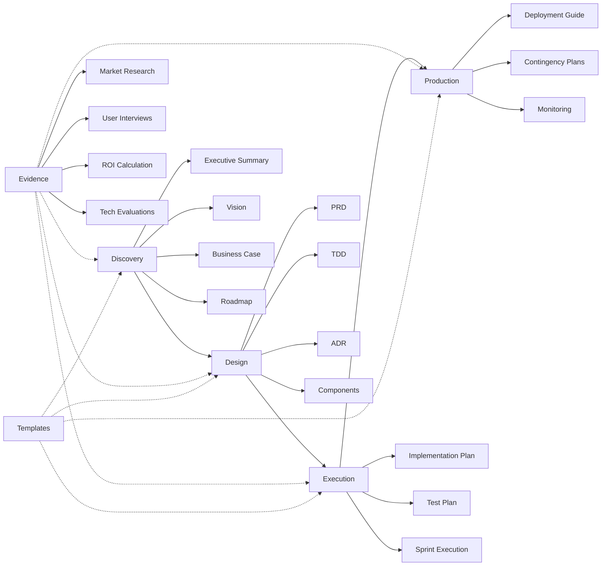

# Ishkarim — System Zarządzania Dokumentacją (Proof System)

## 📋 Czym jest docs/?

**docs/** to **Obsidian vault** zawierający pełną dokumentację projektu Ishkarim - systemu zarządzania dokumentacją opartego na "proof system approach". System dokumentuje **sam siebie** - to żywa demonstracja możliwości frameworka.

**Główne cechy:**
- **Evidence-driven** — Każde twierdzenie wsparte dowodami (E-080 do E-270)
- **Dependency tracking** — Explicit dependencies (requires, blocks, informs)
- **Quality gates** — Go/no-go checkpoints (req-freeze, approvals, DoR/DoD)
- **Versioned** — V2 current, V1 deprecated z migration guides
- **Frontmatter metadata** — YAML z status, dependencies, evidence_ids

---

## 🗂️ Struktura folderów

Dokumentacja zorganizowana według **faz lifecycle projektu**:

```
docs/
├── pre-production/       (8 files)  - Business justification & vision
├── engineering/          (34 files) - Technical design & architecture
├── implementation/       (2 files)  - Sprint execution planning
├── operations/           (2 files)  - Deployment & runtime ops
├── satellites/           (43 files) - Supporting artifacts (evidence, approvals, todos)
├── proposals/            (5 files)  - System enhancement proposals
├── canvases/             (1 file)   - Visual documentation
└── templates/            (184 files)- Reusable templates framework (173 templates + 11 READMEs)
```

### Mapowanie folderów do faz projektu

| Faza projektu | Folder | Status | Dokumenty kluczowe |
|---------------|--------|--------|--------------------|
| **Discovery** | [pre-production/](pre-production/) | ✅ Approved | Vision-v2, Business-Case-v2, Executive Summary, Roadmap |
| **Design** | [engineering/](engineering/) | ✅ Req-freeze | PRD-v2, TDD-v2, ADR-001-009, Components, Concepts-v2 |
| **Execution** | [implementation/](implementation/) | 📝 Draft | Implementation Plan (6 sprints), Test Plan |
| **Production** | [operations/](operations/) | 📝 Draft | Deployment Guide, Contingency Plans |
| **Cross-cutting** | [satellites/](satellites/) | ✅ Active | Evidence (32), Approvals (6), TODOs (3), QA (1), Decisions (1) |
| **Meta** | [proposals/](proposals/) | 💡 Proposals | 5 enhancement proposals for template system |
| **Visualization** | [canvases/](canvases/) | ✅ Active | Project-Overview.canvas (Obsidian visual graph) |
| **Templates** | [templates/](templates/) | ✅ Complete | 173 reusable templates (10 categories) |

---

## 📊 Root-level files (Analysis & Infrastructure)

Bezpośrednio w `docs/` znajdują się pliki systemowe:

### 1. **dependency_graph.md**
- **Cel:** Graf zależności między dokumentami
- **Zawartość:** 1,367 connections, 158 documents
- **Format:** Mermaid graphs (A→Z per folder) + statistics
- **Use:** Navigate document dependencies, understand impact of changes

### 2. **FINAL-GAP-ANALYSIS-REPORT.md**
- **Cel:** Raport kompletności dokumentacji (gap analysis)
- **Status:** 100% integrity achieved (2025-12-26)
- **Zawartość:** Stan początkowy (95.4%) → remediacja → stan końcowy (100%)
- **Rezultat:** 50 plików created/modified, 0 critical gaps

### 3. **PRE-IMPLEMENTATION-DOCUMENTATION-GAPS.md**
- **Cel:** Luki przedimplementacyjne wymagające uzupełnienia
- **Use:** Checklist before starting implementation phase

---

## 🚀 Quick Start — Reading Order

### Dla nowych członków zespołu (Onboarding):

**Poziom 1: Strategic context (30 min)**
1. `pre-production/executive-summary.md` — Czym jest projekt, dlaczego powstał
2. `pre-production/vision-v2.md` — Wizja długoterminowa (12-24 miesiące)
3. `pre-production/business-case-v2.md` — ROI (674%), uzasadnienie biznesowe

**Poziom 2: Technical understanding (2h)**
4. `engineering/prd-v2.md` — Wymagania funkcjonalne i niefunkcjonalne
5. `engineering/concepts-v2-modular-index.md` — System koncepcji (18 koncepcji)
6. `engineering/tdd-v2.md` — Architektura techniczna

**Poziom 3: Implementation context (1h)**
7. `implementation/implementation-plan.md` — 6-sprint MVP breakdown
8. `satellites/evidence/` — Browse E-080 do E-098 (market research, user interviews, ROI)

**Poziom 4: Dive deep (as needed)**
9. `engineering/decisions/` — ADR-001 do ADR-009 (architectural decisions)
10. `satellites/approvals/` — DoR/DoD checklists, funding approval
11. `dependency_graph.md` — Understand document relationships

### Dla twórców rozszerzeń (Extension Developers):

1. `templates/` — Browse 174 reusable templates
2. `proposals/` — Przeczytaj PROPOZYCJA-1 do PROPOZYCJA-4 (enhancement ideas)
3. `templates/specs/` — specs_doc_types.md, specs_error_codes.md, specs_gates.md

### Dla audytorów/walidatorów (Auditors):

1. `FINAL-GAP-ANALYSIS-REPORT.md` — System integrity status
2. `dependency_graph.md` — Verify dependency integrity
3. `satellites/evidence/` — Evidence trail (32 documents)
4. `satellites/approvals/` — Approval records (DoR/DoD, funding)
5. `satellites/qa/QA-CHECKLIST-001.md` — Quality assurance checklist

---

## 📈 Status projektu (2025-12-28)

### Fazy zakończone ✅

**Discovery (pre-production):**
- ✅ Executive Summary (approved 2025-12-26)
- ✅ Vision V2 (approved 2025-12-26)
- ✅ Business Case V2 (approved 2025-12-26)
- ✅ Roadmap (draft → baseline established)

**Design (engineering):**
- ✅ PRD-V2 (req-freeze achieved 2025-12-26)
- ✅ Concepts-V2 (18 concepts, modular structure)
- ✅ ADR-001 do ADR-009 (all decisions documented)
- ✅ Components COMP-001 to COMP-006 (Parser, Validator, Graph, GUI, Viz, Storage)
- ✅ TDD-V2 (technical architecture defined)

**Evidence & Quality Gates:**
- ✅ 32 evidence documents (E-080 to E-270) — 14% of target 150+
- ✅ 6 approvals (DoR/DoD masters, component DORs, funding)
- ✅ Quality gates: REQ-FREEZE passed, DESIGN-COMPLETE ready

### Fazy w toku 📝

**Execution (implementation):**
- 📝 Implementation Plan (6-sprint breakdown defined, draft)
- 📝 Test Plan (strategy defined, draft)
- ⏳ Sprint 1 (Parser + Models) — awaiting design-complete gate

**Production (operations):**
- 📝 Deployment Guide (installation procedures defined)
- 📝 Contingency Plans (CONTINGENCY-001 parser failure planned)

**Meta (proposals):**
- 💡 PROPOZYCJA-1: Research Branch Templates (awaiting approval)
- 💡 PROPOZYCJA-2: Living Documentation Framework (awaiting approval)
- 💡 PROPOZYCJA-3: Decision Templates Enhancement (awaiting approval)
- 💡 PROPOZYCJA-4: Concept Exploration Workflows (awaiting approval)

### Key Metrics

| Metryka | Wartość | Target | Status |
|---------|---------|--------|--------|
| **Dependency Integrity** | 100% | 100% | ✅ |
| **Evidence Coverage** | 32 docs | 150+ | 📝 14% (MVP sufficient) |
| **Template Coverage** | 174 templates | TBD | ✅ |
| **Quality Gates Passed** | 2 / 5 | 5 | 📝 (REQ-FREEZE ✅, DESIGN-COMPLETE ready) |
| **Status Transitions Clean** | 100% | 100% | ✅ |

---

## 🔗 Nawigacja — Folder READMEs

Każdy folder ma dedykowany README wyjaśniający zawartość i cel:

- **[pre-production/README.md](pre-production/README.md)** — Business justification & vision (8 files)
- **[engineering/README.md](engineering/README.md)** — Technical design & architecture (34 files, 4 subfolders)
- **[implementation/README.md](implementation/README.md)** — Sprint execution planning (2 files)
- **[operations/README.md](operations/README.md)** — Deployment & runtime ops (2 files)
- **[satellites/README.md](satellites/README.md)** — Supporting artifacts: evidence, approvals, todos (43 files, 5 subfolders)
- **[proposals/README.md](proposals/README.md)** — System enhancement proposals (5 files)
- **[canvases/README.md](canvases/README.md)** — Visual documentation (1 file)
- **[templates/README.md](templates/README.md)** — Reusable templates (174 files, 10 categories) — **Already documented!**

---

## ⚙️ Tooling — Jak używać tego systemu

### Obsidian (Viewing)

**docs/** jest Obsidian vault — otwórz w Obsidian dla:
- **Graph view** — Wizualizacja zależności między dokumentami
- **Canvas support** — Przeglądanie `canvases/Project-Overview.canvas`
- **Backlinks** — Automatic backlink tracking
- **Search** — Full-text search across all markdown files

**Setup:**
1. Open Obsidian
2. "Open folder as vault" → wybierz `/home/jerzy/Dokumenty/Ishkarim/docs`
3. Graph view → See document dependencies visually

### Parser & Validator (Planned)

System **Archivista Żywego Zapisu** (in development) zapewni:
- **Parser** — Read frontmatter, extract dependencies, build graph
- **Validator** — Check required sections, verify dependencies, enforce gates
- **Gap Engine** — Identify missing documents, broken references, status conflicts
- **CLI** — `ishkarim validate`, `ishkarim graph`, `ishkarim gaps`

**Current Status:** Prototypes exist in `satellites/evidence/E-144` (hybrid storage), `E-146` (SQLite FTS5 benchmark)

### Git Workflow

Dokumentacja w docs/ jest pod kontrolą wersji:
```bash
# View recent changes
git log --oneline docs/

# Check status
git status docs/

# Commit pattern (see past commits for examples)
git commit -m "docs: <brief description>

<detailed changes>

🤖 Generated with Claude Code
Co-Authored-By: Claude Sonnet 4.5 <noreply@anthropic.com>"
```

---

## 🔄 Lifecycle Workflow



**Critical Path:**
1. Vision-v2 (approved) → PRD-v2 (req-freeze) → TDD-v2 (design-complete pending)
2. TDD-v2 (design-complete) → Implementation Plan (sprint execution)
3. Implementation Plan → Deployment Guide (production readiness)

**Gates:**
- `REQ-FREEZE` ✅ (PRD-V2 achieved 2025-12-26)
- `DESIGN-COMPLETE` 📝 (TDD-V2 awaiting)
- `RELEASE-READY` ⏳ (future)
- `OPS-HANDOVER` ⏳ (future)
- `CLOSURE` ⏳ (future)

---

## ⚠️ Uwagi

### Wersjowanie

**Current versions:**
- Vision-V2, Business-Case-V2, PRD-V2, TDD-V2, Concepts-V2 = **CURRENT**
- Vision-V1, Business-Case-V1, PRD-V1, Concepts-V1 = **DEPRECATED**

**Pattern:**
- V1 files renamed: `*-v1-deprecated.md`
- DIFF reports available: `CONCEPTS-001-DIFF-REPORT.md` (v1→v2 changes)
- Migration guides: `CONCEPTS-001-MIGRATION-GUIDE.md`

### Dependencies

**NIGDY nie modyfikuj dokumentu bez sprawdzenia:**
1. `dependencies:` w frontmatter — co blokuje ten dokument
2. `impacts:` w frontmatter — na co ten dokument wpływa
3. `dependency_graph.md` — upstream/downstream effects

**Example:** Zmiana PRD-V2 `status: req-freeze → draft` zablokuje TDD-V2 (wymaga req-freeze)!

### Evidence Trail

**Każde twierdzenie MUSI mieć evidence:**
- Claims w Business Case → E-090 (ROI calculation)
- User needs w PRD → E-081, E-082, E-083 (user interviews)
- Tech choices w ADR → E-140, E-141, E-142 (tech evaluations)

**Pattern:** `[Claim] (Evidence: E-XXX)`

### Quality Gates

**Gates blokują postęp:**
- PRD draft → TDD blocked (wymaga req-freeze)
- TDD draft → Implementation blocked (wymaga design-complete)
- Brak approval → Funding blocked

**Check gate status:** `satellites/approvals/FUNDING-APPROVAL-001.md`

---

## 📖 Zobacz też

- **[CHANGELOG.md](../CHANGELOG.md)** — Historia zmian w systemie szablonów
- **[dependency_graph.md](dependency_graph.md)** — Graf zależności (1,367 connections)
- **[FINAL-GAP-ANALYSIS-REPORT.md](FINAL-GAP-ANALYSIS-REPORT.md)** — Stan integralności systemu
- **[templates/specs/](templates/specs/)** — Specyfikacje systemu szablonów (doc types, error codes, gates)
- **[proposals/](proposals/)** — Propozycje rozszerzeń systemu

---

## 📞 Contact & Contributing

**Zespół Produktowy:** Product Owner, Tech Lead
**Language:** Polish (team language), English (documentation framework)
**License:** TBD (eventual open source goal)

**Contributing:**
1. Read relevant folder README first
2. Check dependency_graph.md for impacts
3. Follow template patterns from `templates/`
4. Add evidence to `satellites/evidence/` for claims
5. Update frontmatter dependencies
6. Run validation (when parser available)

---

**Wygenerowano:** 2025-12-28
**System:** Ishkarim Documentation System (Proof System Approach)
**Coverage:** 100% struktury docs/ (8 READMEs: 1 master + 7 folder-specific)
**Status:** Living documentation — updates ongoing
