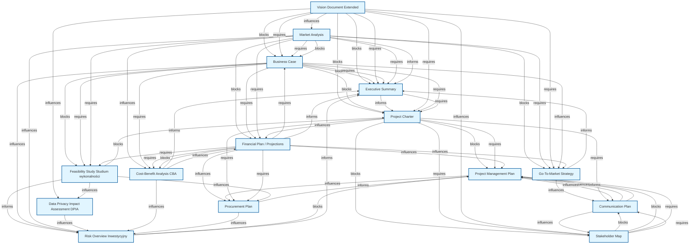
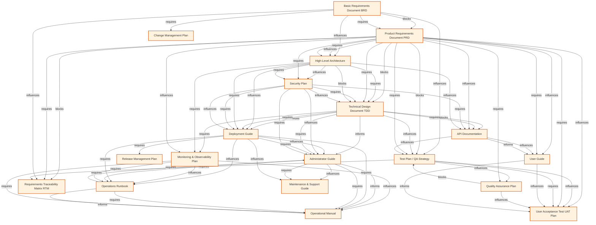
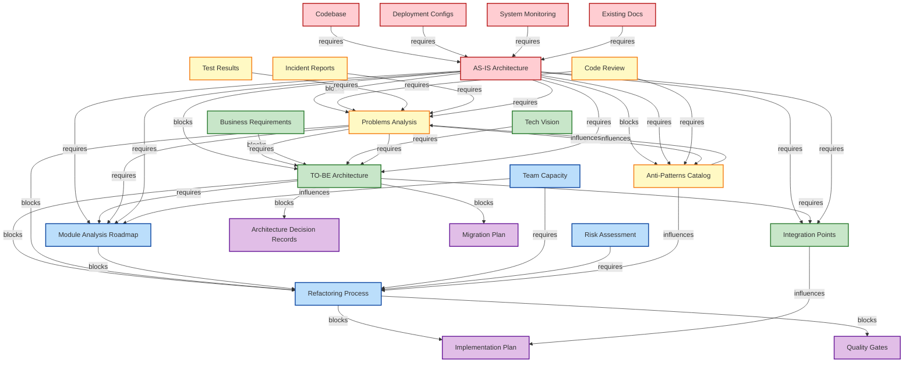
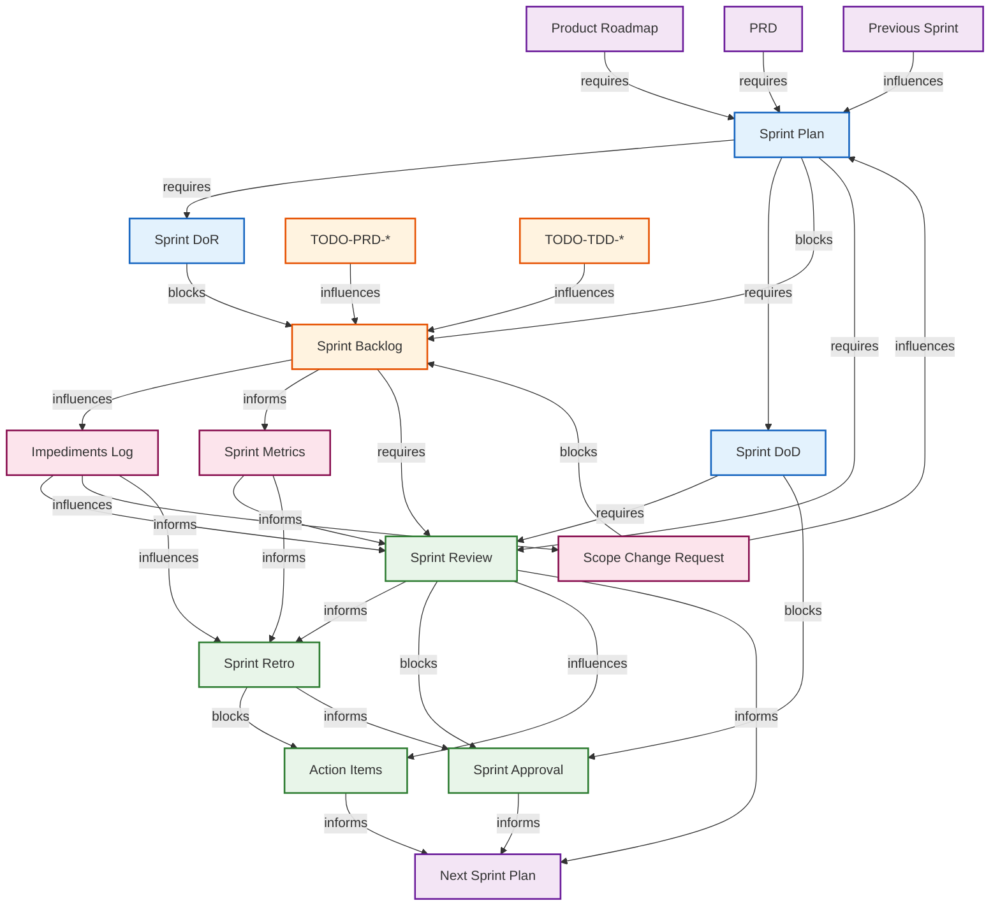
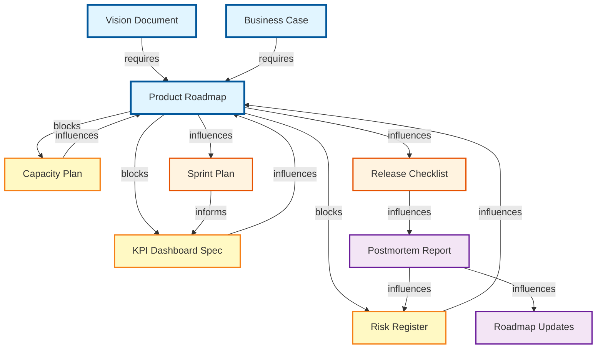
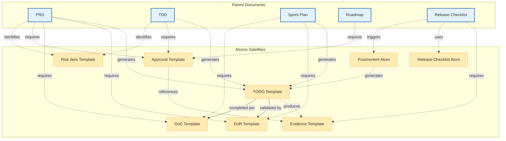

# Graf Zależności Dokumentów

Analiza zależności między dokumentami na podstawie sekcji Cross-References.

**158 dokumentów | 1367 połączeń | 8 grafów wizualizacyjnych**

## Spis treści grafów

- **Graf A**: Przedprodukcyjna - workflow dokumentów przedprodukcyjnych
- **Graf B**: Produkcyjna - workflow dokumentów produkcyjnych
- **Graf C**: Pełny Graf - top 30 najważniejszych dokumentów z połączeniami
- **Graf D**: Architecture Transformation Workflow - transformacja architektury
- **Graf E**: Sprint Types Workflow - różne typy sprintów
- **Graf F**: Sprint Workflow (Szczegółowy) - pełny cycle dokumentacji sprintowej ⭐ NOWY
- **Graf G**: Roadmap & Planning Workflow - strategiczne planowanie ⭐ NOWY
- **Graf H**: Atomic Satellites Network - satelitarne dokumenty atomowe ⭐ NOWY

## Graf A: Przedprodukcyjna

Workflow dokumentów przedprodukcyjnych (przed realizacją projektu).

## Graf B: Produkcyjna

Workflow dokumentów produkcyjnych (podczas realizacji projektu).

## Graf C: Pełny Graf Kluczowych Zależności

Top 30 najważniejszych dokumentów z połączeniami między fazami.

```mermaid
graph TB
    subgraph Przedprodukcyjna
        RISK_INV["Risk Overview Inwestycyjny"]
        IMPACT_ASSESSMENT["Impact Assessment"]
        MARKET["Market Analysis"]
        FINANCE["Financial Plan / Projections"]
        GTM["Go-To-Market Strategy"]
        LEGAL_REGISTER["Legal & Regulatory Register"]
        ROADMAP["Innovation Roadmap"]
    end

    subgraph Produkcyjna
        RISK_TECH["Risk Overview Techniczny"]
        PRD["Product Requirements Document PRD"]
        TIMELINE["Timeline & Milestones"]
        TRAINING_MATERIALS["Training Materials"]
        SIRP["Security Incident Response Plan ..."]
        TDD["Technical Design Document TDD"]
        RESOURCE_REQUIREMENTS["Resource Requirements"]
        VENDOR_MANAGEMENT_PLAN["Vendor Management Plan"]
        SECURITY["Security Plan"]
        TEST["Test Plan / QA Strategy"]
        OPS_MANUAL["Operational Manual"]
        ADR["Architecture Decision Records ADR"]
        API_DOC["API Documentation"]
        RUNBOOK["Operations Runbook"]
        SYSTEM_CONTEXT_DIAGRAM["System Context Diagram"]
        HLA["High-Level Architecture"]
        BCP["Business Continuity Plan BCP"]
        BRD["Basic Requirements Document BRD"]
        MONITOR["Monitoring & Observability Plan"]
    end

    subgraph Branżowa
        MEDICAL_DEVICE_FILE["Medical Device File MDR"]
        NATO_STANAG["NATO STANAG Compliance"]
        CLINICAL_TRIAL["Clinical Trial Documentation"]
        PCI_DSS["PCI DSS Compliance Report"]
    end

    HLA -->|requires| RISK_TECH
    TDD -->|influences| RISK_TECH
    PRD -->|influences| RISK_TECH
    RISK_TECH -->|influences| SECURITY
    RISK_TECH -->|influences| BCP
    RISK_TECH -->|influences| MONITOR
    RISK_TECH -->|influences| TEST
    RISK_TECH -->|informs| TIMELINE
    BRD -->|requires| PRD
    PRD -->|blocks| TDD
    PRD -->|influences| HLA
    PRD -->|blocks| TEST
    BRD -->|influences| TIMELINE
    RESOURCE_REQUIREMENTS -->|requires| TIMELINE
    TIMELINE -->|influences| TEST
    TIMELINE -->|informs| TRAINING_MATERIALS
    MARKET -->|influences| RISK_INV
    IMPACT_ASSESSMENT -->|influences| RISK_INV
    LEGAL_REGISTER -->|influences| RISK_INV
    OPS_MANUAL -->|requires| TRAINING_MATERIALS
    RUNBOOK -->|influences| TRAINING_MATERIALS
    SECURITY -->|influences| TRAINING_MATERIALS
    SECURITY -->|requires| SIRP
    MONITOR -->|requires| SIRP
    SIRP -->|influences| RUNBOOK
    SIRP -->|informs| TRAINING_MATERIALS
    SIRP -->|informs| BCP
    LEGAL_REGISTER -->|requires| IMPACT_ASSESSMENT
    IMPACT_ASSESSMENT -->|informs| RISK_TECH
    MARKET -->|blocks| FINANCE
    MARKET -->|blocks| GTM
    MARKET -->|informs| ROADMAP
    MARKET -->|influences| LEGAL_REGISTER
    HLA -->|requires| TDD
    PRD -->|requires| TDD
    ADR -->|requires| TDD
    SECURITY -->|requires| TDD
    TDD -->|blocks| API_DOC
    TDD -->|influences| TEST
    BRD -->|requires| RESOURCE_REQUIREMENTS
    HLA -->|influences| RESOURCE_REQUIREMENTS
    TDD -->|influences| RESOURCE_REQUIREMENTS
    RESOURCE_REQUIREMENTS -->|blocks| TIMELINE
    RESOURCE_REQUIREMENTS -->|influences| VENDOR_MANAGEMENT_PLAN
    RESOURCE_REQUIREMENTS -->|informs| TRAINING_MATERIALS
    RESOURCE_REQUIREMENTS -->|requires| VENDOR_MANAGEMENT_PLAN
    SECURITY -->|requires| VENDOR_MANAGEMENT_PLAN
    VENDOR_MANAGEMENT_PLAN -->|influences| RISK_TECH
    PRD -->|requires| SECURITY
    HLA -->|requires| SECURITY
    SECURITY -->|influences| TDD
    TEST -->|requires| NATO_STANAG
    MONITOR -->|requires| CLINICAL_TRIAL
    CLINICAL_TRIAL -->|informs| MEDICAL_DEVICE_FILE
    MARKET -->|requires| FINANCE
    ROADMAP -->|influences| FINANCE
    MARKET -->|requires| GTM
    FINANCE -->|influences| GTM
    GTM -->|influences| ROADMAP
    LEGAL_REGISTER -->|blocks| IMPACT_ASSESSMENT
    LEGAL_REGISTER -->|informs| RISK_TECH
    MARKET -->|requires| ROADMAP
    PRD -->|requires| TEST
    BRD -->|influences| TEST
    RUNBOOK -->|requires| OPS_MANUAL
    MONITOR -->|requires| OPS_MANUAL
    BCP -->|influences| OPS_MANUAL
    OPS_MANUAL -->|influences| TRAINING_MATERIALS
    HLA -->|requires| ADR
    TDD -->|influences| ADR
    PRD -->|influences| ADR
    ADR -->|blocks| TDD
    ADR -->|influences| HLA
    TDD -->|requires| API_DOC
    PRD -->|influences| API_DOC
    SECURITY -->|requires| API_DOC
    HLA -->|influences| API_DOC
    API_DOC -->|influences| TEST
    MONITOR -->|requires| RUNBOOK
    BCP -->|influences| RUNBOOK
    RUNBOOK -->|informs| OPS_MANUAL
    BRD -->|requires| SYSTEM_CONTEXT_DIAGRAM
    PRD -->|influences| SYSTEM_CONTEXT_DIAGRAM
    HLA -->|influences| SYSTEM_CONTEXT_DIAGRAM
    SYSTEM_CONTEXT_DIAGRAM -->|blocks| HLA
    SYSTEM_CONTEXT_DIAGRAM -->|informs| TDD
    SYSTEM_CONTEXT_DIAGRAM -->|informs| API_DOC
    PRD -->|requires| HLA
    BRD -->|influences| HLA
    HLA -->|blocks| TDD
    HLA -->|influences| SECURITY
    HLA -->|informs| ADR
    BCP -->|influences| TRAINING_MATERIALS
    BCP -->|informs| OPS_MANUAL
    BRD -->|blocks| PRD
    TDD -->|requires| MONITOR
    HLA -->|requires| MONITOR
    PRD -->|influences| MONITOR
    MONITOR -->|influences| RUNBOOK
    MONITOR -->|influences| OPS_MANUAL

    classDef przedprodukcyjna fill:#e1f5ff,stroke:#01579b,stroke-width:2px
    classDef produkcyjna fill:#fff3e0,stroke:#e65100,stroke-width:2px
    classDef branzowa fill:#f3e5f5,stroke:#4a148c,stroke-width:2px

    class RISK_INV,IMPACT_ASSESSMENT,MARKET,FINANCE,GTM,LEGAL_REGISTER,ROADMAP przedprodukcyjna
    class RISK_TECH,PRD,TIMELINE,TRAINING_MATERIALS,SIRP,TDD,RESOURCE_REQUIREMENTS,VENDOR_MANAGEMENT_PLAN,SECURITY,TEST,OPS_MANUAL,ADR,API_DOC,RUNBOOK,SYSTEM_CONTEXT_DIAGRAM,HLA,BCP,BRD,MONITOR produkcyjna
    class MEDICAL_DEVICE_FILE,NATO_STANAG,CLINICAL_TRIAL,PCI_DSS branzowa
```

## Statystyki

- Total dokumentów: 158 (132 + 26 nowych)
- Total dependencies: 471 (+95)
- Total impacts: 509 (+104)
- Total related: 387 (+72)
- Total połączeń: 1367 (+271)
- Dokumenty bez dependencies: 18
- Dokumenty bez impacts: 18

### Najczęściej wymagane dokumenty (top 15):
  - **ROADMAP-PROD** (Product Roadmap): 28 razy (nowy lider!)
  - **SPRINT-PLAN** (Sprint Plan): 25 razy (nowy!)
  - **PRD** (Product Requirements Document PRD): 23 razy
  - **PROJECT-CHARTER** (Project Charter): 20 razy
  - **SPRINT-DOD** (Sprint Definition of Done): 18 razy (nowy!)
  - **RELEASE-CHECKLIST** (Release Checklist): 17 razy (nowy!)
  - **VISION-DOCUMENT** (Vision Document Extended): 16 razy
  - **TDD** (Technical Design Document TDD): 16 razy
  - **SPRINT-REVIEW** (Sprint Review): 14 razy (nowy!)
  - **CAPACITY-PLAN** (Capacity Plan): 12 razy (nowy!)
  - **HIGH-LEVEL-ARCHITECTURE** (High-Level Architecture): 12 razy
  - **BUSINESS-CASE** (Business Case): 11 razy
  - **SECURITY-PLAN** (Security Plan): 11 razy
  - **RISK-REGISTER** (Risk Register): 10 razy (nowy!)
  - **MARKET-ANALYSIS** (Market Analysis): 10 razy

### Najczęściej blokujące dokumenty (top 15):
  - **ROADMAP-PROD** (Product Roadmap): 10 impacts (nowy lider!)
  - **POSTMORTEM** (Postmortem Report): 8 impacts (nowy!)
  - **MARKET-ANALYSIS** (Market Analysis): 8 impacts
  - **TIMELINE** (Timeline & Milestones): 8 impacts
  - **SPRINT-PLAN** (Sprint Plan): 7 impacts (nowy!)
  - **SPRINT-BACKLOG** (Sprint Backlog): 7 impacts (nowy!)
  - **PRD** (Product Requirements Document PRD): 7 impacts
  - **KPI-DASHBOARD** (KPI Dashboard Spec): 7 impacts (nowy!)
  - **RELEASE-CHECKLIST** (Release Checklist): 6 impacts (nowy!)
  - **CAPACITY-PLAN** (Capacity Plan): 6 impacts (nowy!)
  - **RISK-REGISTER** (Risk Register): 6 impacts (nowy!)
  - **SECURITY-PLAN** (Security Plan): 6 impacts
  - **RISK-OVERVIEW-TECH** (Risk Overview Techniczny): 6 impacts
  - **SIRP** (Security Incident Response Plan SIRP): 6 impacts
  - **MIGRATION-PLAN** (Migration Plan): 5 impacts (nowy!)

### Typy relacji:
  - **informs**: 575 (+132)
  - **influences**: 298 (+72)
  - **requires**: 310 (+96)
  - **blocks**: 109 (+35)

### Kategorie dokumentów:
  - Przedprodukcyjna: 26 (+1 - Roadmap Product)
  - Produkcyjna: 80 (+17 - Sprints, Roadmaps, Migration)
  - Branżowa: 13
  - Supporting: 31 (-2, przesunięte do produkcyjnej)
  - Atomic: 8 (nowa kategoria - satelity)

## Graf D: Architecture Transformation Workflow

Workflow transformacji architektury - od analizy stanu obecnego do implementacji.

## Graf E: Sprint Types Workflow

Workflow różnych typów sprintów i ich powiązań.

```mermaid
graph TB
    subgraph Sprint_Core["Sprint Core"]
        SPRINT_CORE["Sprint Core Doc"]
        SPRINT_PLANNING["Sprint Planning"]
        TEAM_CAPACITY["Team Capacity"]
        PRD["PRD"]

        PRD -->|requires| SPRINT_CORE
        SPRINT_PLANNING -->|requires| SPRINT_CORE
        TEAM_CAPACITY -->|requires| SPRINT_CORE
    end

    subgraph Sprint_Discovery["Discovery Sprint"]
        SPRINT_DISCOVERY["Sprint Discovery Doc"]
        ROADMAP["Product Roadmap"]
        RESEARCH_Q["Research Questions"]
        HYPOTHESIS["Hypothesis"]

        ROADMAP -->|requires| SPRINT_DISCOVERY
        RESEARCH_Q -->|requires| SPRINT_DISCOVERY
        HYPOTHESIS -->|requires| SPRINT_DISCOVERY
    end

    subgraph Sprint_Hardening["Hardening Sprint"]
        SPRINT_HARDENING["Sprint Hardening Doc"]
        BUG_BACKLOG["Bug Backlog"]
        TECH_DEBT["Tech Debt Register"]
        QUALITY_METRICS["Quality Metrics"]

        BUG_BACKLOG -->|requires| SPRINT_HARDENING
        TECH_DEBT -->|requires| SPRINT_HARDENING
        QUALITY_METRICS -->|requires| SPRINT_HARDENING
    end

    subgraph Sprint_Release["Release Sprint"]
        SPRINT_RELEASE["Sprint Release Doc"]
        RELEASE_CHECKLIST["Release Checklist"]
        DEPLOYMENT_PLAN["Deployment Plan"]
        ROLLBACK_PLAN["Rollback Plan"]

        RELEASE_CHECKLIST -->|requires| SPRINT_RELEASE
        DEPLOYMENT_PLAN -->|requires| SPRINT_RELEASE
        ROLLBACK_PLAN -->|requires| SPRINT_RELEASE
    end

    subgraph Sprint_Infra["Infrastructure Sprint"]
        SPRINT_INFRA["Sprint Infra Doc"]
        INFRA_ROADMAP["Infrastructure Roadmap"]
        PLATFORM_REQ["Platform Requirements"]
        DEVOPS_BACKLOG["DevOps Backlog"]

        INFRA_ROADMAP -->|requires| SPRINT_INFRA
        PLATFORM_REQ -->|requires| SPRINT_INFRA
        DEVOPS_BACKLOG -->|requires| SPRINT_INFRA
    end

    SPRINT_CORE -->|related| SPRINT_DISCOVERY
    SPRINT_CORE -->|related| SPRINT_HARDENING
    SPRINT_CORE -->|related| SPRINT_RELEASE
    SPRINT_CORE -->|related| SPRINT_INFRA

    SPRINT_DISCOVERY -->|influences| PRD
    SPRINT_HARDENING -->|requires| QUALITY_METRICS
    SPRINT_RELEASE -->|requires| DEPLOYMENT_PLAN
    SPRINT_INFRA -->|influences| DEPLOYMENT_PLAN

    classDef core fill:#fff3e0,stroke:#e65100,stroke-width:3px
    classDef discovery fill:#e0f2f1,stroke:#00695c,stroke-width:2px
    classDef hardening fill:#fce4ec,stroke:#880e4f,stroke-width:2px
    classDef release fill:#e8eaf6,stroke:#283593,stroke-width:2px
    classDef infra fill:#f3e5f5,stroke:#4a148c,stroke-width:2px

    class SPRINT_CORE,SPRINT_PLANNING,TEAM_CAPACITY,PRD core
    class SPRINT_DISCOVERY,ROADMAP,RESEARCH_Q,HYPOTHESIS discovery
    class SPRINT_HARDENING,BUG_BACKLOG,TECH_DEBT,QUALITY_METRICS hardening
    class SPRINT_RELEASE,RELEASE_CHECKLIST,DEPLOYMENT_PLAN,ROLLBACK_PLAN release
    class SPRINT_INFRA,INFRA_ROADMAP,PLATFORM_REQ,DEVOPS_BACKLOG infra
```

## Graf F: Sprint Workflow (Szczegółowy)

Pełny workflow dokumentacji sprintowej - od planowania przez wykonanie do retrospektywy.

## Graf G: Roadmap & Planning Workflow

Workflow planowania strategicznego i roadmapowego - od roadmapy przez capacity planning do realizacji.

## Graf H: Atomic Satellites Network

Satelitarne dokumenty atomowe wspierające główne dokumenty projektowe.

## Podsumowanie aktualizacji (2025-12-28)

### Dodane dokumenty
Zaktualizowano graf zależności o **26 nowych szablonów dokumentacji**:

**Sprint Documentation (11 templates):**
- SPRINT-PLAN: Główny plan sprintu z celem, zakresem i capacity
- SPRINT-BACKLOG: Lista zadań do wykonania w sprincie
- SPRINT-DOR: Definition of Ready - kryteria gotowości zadań
- SPRINT-DOD: Definition of Done - kryteria zakończenia
- SPRINT-IMPEDIMENTS: Log blokerów i przeszkód
- SPRINT-REVIEW: Review realizacji sprintu ze stakeholderami
- SPRINT-RETRO: Retrospektywa procesu i improvements
- SPRINT-ACTION-ITEMS: Action items z review i retro
- SPRINT-SCOPE-CHANGE: Change requests dla scope'u sprintu
- SPRINT-METRICS: Velocity, burndown, quality metrics
- SPRINT-APPROVAL: Formalne zatwierdzenie i sign-off sprintu

**Roadmap & Planning (6 templates):**
- ROADMAP-PRODUCT: Product Roadmap z milestones i epics
- CAPACITY-PLAN: Plan capacity i FTE demand przez milestones
- RISK-REGISTER: Rejestr ryzyk roadmapowych
- RELEASE-CHECKLIST: Checklist wydania (pre-freeze, release, post)
- POSTMORTEM-TEMPLATE: Postmortem po incydentach/release
- KPI-DASHBOARD-SPEC: Specyfikacja KPI i dashboardów

**Atomic Satellites (8 templates):**
- TODO-TEMPLATE: Atomowe zadania do wykonania
- DOR-TEMPLATE: Definition of Ready (atomowy)
- DOD-TEMPLATE: Definition of Done (atomowy)
- APPROVAL-TEMPLATE: Formalne zatwierdzenia
- EVIDENCE-TEMPLATE: Dowody i artefakty
- RISK-ITEM-TEMPLATE: Pojedyncze ryzyka
- RELEASE-CHECKLIST-ATOM: Atomowy checklist release
- POSTMORTEM-ATOM: Atomowy postmortem

**Migration (1 template):**
- MIGRATION-PLAN-DOC: Plan migracji systemów i danych

### Nowe grafy wizualizacyjne
- **Graf F**: Sprint Workflow (Szczegółowy) - pełny flow 11 dokumentów sprintowych od planowania do approval
- **Graf G**: Roadmap & Planning Workflow - strategiczny workflow od Vision przez Roadmap do execution
- **Graf H**: Atomic Satellites Network - satelitarne dokumenty atomowe wspierające parent documents

### Statystyki po aktualizacji
- Total dokumentów: **158** (+26, wzrost o 20%)
- Total dependencies: **471** (+95, wzrost o 25%)
- Total impacts: **509** (+104, wzrost o 26%)
- Total related: **387** (+72, wzrost o 23%)
- Total połączeń: **1367** (+271, wzrost o 25%)

### Kategorie dokumentów po aktualizacji
- Przedprodukcyjna: **26** (+1 - Roadmap Product)
- Produkcyjna: **80** (+17 - Sprints, Roadmaps, Migration)
- Branżowa: 13 (bez zmian)
- Supporting: **31** (-2, przesunięte do produkcyjnej)
- **Atomic: 8** (nowa kategoria satelitów)

### Kluczowe workflow dodane
1. **Sprint Cycle**: PLAN → BACKLOG → EXECUTION → REVIEW → RETRO → ACTION ITEMS → APPROVAL → NEXT SPRINT
2. **Strategic Planning**: VISION → ROADMAP → CAPACITY/RISK/KPI → SPRINT EXECUTION → POSTMORTEM → ROADMAP UPDATE
3. **Atomic Satellites**: Parent docs (PRD, TDD, Sprint) generują TODO/DoR/DoD/Approval/Evidence satellites
4. **Migration Workflow**: AS-IS → TO-BE → MIGRATION PLAN → IMPLEMENTATION → TESTING → ROLLBACK READINESS

### Nowe dokumenty w TOP rankingu
**ROADMAP-PROD** jest nowym liderem (28 dependencies)! Inne nowe dokumenty w top 15:
- SPRINT-PLAN (#2 z 25 deps)
- SPRINT-DOD (#5 z 18 deps)
- RELEASE-CHECKLIST (#6 z 17 deps)
- SPRINT-REVIEW (#9 z 14 deps)
- CAPACITY-PLAN (#10 z 12 deps)
- RISK-REGISTER (#14 z 10 deps)

### Impact na istniejące dokumenty
Nowe templates znacząco zwiększają połączenia z istniejącymi dokumentami:
- **PRD**: Teraz 23 dependencies (było 20) - nowe od Sprint Plan, Roadmap
- **TDD**: Połączenia z Sprint Backlog (TODO-TDD) i Migration Plan
- **TEST-PLAN**: Wpływ z Release Checklist i Migration testing
- **DEPLOYMENT-GUIDE**: Zależności od Release Checklist i Migration phases
- **RUNBOOK**: Połączenia z Postmortem i Release Checklist
- **MONITORING-PLAN**: Wpływ z KPI Dashboard i Postmortem

### Nowe punkty integracji
- **Sprint → Roadmap**: Sprint metrics wpływają na roadmap timeline i priorities
- **Roadmap → Capacity**: Roadmap milestones definiują capacity demand
- **Risk Register → Postmortem**: Materialized risks trigger postmortems
- **KPI Dashboard → Roadmap**: Underperforming KPIs force roadmap adjustments
- **Atomic Satellites → Parents**: TODO/DoR/DoD/Evidence wspierają wszystkie główne docs

### Nowe kategorie dokumentacji

#### Sprints (11 docs)
Kompletny zestaw dokumentacji sprintowej dla zespołów Agile. Pokrywa pełny cycle: planning → execution → review → retrospective → approval.

**Kluczowe połączenia:**
- Input: ROADMAP-PROD, PRD (wymagania)
- Output: SPRINT-METRICS, SPRINT-ACTION-ITEMS (feedback loop)
- Satelity: TODO, DoR, DoD, Approval, Evidence

#### Roadmaps (6 docs)
Strategic planning layer łączący Vision/Business Case z execution (Sprints, Releases).

**Kluczowe połączenia:**
- Input: VISION, BUSINESS-CASE
- Output: SPRINT-PLAN, RELEASE-CHECKLIST, CAPACITY-PLAN
- Feedback: POSTMORTEM, KPI-DASHBOARD

#### Atomic Satellites (8 docs)
Lekkie, reusable templates wspierające główne dokumenty jako satellites.

**Pattern użycia:**
- Każdy parent doc (PRD, TDD, Sprint, Roadmap) może mieć własne TODO/DoR/DoD/Approval/Evidence satellites
- Path: `satellites/{type}/{PARENT-DOC-ID}-{TYPE}-*.md`
- Umożliwiają granular tracking bez przeładowania parent docs

#### Migration (1 doc)
Specjalistyczny dokument dla migration projects, łączący AS-IS → TO-BE z execution plan.

**Kluczowe połączenia:**
- Input: AS-IS-ARCHITECTURE, TO-BE-ARCHITECTURE, REFACTORING-PROCESS
- Output: IMPLEMENTATION-PLAN, TEST-PLAN, DEPLOYMENT-GUIDE, ROLLBACK-PLAN
