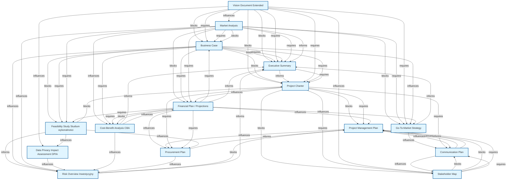
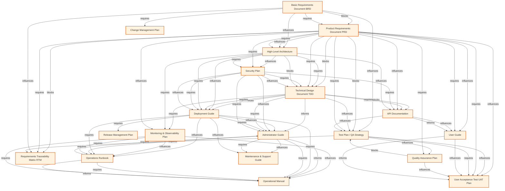

# Graf Zależności Dokumentów

Analiza zależności między dokumentami na podstawie sekcji Cross-References.

## Graf A: Przedprodukcyjna

Workflow dokumentów przedprodukcyjnych (przed realizacją projektu).

## Graf B: Produkcyjna

Workflow dokumentów produkcyjnych (podczas realizacji projektu).

## Graf C: Pełny Graf Kluczowych Zależności

Top 30 najważniejszych dokumentów z połączeniami między fazami.

```mermaid
graph TB
    subgraph Przedprodukcyjna
        RISK_INV["Risk Overview Inwestycyjny"]
        IMPACT_ASSESSMENT["Impact Assessment"]
        MARKET["Market Analysis"]
        FINANCE["Financial Plan / Projections"]
        GTM["Go-To-Market Strategy"]
        LEGAL_REGISTER["Legal & Regulatory Register"]
        ROADMAP["Innovation Roadmap"]
    end

    subgraph Produkcyjna
        RISK_TECH["Risk Overview Techniczny"]
        PRD["Product Requirements Document PRD"]
        TIMELINE["Timeline & Milestones"]
        TRAINING_MATERIALS["Training Materials"]
        SIRP["Security Incident Response Plan ..."]
        TDD["Technical Design Document TDD"]
        RESOURCE_REQUIREMENTS["Resource Requirements"]
        VENDOR_MANAGEMENT_PLAN["Vendor Management Plan"]
        SECURITY["Security Plan"]
        TEST["Test Plan / QA Strategy"]
        OPS_MANUAL["Operational Manual"]
        ADR["Architecture Decision Records ADR"]
        API_DOC["API Documentation"]
        RUNBOOK["Operations Runbook"]
        SYSTEM_CONTEXT_DIAGRAM["System Context Diagram"]
        HLA["High-Level Architecture"]
        BCP["Business Continuity Plan BCP"]
        BRD["Basic Requirements Document BRD"]
        MONITOR["Monitoring & Observability Plan"]
    end

    subgraph Branżowa
        MEDICAL_DEVICE_FILE["Medical Device File MDR"]
        NATO_STANAG["NATO STANAG Compliance"]
        CLINICAL_TRIAL["Clinical Trial Documentation"]
        PCI_DSS["PCI DSS Compliance Report"]
    end

    HLA -->|requires| RISK_TECH
    TDD -->|influences| RISK_TECH
    PRD -->|influences| RISK_TECH
    RISK_TECH -->|influences| SECURITY
    RISK_TECH -->|influences| BCP
    RISK_TECH -->|influences| MONITOR
    RISK_TECH -->|influences| TEST
    RISK_TECH -->|informs| TIMELINE
    BRD -->|requires| PRD
    PRD -->|blocks| TDD
    PRD -->|influences| HLA
    PRD -->|blocks| TEST
    BRD -->|influences| TIMELINE
    RESOURCE_REQUIREMENTS -->|requires| TIMELINE
    TIMELINE -->|influences| TEST
    TIMELINE -->|informs| TRAINING_MATERIALS
    MARKET -->|influences| RISK_INV
    IMPACT_ASSESSMENT -->|influences| RISK_INV
    LEGAL_REGISTER -->|influences| RISK_INV
    OPS_MANUAL -->|requires| TRAINING_MATERIALS
    RUNBOOK -->|influences| TRAINING_MATERIALS
    SECURITY -->|influences| TRAINING_MATERIALS
    SECURITY -->|requires| SIRP
    MONITOR -->|requires| SIRP
    SIRP -->|influences| RUNBOOK
    SIRP -->|informs| TRAINING_MATERIALS
    SIRP -->|informs| BCP
    LEGAL_REGISTER -->|requires| IMPACT_ASSESSMENT
    IMPACT_ASSESSMENT -->|informs| RISK_TECH
    MARKET -->|blocks| FINANCE
    MARKET -->|blocks| GTM
    MARKET -->|informs| ROADMAP
    MARKET -->|influences| LEGAL_REGISTER
    HLA -->|requires| TDD
    PRD -->|requires| TDD
    ADR -->|requires| TDD
    SECURITY -->|requires| TDD
    TDD -->|blocks| API_DOC
    TDD -->|influences| TEST
    BRD -->|requires| RESOURCE_REQUIREMENTS
    HLA -->|influences| RESOURCE_REQUIREMENTS
    TDD -->|influences| RESOURCE_REQUIREMENTS
    RESOURCE_REQUIREMENTS -->|blocks| TIMELINE
    RESOURCE_REQUIREMENTS -->|influences| VENDOR_MANAGEMENT_PLAN
    RESOURCE_REQUIREMENTS -->|informs| TRAINING_MATERIALS
    RESOURCE_REQUIREMENTS -->|requires| VENDOR_MANAGEMENT_PLAN
    SECURITY -->|requires| VENDOR_MANAGEMENT_PLAN
    VENDOR_MANAGEMENT_PLAN -->|influences| RISK_TECH
    PRD -->|requires| SECURITY
    HLA -->|requires| SECURITY
    SECURITY -->|influences| TDD
    TEST -->|requires| NATO_STANAG
    MONITOR -->|requires| CLINICAL_TRIAL
    CLINICAL_TRIAL -->|informs| MEDICAL_DEVICE_FILE
    MARKET -->|requires| FINANCE
    ROADMAP -->|influences| FINANCE
    MARKET -->|requires| GTM
    FINANCE -->|influences| GTM
    GTM -->|influences| ROADMAP
    LEGAL_REGISTER -->|blocks| IMPACT_ASSESSMENT
    LEGAL_REGISTER -->|informs| RISK_TECH
    MARKET -->|requires| ROADMAP
    PRD -->|requires| TEST
    BRD -->|influences| TEST
    RUNBOOK -->|requires| OPS_MANUAL
    MONITOR -->|requires| OPS_MANUAL
    BCP -->|influences| OPS_MANUAL
    OPS_MANUAL -->|influences| TRAINING_MATERIALS
    HLA -->|requires| ADR
    TDD -->|influences| ADR
    PRD -->|influences| ADR
    ADR -->|blocks| TDD
    ADR -->|influences| HLA
    TDD -->|requires| API_DOC
    PRD -->|influences| API_DOC
    SECURITY -->|requires| API_DOC
    HLA -->|influences| API_DOC
    API_DOC -->|influences| TEST
    MONITOR -->|requires| RUNBOOK
    BCP -->|influences| RUNBOOK
    RUNBOOK -->|informs| OPS_MANUAL
    BRD -->|requires| SYSTEM_CONTEXT_DIAGRAM
    PRD -->|influences| SYSTEM_CONTEXT_DIAGRAM
    HLA -->|influences| SYSTEM_CONTEXT_DIAGRAM
    SYSTEM_CONTEXT_DIAGRAM -->|blocks| HLA
    SYSTEM_CONTEXT_DIAGRAM -->|informs| TDD
    SYSTEM_CONTEXT_DIAGRAM -->|informs| API_DOC
    PRD -->|requires| HLA
    BRD -->|influences| HLA
    HLA -->|blocks| TDD
    HLA -->|influences| SECURITY
    HLA -->|informs| ADR
    BCP -->|influences| TRAINING_MATERIALS
    BCP -->|informs| OPS_MANUAL
    BRD -->|blocks| PRD
    TDD -->|requires| MONITOR
    HLA -->|requires| MONITOR
    PRD -->|influences| MONITOR
    MONITOR -->|influences| RUNBOOK
    MONITOR -->|influences| OPS_MANUAL

    classDef przedprodukcyjna fill:#e1f5ff,stroke:#01579b,stroke-width:2px
    classDef produkcyjna fill:#fff3e0,stroke:#e65100,stroke-width:2px
    classDef branzowa fill:#f3e5f5,stroke:#4a148c,stroke-width:2px

    class RISK_INV,IMPACT_ASSESSMENT,MARKET,FINANCE,GTM,LEGAL_REGISTER,ROADMAP przedprodukcyjna
    class RISK_TECH,PRD,TIMELINE,TRAINING_MATERIALS,SIRP,TDD,RESOURCE_REQUIREMENTS,VENDOR_MANAGEMENT_PLAN,SECURITY,TEST,OPS_MANUAL,ADR,API_DOC,RUNBOOK,SYSTEM_CONTEXT_DIAGRAM,HLA,BCP,BRD,MONITOR produkcyjna
    class MEDICAL_DEVICE_FILE,NATO_STANAG,CLINICAL_TRIAL,PCI_DSS branzowa
```

## Statystyki

- Total dokumentów: 116
- Total dependencies: 331
- Total impacts: 349
- Total related: 277
- Total połączeń: 957
- Dokumenty bez dependencies: 18
- Dokumenty bez impacts: 18

### Najczęściej wymagane dokumenty (top 10):
  - **PRD** (Product Requirements Document PRD): 20 razy
  - **PROJECT-CHARTER** (Project Charter): 20 razy
  - **VISION-DOCUMENT** (Vision Document Extended): 16 razy
  - **TDD** (Technical Design Document TDD): 16 razy
  - **HIGH-LEVEL-ARCHITECTURE** (High-Level Architecture): 12 razy
  - **BUSINESS-CASE** (Business Case): 11 razy
  - **SECURITY-PLAN** (Security Plan): 11 razy
  - **MARKET-ANALYSIS** (Market Analysis): 10 razy
  - **BRD** (Basic Requirements Document BRD): 9 razy
  - **DEPLOYMENT-GUIDE** (Deployment Guide): 8 razy

### Najczęściej blokujące dokumenty (top 10):
  - **MARKET-ANALYSIS** (Market Analysis): 8 impacts
  - **TIMELINE** (Timeline & Milestones): 8 impacts
  - **PRD** (Product Requirements Document PRD): 7 impacts
  - **SECURITY-PLAN** (Security Plan): 6 impacts
  - **RISK-OVERVIEW-TECH** (Risk Overview Techniczny): 6 impacts
  - **SIRP** (Security Incident Response Plan SIRP): 6 impacts
  - **LEGAL-REGISTER** (Legal & Regulatory Register): 5 impacts
  - **TDD** (Technical Design Document TDD): 5 impacts
  - **RESOURCE-REQUIREMENTS** (Resource Requirements): 5 impacts
  - **VENDOR-MANAGEMENT-PLAN** (Vendor Management Plan): 5 impacts

### Typy relacji:
  - **informs**: 443
  - **influences**: 226
  - **requires**: 214
  - **blocks**: 74

### Kategorie dokumentów:
  - Przedprodukcyjna: 25
  - Produkcyjna: 47
  - Branżowa: 13
  - Supporting: 31
