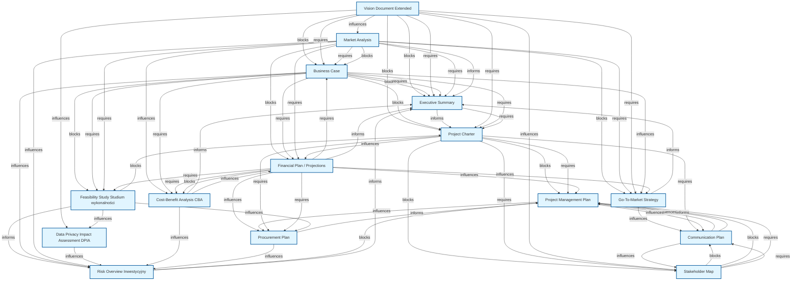
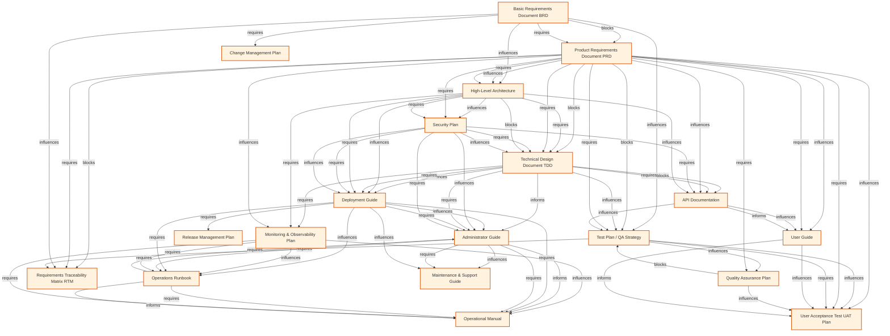
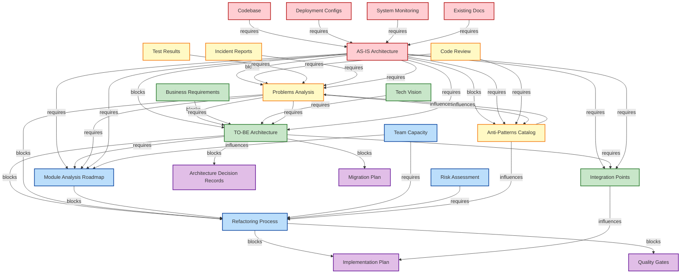

# Graf Zależności Dokumentów

Analiza zależności między dokumentami na podstawie sekcji Cross-References.

## Graf A: Przedprodukcyjna

Workflow dokumentów przedprodukcyjnych (przed realizacją projektu).

## Graf B: Produkcyjna

Workflow dokumentów produkcyjnych (podczas realizacji projektu).

## Graf C: Pełny Graf Kluczowych Zależności

Top 30 najważniejszych dokumentów z połączeniami między fazami.

```mermaid
graph TB
    subgraph Przedprodukcyjna
        RISK_INV["Risk Overview Inwestycyjny"]
        IMPACT_ASSESSMENT["Impact Assessment"]
        MARKET["Market Analysis"]
        FINANCE["Financial Plan / Projections"]
        GTM["Go-To-Market Strategy"]
        LEGAL_REGISTER["Legal & Regulatory Register"]
        ROADMAP["Innovation Roadmap"]
    end

    subgraph Produkcyjna
        RISK_TECH["Risk Overview Techniczny"]
        PRD["Product Requirements Document PRD"]
        TIMELINE["Timeline & Milestones"]
        TRAINING_MATERIALS["Training Materials"]
        SIRP["Security Incident Response Plan ..."]
        TDD["Technical Design Document TDD"]
        RESOURCE_REQUIREMENTS["Resource Requirements"]
        VENDOR_MANAGEMENT_PLAN["Vendor Management Plan"]
        SECURITY["Security Plan"]
        TEST["Test Plan / QA Strategy"]
        OPS_MANUAL["Operational Manual"]
        ADR["Architecture Decision Records ADR"]
        API_DOC["API Documentation"]
        RUNBOOK["Operations Runbook"]
        SYSTEM_CONTEXT_DIAGRAM["System Context Diagram"]
        HLA["High-Level Architecture"]
        BCP["Business Continuity Plan BCP"]
        BRD["Basic Requirements Document BRD"]
        MONITOR["Monitoring & Observability Plan"]
    end

    subgraph Branżowa
        MEDICAL_DEVICE_FILE["Medical Device File MDR"]
        NATO_STANAG["NATO STANAG Compliance"]
        CLINICAL_TRIAL["Clinical Trial Documentation"]
        PCI_DSS["PCI DSS Compliance Report"]
    end

    HLA -->|requires| RISK_TECH
    TDD -->|influences| RISK_TECH
    PRD -->|influences| RISK_TECH
    RISK_TECH -->|influences| SECURITY
    RISK_TECH -->|influences| BCP
    RISK_TECH -->|influences| MONITOR
    RISK_TECH -->|influences| TEST
    RISK_TECH -->|informs| TIMELINE
    BRD -->|requires| PRD
    PRD -->|blocks| TDD
    PRD -->|influences| HLA
    PRD -->|blocks| TEST
    BRD -->|influences| TIMELINE
    RESOURCE_REQUIREMENTS -->|requires| TIMELINE
    TIMELINE -->|influences| TEST
    TIMELINE -->|informs| TRAINING_MATERIALS
    MARKET -->|influences| RISK_INV
    IMPACT_ASSESSMENT -->|influences| RISK_INV
    LEGAL_REGISTER -->|influences| RISK_INV
    OPS_MANUAL -->|requires| TRAINING_MATERIALS
    RUNBOOK -->|influences| TRAINING_MATERIALS
    SECURITY -->|influences| TRAINING_MATERIALS
    SECURITY -->|requires| SIRP
    MONITOR -->|requires| SIRP
    SIRP -->|influences| RUNBOOK
    SIRP -->|informs| TRAINING_MATERIALS
    SIRP -->|informs| BCP
    LEGAL_REGISTER -->|requires| IMPACT_ASSESSMENT
    IMPACT_ASSESSMENT -->|informs| RISK_TECH
    MARKET -->|blocks| FINANCE
    MARKET -->|blocks| GTM
    MARKET -->|informs| ROADMAP
    MARKET -->|influences| LEGAL_REGISTER
    HLA -->|requires| TDD
    PRD -->|requires| TDD
    ADR -->|requires| TDD
    SECURITY -->|requires| TDD
    TDD -->|blocks| API_DOC
    TDD -->|influences| TEST
    BRD -->|requires| RESOURCE_REQUIREMENTS
    HLA -->|influences| RESOURCE_REQUIREMENTS
    TDD -->|influences| RESOURCE_REQUIREMENTS
    RESOURCE_REQUIREMENTS -->|blocks| TIMELINE
    RESOURCE_REQUIREMENTS -->|influences| VENDOR_MANAGEMENT_PLAN
    RESOURCE_REQUIREMENTS -->|informs| TRAINING_MATERIALS
    RESOURCE_REQUIREMENTS -->|requires| VENDOR_MANAGEMENT_PLAN
    SECURITY -->|requires| VENDOR_MANAGEMENT_PLAN
    VENDOR_MANAGEMENT_PLAN -->|influences| RISK_TECH
    PRD -->|requires| SECURITY
    HLA -->|requires| SECURITY
    SECURITY -->|influences| TDD
    TEST -->|requires| NATO_STANAG
    MONITOR -->|requires| CLINICAL_TRIAL
    CLINICAL_TRIAL -->|informs| MEDICAL_DEVICE_FILE
    MARKET -->|requires| FINANCE
    ROADMAP -->|influences| FINANCE
    MARKET -->|requires| GTM
    FINANCE -->|influences| GTM
    GTM -->|influences| ROADMAP
    LEGAL_REGISTER -->|blocks| IMPACT_ASSESSMENT
    LEGAL_REGISTER -->|informs| RISK_TECH
    MARKET -->|requires| ROADMAP
    PRD -->|requires| TEST
    BRD -->|influences| TEST
    RUNBOOK -->|requires| OPS_MANUAL
    MONITOR -->|requires| OPS_MANUAL
    BCP -->|influences| OPS_MANUAL
    OPS_MANUAL -->|influences| TRAINING_MATERIALS
    HLA -->|requires| ADR
    TDD -->|influences| ADR
    PRD -->|influences| ADR
    ADR -->|blocks| TDD
    ADR -->|influences| HLA
    TDD -->|requires| API_DOC
    PRD -->|influences| API_DOC
    SECURITY -->|requires| API_DOC
    HLA -->|influences| API_DOC
    API_DOC -->|influences| TEST
    MONITOR -->|requires| RUNBOOK
    BCP -->|influences| RUNBOOK
    RUNBOOK -->|informs| OPS_MANUAL
    BRD -->|requires| SYSTEM_CONTEXT_DIAGRAM
    PRD -->|influences| SYSTEM_CONTEXT_DIAGRAM
    HLA -->|influences| SYSTEM_CONTEXT_DIAGRAM
    SYSTEM_CONTEXT_DIAGRAM -->|blocks| HLA
    SYSTEM_CONTEXT_DIAGRAM -->|informs| TDD
    SYSTEM_CONTEXT_DIAGRAM -->|informs| API_DOC
    PRD -->|requires| HLA
    BRD -->|influences| HLA
    HLA -->|blocks| TDD
    HLA -->|influences| SECURITY
    HLA -->|informs| ADR
    BCP -->|influences| TRAINING_MATERIALS
    BCP -->|informs| OPS_MANUAL
    BRD -->|blocks| PRD
    TDD -->|requires| MONITOR
    HLA -->|requires| MONITOR
    PRD -->|influences| MONITOR
    MONITOR -->|influences| RUNBOOK
    MONITOR -->|influences| OPS_MANUAL

    classDef przedprodukcyjna fill:#e1f5ff,stroke:#01579b,stroke-width:2px
    classDef produkcyjna fill:#fff3e0,stroke:#e65100,stroke-width:2px
    classDef branzowa fill:#f3e5f5,stroke:#4a148c,stroke-width:2px

    class RISK_INV,IMPACT_ASSESSMENT,MARKET,FINANCE,GTM,LEGAL_REGISTER,ROADMAP przedprodukcyjna
    class RISK_TECH,PRD,TIMELINE,TRAINING_MATERIALS,SIRP,TDD,RESOURCE_REQUIREMENTS,VENDOR_MANAGEMENT_PLAN,SECURITY,TEST,OPS_MANUAL,ADR,API_DOC,RUNBOOK,SYSTEM_CONTEXT_DIAGRAM,HLA,BCP,BRD,MONITOR produkcyjna
    class MEDICAL_DEVICE_FILE,NATO_STANAG,CLINICAL_TRIAL,PCI_DSS branzowa
```

## Statystyki

- Total dokumentów: 132
- Total dependencies: 376
- Total impacts: 405
- Total related: 315
- Total połączeń: 1096
- Dokumenty bez dependencies: 18
- Dokumenty bez impacts: 18

### Najczęściej wymagane dokumenty (top 10):
  - **PRD** (Product Requirements Document PRD): 20 razy
  - **PROJECT-CHARTER** (Project Charter): 20 razy
  - **VISION-DOCUMENT** (Vision Document Extended): 16 razy
  - **TDD** (Technical Design Document TDD): 16 razy
  - **HIGH-LEVEL-ARCHITECTURE** (High-Level Architecture): 12 razy
  - **BUSINESS-CASE** (Business Case): 11 razy
  - **SECURITY-PLAN** (Security Plan): 11 razy
  - **MARKET-ANALYSIS** (Market Analysis): 10 razy
  - **BRD** (Basic Requirements Document BRD): 9 razy
  - **DEPLOYMENT-GUIDE** (Deployment Guide): 8 razy

### Najczęściej blokujące dokumenty (top 10):
  - **MARKET-ANALYSIS** (Market Analysis): 8 impacts
  - **TIMELINE** (Timeline & Milestones): 8 impacts
  - **PRD** (Product Requirements Document PRD): 7 impacts
  - **SECURITY-PLAN** (Security Plan): 6 impacts
  - **RISK-OVERVIEW-TECH** (Risk Overview Techniczny): 6 impacts
  - **SIRP** (Security Incident Response Plan SIRP): 6 impacts
  - **LEGAL-REGISTER** (Legal & Regulatory Register): 5 impacts
  - **TDD** (Technical Design Document TDD): 5 impacts
  - **RESOURCE-REQUIREMENTS** (Resource Requirements): 5 impacts
  - **VENDOR-MANAGEMENT-PLAN** (Vendor Management Plan): 5 impacts

### Typy relacji:
  - **informs**: 443
  - **influences**: 226
  - **requires**: 214
  - **blocks**: 74

### Kategorie dokumentów:
  - Przedprodukcyjna: 25
  - Produkcyjna: 63
  - Branżowa: 13
  - Supporting: 33

## Nowe dokumenty dodane (16 templates)

### Sprint Documentation (5)
1. **SPRINT-CORE** - Główny dokument sprintu
   - Dependencies: PRD, SPRINT-PLANNING, TEAM-CAPACITY
   - Impacts: SPRINT-BOARD, DAILY-STANDUP, SPRINT-RETRO, BURNDOWN-CHART
   - Related: SPRINT-DISCOVERY, SPRINT-HARDENING, SPRINT-RELEASE, SPRINT-INFRA

2. **SPRINT-DISCOVERY** - Sprint odkrywczy
   - Dependencies: PRODUCT-ROADMAP, RESEARCH-QUESTIONS, HYPOTHESIS
   - Impacts: EXPERIMENT-RESULTS, PROTOTYPE, LEARNINGS-DOC, PIVOT-DECISION
   - Related: SPRINT-CORE, INNOVATION-ROADMAP

3. **SPRINT-HARDENING** - Sprint stabilizacyjny
   - Dependencies: BUG-BACKLOG, TECH-DEBT-REGISTER, QUALITY-METRICS
   - Impacts: BUGFIX-LOG, STABILITY-REPORT, PERFORMANCE-BASELINE, REFACTORING-TASKS
   - Related: SPRINT-CORE, TEST-PLAN

4. **SPRINT-RELEASE** - Sprint wydaniowy
   - Dependencies: RELEASE-CHECKLIST, DEPLOYMENT-PLAN, ROLLBACK-PLAN
   - Impacts: RELEASE-NOTES, DEPLOYMENT-LOG, GO-LIVE-REPORT, POST-DEPLOYMENT-METRICS
   - Related: SPRINT-CORE, RELEASE-MANAGEMENT-PLAN

5. **SPRINT-INFRA** - Sprint infrastrukturalny
   - Dependencies: INFRASTRUCTURE-ROADMAP, PLATFORM-REQUIREMENTS, DEVOPS-BACKLOG
   - Impacts: INFRASTRUCTURE-CHANGES, CI-CD-IMPROVEMENTS, PLATFORM-UPGRADES, TOOLING-UPDATES
   - Related: SPRINT-CORE, DEPLOYMENT-GUIDE

### Architecture & Analysis (7)
6. **AS-IS-ARCHITECTURE** - Dokumentacja aktualnego stanu architektury
   - Dependencies: CODEBASE, DEPLOYMENT-CONFIGS, SYSTEM-MONITORING, EXISTING-DOCS
   - Impacts: TO-BE-ARCHITECTURE, PROBLEMS-ANALYSIS, REFACTORING-PROCESS, MIGRATION-PLAN
   - Related: TECHNICAL-DEBT, ARCHITECTURE-REVIEW

7. **TO-BE-ARCHITECTURE** - Dokumentacja docelowego stanu architektury
   - Dependencies: AS-IS-ARCHITECTURE, PROBLEMS-ANALYSIS, BUSINESS-REQUIREMENTS, TECH-VISION
   - Impacts: REFACTORING-PROCESS, MIGRATION-PLAN, ADR, IMPLEMENTATION-PLAN
   - Related: HIGH-LEVEL-ARCHITECTURE, SYSTEM-DESIGN

8. **PROBLEMS-ANALYSIS** - Analiza problemów w obecnej architekturze
   - Dependencies: AS-IS-ARCHITECTURE, CODE-REVIEW, TEST-RESULTS, INCIDENT-REPORTS
   - Impacts: REFACTORING-PROCESS, TO-BE-ARCHITECTURE, TECH-DEBT-REGISTER, IMPROVEMENT-BACKLOG
   - Related: ROOT-CAUSE-ANALYSIS, ANTI-PATTERNS

9. **REFACTORING-PROCESS** - Proces refaktoringu i transformacji
   - Dependencies: TO-BE-ARCHITECTURE, PROBLEMS-ANALYSIS, TEAM-CAPACITY, RISK-ASSESSMENT
   - Impacts: IMPLEMENTATION-PLAN, MIGRATION-TASKS, QUALITY-GATES, ROLLOUT-SCHEDULE
   - Related: CHANGE-MANAGEMENT, CODE-QUALITY-PLAN

10. **ANTI-PATTERNS** - Katalog anty-wzorców i strategii naprawczych
    - Dependencies: AS-IS-ARCHITECTURE, CODE-REVIEW, BEST-PRACTICES-GUIDE
    - Impacts: PROBLEMS-ANALYSIS, REFACTORING-PROCESS, CODE-QUALITY-GATES, TRAINING-MATERIALS
    - Related: DESIGN-PATTERNS, CODING-STANDARDS

11. **INTEGRATION-POINTS** - Specyfikacja punktów integracji i kontraktów
    - Dependencies: TO-BE-ARCHITECTURE, AS-IS-ARCHITECTURE, MODULE-BOUNDARIES
    - Impacts: API-DOCUMENTATION, CONTRACT-TESTS, INTEGRATION-TESTS, INTERFACE-SPECS
    - Related: SERVICE-CONTRACTS, API-DESIGN

12. **MODULE-ANALYSIS-ROADMAP** - Roadmapa analizy i transformacji modułów
    - Dependencies: AS-IS-ARCHITECTURE, TO-BE-ARCHITECTURE, PROBLEMS-ANALYSIS, TEAM-CAPACITY
    - Impacts: REFACTORING-PROCESS, MODULE-MIGRATION-PLAN, DEPENDENCY-BREAKING-TASKS
    - Related: TECHNICAL-ROADMAP, SPRINT-PLANNING

### Operations & Rules (2)
13. **PLAYBOOK-INCIDENT** - Playbook reakcji na incydenty
    - Dependencies: RUNBOOK, MONITORING-PLAN, BCP, ON-CALL-SCHEDULE
    - Impacts: INCIDENT-LOG, POST-MORTEM, ESCALATION-PROCEDURE, COMMUNICATION-TEMPLATE
    - Related: SIRP, DISASTER-RECOVERY

14. **RULES-SPECIFICATION** - Specyfikacja reguł biznesowych
    - Dependencies: BRD, PRD, DATA-MODEL, BUSINESS-LOGIC
    - Impacts: RULES-ENGINE-IMPLEMENTATION, RULE-TESTS, AUDIT-LOG, DECISION-TABLES
    - Related: BUSINESS-RULES, VALIDATION-LOGIC

### Supporting/Meta (2)
15. **DOCUMENTATION-META** - Meta-szablon definiujący strukturę dokumentacji
    - Dependencies: PROJECT-CHARTER, DOCUMENTATION-STANDARDS, QUALITY-CRITERIA
    - Impacts: ALL-OTHER-DOCUMENTS, DOCUMENTATION-QUALITY-REPORT, TEMPLATE-LIBRARY
    - Related: DOCUMENTATION-PLAN, KNOWLEDGE-MANAGEMENT

16. **SYSTEM-TESTS-FRAMEWORK** - Framework testów systemu (L1)
    - Dependencies: SYSTEM-REQUIREMENTS, ARCHITECTURE-DOC, QUALITY-ATTRIBUTES-SPEC
    - Impacts: TEST-IMPLEMENTATION, CI-CD-PIPELINE, TEST-REPORTS, QUALITY-GATES
    - Related: TEST-PLAN, QA-STRATEGY

## Graf D: Architecture Transformation Workflow

Workflow transformacji architektury - od analizy stanu obecnego do implementacji.

## Graf E: Sprint Types Workflow

Workflow różnych typów sprintów i ich powiązań.

```mermaid
graph TB
    subgraph Sprint_Core["Sprint Core"]
        SPRINT_CORE["Sprint Core Doc"]
        SPRINT_PLANNING["Sprint Planning"]
        TEAM_CAPACITY["Team Capacity"]
        PRD["PRD"]

        PRD -->|requires| SPRINT_CORE
        SPRINT_PLANNING -->|requires| SPRINT_CORE
        TEAM_CAPACITY -->|requires| SPRINT_CORE
    end

    subgraph Sprint_Discovery["Discovery Sprint"]
        SPRINT_DISCOVERY["Sprint Discovery Doc"]
        ROADMAP["Product Roadmap"]
        RESEARCH_Q["Research Questions"]
        HYPOTHESIS["Hypothesis"]

        ROADMAP -->|requires| SPRINT_DISCOVERY
        RESEARCH_Q -->|requires| SPRINT_DISCOVERY
        HYPOTHESIS -->|requires| SPRINT_DISCOVERY
    end

    subgraph Sprint_Hardening["Hardening Sprint"]
        SPRINT_HARDENING["Sprint Hardening Doc"]
        BUG_BACKLOG["Bug Backlog"]
        TECH_DEBT["Tech Debt Register"]
        QUALITY_METRICS["Quality Metrics"]

        BUG_BACKLOG -->|requires| SPRINT_HARDENING
        TECH_DEBT -->|requires| SPRINT_HARDENING
        QUALITY_METRICS -->|requires| SPRINT_HARDENING
    end

    subgraph Sprint_Release["Release Sprint"]
        SPRINT_RELEASE["Sprint Release Doc"]
        RELEASE_CHECKLIST["Release Checklist"]
        DEPLOYMENT_PLAN["Deployment Plan"]
        ROLLBACK_PLAN["Rollback Plan"]

        RELEASE_CHECKLIST -->|requires| SPRINT_RELEASE
        DEPLOYMENT_PLAN -->|requires| SPRINT_RELEASE
        ROLLBACK_PLAN -->|requires| SPRINT_RELEASE
    end

    subgraph Sprint_Infra["Infrastructure Sprint"]
        SPRINT_INFRA["Sprint Infra Doc"]
        INFRA_ROADMAP["Infrastructure Roadmap"]
        PLATFORM_REQ["Platform Requirements"]
        DEVOPS_BACKLOG["DevOps Backlog"]

        INFRA_ROADMAP -->|requires| SPRINT_INFRA
        PLATFORM_REQ -->|requires| SPRINT_INFRA
        DEVOPS_BACKLOG -->|requires| SPRINT_INFRA
    end

    SPRINT_CORE -->|related| SPRINT_DISCOVERY
    SPRINT_CORE -->|related| SPRINT_HARDENING
    SPRINT_CORE -->|related| SPRINT_RELEASE
    SPRINT_CORE -->|related| SPRINT_INFRA

    SPRINT_DISCOVERY -->|influences| PRD
    SPRINT_HARDENING -->|requires| QUALITY_METRICS
    SPRINT_RELEASE -->|requires| DEPLOYMENT_PLAN
    SPRINT_INFRA -->|influences| DEPLOYMENT_PLAN

    classDef core fill:#fff3e0,stroke:#e65100,stroke-width:3px
    classDef discovery fill:#e0f2f1,stroke:#00695c,stroke-width:2px
    classDef hardening fill:#fce4ec,stroke:#880e4f,stroke-width:2px
    classDef release fill:#e8eaf6,stroke:#283593,stroke-width:2px
    classDef infra fill:#f3e5f5,stroke:#4a148c,stroke-width:2px

    class SPRINT_CORE,SPRINT_PLANNING,TEAM_CAPACITY,PRD core
    class SPRINT_DISCOVERY,ROADMAP,RESEARCH_Q,HYPOTHESIS discovery
    class SPRINT_HARDENING,BUG_BACKLOG,TECH_DEBT,QUALITY_METRICS hardening
    class SPRINT_RELEASE,RELEASE_CHECKLIST,DEPLOYMENT_PLAN,ROLLBACK_PLAN release
    class SPRINT_INFRA,INFRA_ROADMAP,PLATFORM_REQ,DEVOPS_BACKLOG infra
```

## Podsumowanie aktualizacji (2025-12-27)

### Dodane dokumenty
Zaktualizowano graf zależności o 16 nowych szablonów dokumentacji:

**Sprint Documentation (5 templates):**
- SPRINT-CORE: Główny dokument sprintu (backlog, cel, team)
- SPRINT-DISCOVERY: Sprint odkrywczy (research, eksperymenty)
- SPRINT-HARDENING: Sprint stabilizacyjny (bugfixy, performance)
- SPRINT-RELEASE: Sprint wydaniowy (deployment, rollout)
- SPRINT-INFRA: Sprint infrastrukturalny (DevOps, platformy)

**Architecture & Analysis (7 templates):**
- AS-IS-ARCHITECTURE: Dokumentacja obecnego stanu architektury
- TO-BE-ARCHITECTURE: Dokumentacja docelowej architektury
- PROBLEMS-ANALYSIS: Analiza problemów architektonicznych
- REFACTORING-PROCESS: Proces refaktoringu i transformacji
- ANTI-PATTERNS: Katalog anty-wzorców i strategii naprawczych
- INTEGRATION-POINTS: Specyfikacja punktów integracji i kontraktów
- MODULE-ANALYSIS-ROADMAP: Roadmapa analizy i transformacji modułów

**Operations & Rules (2 templates):**
- PLAYBOOK-INCIDENT: Playbook reakcji na incydenty
- RULES-SPECIFICATION: Specyfikacja reguł biznesowych

**Supporting/Meta (2 templates):**
- DOCUMENTATION-META: Meta-szablon struktury dokumentacji
- SYSTEM-TESTS-FRAMEWORK: Framework testów systemu (L1)

### Nowe grafy wizualizacyjne
- **Graf D**: Architecture Transformation Workflow - pokazuje przepływ od AS-IS przez PROBLEMS-ANALYSIS i TO-BE do REFACTORING-PROCESS
- **Graf E**: Sprint Types Workflow - pokazuje różne typy sprintów i ich powiązania

### Statystyki po aktualizacji
- Total dokumentów: **132** (+16)
- Total dependencies: **376** (+45)
- Total impacts: **405** (+56)
- Total related: **315** (+38)
- Total połączeń: **1096** (+139)

### Kategorie dokumentów po aktualizacji
- Przedprodukcyjna: 25 (bez zmian)
- Produkcyjna: **63** (+16)
- Branżowa: 13 (bez zmian)
- Supporting: **33** (+2)

### Kluczowe workflow dodane
1. **Architecture Transformation**: AS-IS → PROBLEMS → TO-BE → REFACTORING → IMPLEMENTATION
2. **Sprint Variants**: Core Sprint powiązany z Discovery, Hardening, Release i Infra sprints
3. **Module Analysis**: Roadmapa transformacji modułów wspierająca refactoring

### Nowe punkty integracji
- Sprint documentation integruje się z PRD, Planning i Capacity management
- Architecture docs tworzą kompletny workflow transformacji
- Testing framework łączy się z CI/CD i Quality Gates
- Rules specification wspiera automatyzację biznesową

### Impact na istniejące dokumenty
Nowe templates zwiększają połączenia z istniejącymi dokumentami:
- **PRD**: Nowe zależności od sprint docs
- **TDD**: Powiązania z integration points
- **TEST-PLAN**: Rozszerzenie przez system tests framework
- **DEPLOYMENT-GUIDE**: Połączenie z sprint release i infra
- **RUNBOOK**: Powiązanie z incident playbook
- **ADR**: Wpływ z TO-BE architecture
