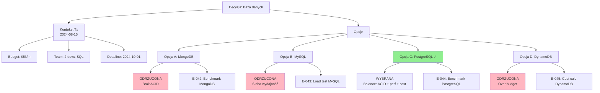

# Część 0: Filozofia Proof System

← [Powrót do głównego dokumentu](./koncepcje-v2.md) | [Następna: Definicje →](./koncepcje-v2-definicje.md)

---

## Wprowadzenie: Rewolucja Paradygmatu

Tradycyjne podejście traktuje dokument jako **„tekst do edycji"**.

**To podejście traktuje dokument jako żywy organizm wzajemnie powiązanych artefaktów**, gdzie każdy element ma swoją tożsamość, historię i sieć powiązań.

### Źródło filozofii

Filozofia proof system pochodzi z dokumentu:
- **[Odpowiedź_08.md](/home/jerzy/Dokumenty/Odpowiedzi/Odpowiedź_08.md)** - "Niestandardowe podejście do dokumentacji: System dokumentacyjny z pełną audytowalnością i grafem decyzyjnym"

Przykłady konkretne:
- **[Przykłady do Odpowiedź 8.md](/home/jerzy/Dokumenty/Odpowiedzi/Przykłady do Odpowiedź 8.md)** - 4 szczegółowe przykłady zastosowania

---

## Fundamentalne Zasady (5 Filarów)

### 1. Dokument = Kolekcja Artefaktów z Własnymi Szablonami

Każdy typ dokumentu (ADR, RFC, raport techniczny, specyfikacja) posiada:

#### Dedykowane szablony jako osobne artefakty
- Szablon nie jest "pustym plikiem"
- Szablon to **aktywny artefakt** z metadanymi
- Szablon definiuje: sekcje, bramki, walidatory, satelity

#### Własne powiązania wewnętrzne między sekcjami
- Sekcja A wpływa na sekcję B (bramka wewnętrzna)
- Zmiana w A wywołuje weryfikację B
- Graf zależności **wewnątrz dokumentu**

#### Mechanizm wpływu
Każda sekcja ma zdefiniowane:
- **Co na nią wpływa** (bramki wejścia)
- **Na co ona wpływa** (bramki wyjścia)

**Przykład:**

```markdown
## Sekcja: Wymagania Niefunkcjonalne

### Bramki wejścia (co wpływa na tę sekcję)
- Sekcja "Use Cases" → definiuje ruch (10k req/s)
- Sekcja "Budget" → ogranicza infrastrukturę ($5k/miesiąc)

### Bramki wyjścia (na co ta sekcja wpływa)
- Sekcja "Architektura" → musi spełnić NFR
- Sekcja "Testy Wydajnościowe" → musi weryfikować metryki
- Sekcja "Oszacowanie Kosztów" → musi uwzględnić infrastrukturę
```

**Zmiana w "Wymagania Niefunkcjonalne"** (np. ruch 10k → 50k req/s) automatycznie wywołuje weryfikację wpływu na sekcje: Architektura, Testy, Koszty.

---

### 2. Bramki Wejścia/Wyjścia: Globalne i Wewnętrzne

**To nie jest statyczny hyperlink — to aktywny mechanizm kaskadowego wpływu.**

#### Bramki Globalne (między dokumentami)

**Przykład:**
```yaml
# ADR-005: "Wybór bazy danych"

## Bramki wejścia (co wpłynęło na ten dokument)
dependencies:
  - id: RFC-2024-08
    title: "Architektura Cart Service"
    type: requires
    reason: "Definiuje wymagania ACID i latencji"

  - id: ADR-003
    title: "Standardy persystencji danych"
    type: requires
    reason: "Wymaga zgodności z ACID"

## Bramki wyjścia (na co ten dokument wpływa)
impacts:
  - id: IMPL-CART-DB
    title: "Implementacja warstwy persystencji"
    type: blocks
    until: "ADR-005 status = approved"

  - id: OPS-RUNBOOK-07
    title: "Backup strategy"
    type: informs
    reason: "Definiuje typ bazy (PostgreSQL)"
```

**Mechanizm kaskadowy:**
- Zmiana w ADR-003 → propaguje się do ADR-005
- ADR-005 blokuje IMPL-CART-DB do czasu zatwierdzenia
- Zmiana typu bazy w ADR-005 → wymaga aktualizacji OPS-RUNBOOK-07

#### Bramki Wewnętrzne (w obrębie dokumentu)

**Przykład (PRD):**
```markdown
## Sekcja: Założenia Budżetowe
Budget: $5,000/miesiąc na infrastrukturę

### Bramki wyjścia (wewnętrzne)
- Sekcja "Wybór Technologii" → musi zmieścić się w budżecie
- Sekcja "Szacowanie Kosztów" → musi uwzględnić limit
- Sekcja "Strategia Skalowania" → ograniczona budżetem
```

**Zmiana budżetu $5k → $10k:**
- System wykrywa 3 sekcje do ponownej weryfikacji
- Generuje TODO: "Re-evaluate tech choices with higher budget"
- Tworzy lukę E180 jeśli sekcje nie zostały zaktualizowane

---

### 3. Graf Decyzyjny: Absolutna Ścieżka Audytowa

**Większość systemów dokumentacyjnych pokazuje „co jest teraz".**

**Ten system pokazuje:**
1. **Co było** (historia)
2. **Dlaczego jest teraz tak a nie inaczej** (proces decyzyjny)
3. **Jakie były alternatywy** (opcje odrzucone)
4. **Kontekst decyzji** (dostępne informacje w momencie wyboru)

#### Struktura Grafu Decyzyjnego

```
Decyzja: Wybór bazy danych dla Cart Service
│
├── Kontekst globalny w momencie T₀ (2024-08-15)
│   ├── Dostępne zasoby: $5k/miesiąc, 2 backend devs
│   ├── Ograniczenia biznesowe: Launch do 2024-10-01
│   ├── Stan technologii: PostgreSQL 16, MySQL 8.0, MongoDB 7.0
│   └── Wymogi regulacyjne: GDPR (dane EU)
│
├── Kontekst wewnętrzny dokumentu
│   ├── Poprzednie decyzje: ADR-003 wymaga ACID
│   ├── Założenia bazowe: 10k req/s, 99.9% uptime
│   └── Constraints: Team zna SQL, nie zna NoSQL
│
├── Opcje rozważane
│   ├── Opcja A: MongoDB
│   │   ├── Benchmark: 15k writes/s, 50ms p99
│   │   ├── Cost: $3k/miesiąc (Atlas M40)
│   │   ├── ODRZUCONA: Brak ACID (wymóg z ADR-003)
│   │   └── Evidence: [E-042] Benchmark report
│   │
│   ├── Opcja B: MySQL 8.0
│   │   ├── Benchmark: 8k writes/s, 80ms p99
│   │   ├── Cost: $2k/miesiąc (RDS db.m5.large)
│   │   ├── ODRZUCONA: Słaba wydajność na write-heavy workload
│   │   └── Evidence: [E-043] Load testing results
│   │
│   ├── Opcja C: PostgreSQL 16
│   │   ├── Benchmark: 12k writes/s, 60ms p99
│   │   ├── Cost: $2.5k/miesiąc (RDS db.m5.large)
│   │   ├── WYBRANA ✓
│   │   └── Evidence: [E-044] Comparative benchmark
│   │
│   └── Opcja D: DynamoDB
│       ├── Benchmark: 25k writes/s, 30ms p99
│       ├── Cost: $6k/miesiąc (provisioned capacity)
│       ├── ODRZUCONA: Over budget + vendor lock-in
│       └── Evidence: [E-045] AWS cost calculator
│
└── Uzasadnienie wyboru (Opcja C: PostgreSQL)
    ├── Dlaczego PostgreSQL, a nie MongoDB?
    │   → ACID compliance (wymóg z ADR-003)
    │   → Team expertise (SQL > NoSQL)
    │
    ├── Dlaczego PostgreSQL, a nie MySQL?
    │   → Lepsza wydajność write (12k vs 8k writes/s)
    │   → Advanced indexing (GIN, GiST dla JSON)
    │
    ├── Dlaczego PostgreSQL, a nie DynamoDB?
    │   → Budget constraint ($2.5k vs $6k)
    │   → Avoid vendor lock-in
    │
    └── Jakie ryzyka akceptujemy?
        → Lower throughput niż DynamoDB (12k vs 25k)
        → Mitigation: Horizontal sharding jeśli > 10k req/s
        → Re-evaluation trigger: Traffic > 8k req/s przez 7 dni
```

**To jest jak „git log" dla decyzji**, ale z wyeksponowaniem **dróg niewykorzystanych** i **uzasadnieniem każdego rozwidlenia**.

#### Wizualizacja Mermaid



---

### 4. Storytelling jako Metoda Weryfikacji Zrozumienia

**Tradycyjna dokumentacja to lista faktów.**

**Ten system wymaga narracji**, ponieważ:

#### 1. Narracja wymusza zrozumienie
Nie można spójnie opowiedzieć czegoś, czego się nie rozumie.

#### 2. Narracja ujawnia luki
Miejsca, gdzie "nie ma historii", to miejsca bez zrozumienia.

#### 3. Narracja jest testowalna
Można weryfikować czy osoba X rozumie system, prosząc ją o opowiedzenie jego ewolucji.

#### Przykład Storytellingu w Praktyce

**❌ ZAMIAST (lista faktów):**
```markdown
System używa Redis jako cache. TTL ustawiony na 300s.
```

**✅ WYMAGANA FORMA (narracja):**
```markdown
## Historia decyzji: Redis jako cache

Początkowo rozważaliśmy **cache in-memory** (Opcja A) używając Python dictionaries
z LRU eviction. Odrzuciliśmy to ze względu na brak współdzielenia między replikami
— każdy pod miałby własny cache, co przy 5 replikach oznaczało 5x więcej cache misses
i 5x większe obciążenie bazy danych.

Następnie testowaliśmy **Memcached** (Opcja B). Benchmark pokazał dobrą wydajność
(20k ops/s), ale zrezygnowaliśmy z powodu braku persystencji przy restarcie.
Nasz typowy restart (deploy nowej wersji) trwał 30s, w tym czasie cache był pusty,
co powodowało spike na bazie danych z ~100 req/s do ~2000 req/s.

Wybraliśmy **Redis** (Opcja C), akceptując koszt większej złożoności operacyjnej
(backup, clustering, monitoring). W kontekście naszego ruchu (10k req/s) i SLA (99.9%)
persystencja cache była krytyczna. Incydent z 2024-07-10 [E-051] pokazał, że cold
cache po restarcie powodował 15-minutowy spike latencji (p99: 50ms → 800ms),
co łamało SLA.

**TTL 300s** wynika z analizy częstotliwości zmian danych źródłowych. Raport
PERF-2024-03 [E-052] pokazał, że mediana częstotliwości updatów produktów to 4 minuty.
TTL=300s (5 min) oznacza, że ~80% requestów trafia w aktualny cache, a ~20%
może widzieć dane z poprzedniego update (akceptowalne dla product catalog,
nie dla cart/checkout).

**Re-evaluation trigger**: Jeśli mediana częstotliwości updatów spadnie < 3 min
przez 7 dni, rozważymy obniżenie TTL do 180s lub wprowadzenie cache invalidation.
```

**To nie jest gadulstwo — to jest mapa myślenia.**

#### Storytelling Validation

System automatycznie wykrywa brak storytellingu:

**Luka E180**: Sekcja zawiera tylko fakty, brak narracji
```yaml
gap:
  id: E180
  type: missing-storytelling
  severity: medium
  location: "prd.md:245-250"
  description: "Sekcja 'Caching Strategy' to lista faktów, brak kontekstu decyzyjnego"
  remediation:
    - "Opisz proces decyzyjny: jakie opcje rozważano?"
    - "Dodaj uzasadnienie: dlaczego ta opcja, nie inne?"
    - "Dołącz evidence: testy, benchmarki, incydenty"
    - "Zdefiniuj re-evaluation trigger"
```

---

### 5. Niemutowalność z Pełną Ścieżką Audytu

**Żelazna zasada: Nic bez DoR → Zmiana → DoD → Post-mortem**

Każda zmiana w systemie (kod, dokumentacja, konfiguracja) **musi przejść przez pełny cykl**:

#### FAZA 1: Definition of Ready (DoR)

**Przed rozpoczęciem pracy:**
```yaml
DoR Checklist:
  - [ ] Dokument decyzyjny stworzony (ADR/RFC)
  - [ ] Analiza wpływu ukończona (które komponenty będą dotknięte?)
  - [ ] Opcje alternatywne rozważone (co jeszcze mogliśmy zrobić?)
  - [ ] Evidence zebrane (benchmarki, testy, research)
  - [ ] Akceptacja stakeholderów (approval documents)
  - [ ] Bramki wejścia zidentyfikowane (co blokuje start?)
  - [ ] Bramki wyjścia zdefiniowane (na co wpłynie zmiana?)
  - [ ] Satellite documents created (TODO, DOR, DOD)
```

**Bramka**: Nie można rozpocząć pracy jeśli DoR nie jest spełniony.

#### FAZA 2: Realizacja Zmiany (Implementation Log)

**W trakcie implementacji - dziennik realizacji:**
```markdown
## Implementation Log: IMPL-CART-DB-001

### 2024-08-20: Rozpoczęcie implementacji
- Setup: PostgreSQL RDS db.m5.large
- Status: Provisioning (15 min)

### 2024-08-21: Nieoczekiwane odkrycie #1
**Problem**: Connection pooling domyślnie ustawione na 100 connections.
**Impact**: Przy 5 replikach = 500 connections, limit RDS = 400.
**Rozwiązanie**: Obniżyliśmy pool size do 60/replica = 300 total.
**Evidence**: [E-055] RDS connection limit docs
**Decyzja**: Akceptujemy ryzyko connection starvation przy > 8k req/s.
**Re-evaluation**: Monitoring alert jeśli wait_for_connection > 50ms p99.

### 2024-08-22: Zmiana w pierwotnym planie
**Oryginalny plan**: Single master, streaming replication.
**Zmiana**: Multi-AZ deployment (master + standby).
**Powód**: Incident z 2024-07-10 pokazał, że single-AZ ma SPOF.
**Cost impact**: +$800/miesiąc (total: $3.3k vs budżet $2.5k).
**Approval**: CFO approved over-budget [E-056] email z 2024-08-22.

### 2024-08-23: Edge case discovered
**Case**: Query timeout przy full-table scan na products (2M rows).
**Solution**: Added GIN index na jsonb column (product_attributes).
**Performance**: Query time 5000ms → 50ms.
**Evidence**: [E-057] EXPLAIN ANALYZE output.
```

**Cel**: Każde odkrycie, każda zmiana planu, każdy edge case — wszystko zapisane.

#### FAZA 3: Definition of Done (DoD)

**Weryfikacja ukończenia:**
```yaml
DoD Checklist:
  - [ ] Wszystkie acceptance criteria spełnione
  - [ ] Metryki przed/po zmierzone
    - Before: MySQL 8k writes/s, 80ms p99
    - After: PostgreSQL 12k writes/s, 60ms p99 ✓
  - [ ] Testy akceptacyjne przeszły (unit, integration, load)
  - [ ] Documentation zaktualizowana
  - [ ] Runbook zaktualizowany (OPS-RUNBOOK-07)
  - [ ] Monitoring dashboards utworzone
  - [ ] Stakeholder sign-off otrzymany
```

**Bramka**: Nie można zamknąć zadania jeśli DoD nie jest spełniony.

#### FAZA 4: Post-mortem (nawet przy sukcesie!)

**Retrospektywa obowiązkowa:**
```markdown
## Post-mortem: IMPL-CART-DB-001

### Status: ✓ Success (deployed 2024-08-25)

### Co działało lepiej niż oczekiwano?
1. **Migration speed**: 2M rows w 15 min (oczekiwano 60 min)
   - Powód: COPY command zamiast INSERT
   - Learning: Use COPY for bulk migrations

2. **Stabilność**: Zero downtime, zero rollback
   - Powód: Blue-green deployment z 5-min validation
   - Learning: Blue-green essential for DB migrations

### Co poszło gorzej niż oczekiwano?
1. **Budget overrun**: $3.3k vs $2.5k (over budget $800/m)
   - Powód: Multi-AZ nie był w oryginalnym planie
   - Impact: OK (CFO approved), ale wymaga recurrent approval co 6 miesięcy

2. **Connection pooling issue**: Niewykryte w load testing
   - Powód: Load test używał 3 replicas, prod ma 5
   - Learning: Always load test z production-like topology

### Co zrobilibyśmy inaczej?
1. **Zaplanować Multi-AZ od początku** zamiast jako reaktywna zmiana
2. **Load test z production topology** (5 replicas, nie 3)
3. **Buffer budget +20%** dla nieprzewidzianych kosztów

### Triggers dla re-evaluation
1. **Traffic > 8k req/s przez 7 dni** → rozważ sharding
2. **Connection wait time > 50ms p99** → zwiększ pool size / dodaj connection pooler (pgBouncer)
3. **Cost > $4k/miesiąc przez 3 miesiące** → re-evaluate cheaper options

### Metryki sukcesu (90 dni po deploy)
- [ ] Latency p99 < 80ms (target: 60ms)
- [ ] Uptime > 99.9% (target: 99.9%)
- [ ] Zero data loss incidents
- [ ] Budget < $3.5k/miesiąc

**Post-mortem review date**: 2024-11-25 (90 dni po deploy)
```

---

## Porównanie z Tradycyjnym Podejściem

| Aspekt | Standardowe podejście | Proof System |
|--------|----------------------|--------------|
| **Edycja dokumentu** | "Edit in place" | Immutable + wersjonowanie decyzji |
| **Historia zmian** | Git log (techniczna) | Graf decyzyjny (semantyczny) |
| **Zależności** | Hyperlinki (statyczne) | Bramki wpływu (aktywne, kaskadowe) |
| **Uzasadnienie** | Opcjonalne | Obowiązkowe dla każdej zmiany |
| **Opcje odrzucone** | Niezapisywane | Część grafu (równie ważne co wybrane) |
| **Weryfikacja zrozumienia** | Code review | Storytelling + test narracji |
| **Audytowalność** | "Co się zmieniło?" | "Dlaczego? W jakim kontekście? Jakie były alternatywy?" |
| **Cykl życia zmiany** | Commit → PR → Merge | DoR → Impl Log → DoD → Post-mortem |
| **Dowody** | Brak systemu | Research-grade ([E-XXX] notacje) |
| **Koszt zmiany** | Niski (łatwo zmienić) | Wysoki (celowo!) - wymusza przemyślenie |

---

## Praktyczne Implikacje

### 1. Każda zmiana jest kosztowna (celowo!)

**Jeśli zmiana wymaga:**
- DoR (analiza wpływu, opcje alternatywne, evidence)
- Implementation Log (dziennik realizacji)
- DoD (weryfikacja metryk)
- Post-mortem (retrospektywa)

**To wymusza przemyślenie**, czy jest niezbędna.

**Rezultat**: Eliminuje „śmieciowe commity" i impulsywne zmiany.

### 2. Wiedza nie ginie przy rotacji ludzi

**Nowa osoba może:**
- Prześledzić graf decyzyjny
- Zrozumieć "dlaczego system wygląda tak, a nie inaczej"
- Przeczytać implementation logi (nieoczekiwane odkrycia)
- Zobaczyć post-mortemy (co działało/nie działało)

**Bez pytania seniorów.**

### 3. Compliance „za darmo"

Systemy regulowane (finanse, medycyna, aerospace) mają te same wymagania:
- Pełna ścieżka audytowa
- Uzasadnienie każdej decyzji
- Evidence-based decisions
- Retrospektywa i continuous improvement

**Ten system je spełnia z designu**, nie jako dodatek.

### 4. Debugging decyzji biznesowych

Gdy CEO pyta:
> "Dlaczego wydaliśmy $100k na ten moduł?"

Odpowiedź nie jest:
> "Bo dev tak uznał"

Odpowiedź to:
> **Clickable path przez ADR-y, RFC-y, evidence notes i metryki:**
> - [ADR-012] Wybór frameworku → uzasadnienie dlaczego React, nie Vue
> - [E-089] Benchmark React vs Vue → React 20% szybszy dla naszego use case
> - [BIZ-CASE-003] ROI analysis → payback 18 miesięcy
> - [POST-MORTEM-004] Retrospektywa po 6 miesiącach → metryki spełnione, ROI on track

---

## Podsumowanie: Dokumentacja jako Proof System

To nie jest "dokumentacja", to **system dowodowy** w stylu:

### Matematyka formalna
- Każde twierdzenie ma dowód
- Każdy dowód składa się z kroków
- Każdy krok jest weryfikowalny

### Prawo sądowe
- Każdy wyrok ma uzasadnienie
- Każde uzasadnienie odwołuje się do precedensów
- Każdy precedens jest udokumentowany

### Nauka eksperymentalna
- Każda konkluzja ma metodologię
- Każda metodologia ma dane
- Każde dane są replikowalne

---

**Cena**: Większy upfront cost (trzeba pisać więcej).

**Korzyść**:
- Zerowy technical debt w warstwie decyzyjnej
- Pełna audytowalność
- Transferowalność wiedzy
- Compliance z regulacjami
- Możliwość debugowania decyzji biznesowych

---

← [Powrót do głównego dokumentu](./koncepcje-v2.md) | [Następna: Definicje →](./koncepcje-v2-definicje.md)
