# Część 4: Przykłady Proof System

← [Poprzednia: Funkcje](./koncepcje-v2-funkcje.md) | [Powrót do głównego dokumentu](./koncepcje-v2.md)

---

## Wprowadzenie

Ten dokument pokazuje **konkretne przykłady** zastosowania proof system w praktyce. Każdy przykład to real-world scenario z pełnymi artefaktami.

**Źródło przykładów**: [Przykłady do Odpowiedź 8.md](/home/jerzy/Dokumenty/Odpowiedzi/Przykłady%20do%20Odpowiedź%208.md)

---

## Przykład 1: ADR z Pełnymi Bramkami

### Kontekst

**Dokument**: ADR-005 "Wybór bazy danych dla Cart Service"
**Data**: 2024-08-15
**Decision Maker**: Tech Lead + Backend Team

### Pełny Dokument z Bramkami

```markdown
---
id: ADR-005
title: "Wybór bazy danych dla Cart Service"
type: adr
status: approved
created: 2024-08-15
updated: 2024-08-22
decision_date: 2024-08-15
decision_maker: ["Tech Lead", "Backend Team"]

# Bramki wejścia (co wpłynęło na ten dokument)
dependencies:
  - id: RFC-2024-08
    title: "Architektura Cart Service"
    type: requires
    status_constraint: [approved, completed]
    reason: "Definiuje wymagania ACID i latencji"
    evidence: ["E-040"]

  - id: ADR-003
    title: "Standardy persystencji danych"
    type: requires
    status_constraint: [approved]
    reason: "Wymaga zgodności z ACID"
    evidence: ["E-041"]

# Bramki wyjścia (na co ten dokument wpływa)
impacts:
  - id: IMPL-CART-DB
    title: "Implementacja warstwy persystencji Cart"
    type: blocks
    until: "ADR-005.status == approved"
    reason: "Implementacja nie może ruszyć bez zatwierdzonej architektury"
    cascade: true

  - id: OPS-RUNBOOK-07
    title: "Backup strategy"
    type: informs
    reason: "Typ bazy determinuje strategię backupu"
    cascade: true

  - id: TEST-PLAN-002
    title: "Load testing plan"
    type: informs
    reason: "Benchmarki bazy wpływają na test scenarios"
    cascade: false

# Context snapshot (T₀)
context_snapshot:
  budget: "$5k/month"
  team_size: 2
  team_skills: ["SQL", "Python"]
  timeline: "Launch by 2024-10-01"
  constraints:
    - "GDPR compliance (data in EU)"
    - "ACID required (from ADR-003)"

# Evidence trail
evidence_ids:
  - "E-042"  # MongoDB benchmark
  - "E-043"  # MySQL benchmark
  - "E-044"  # PostgreSQL benchmark
  - "E-045"  # DynamoDB cost analysis
  - "E-051"  # Incident report (cold cache)
  - "E-056"  # CFO approval (budget increase)

# Alternatives considered
alternatives:
  - id: "OPTION-A"
    title: "MongoDB"
    status: rejected
    reason: "Brak ACID compliance (ADR-003 requirement)"

  - id: "OPTION-B"
    title: "MySQL 8.0"
    status: rejected
    reason: "Słaba wydajność write (8k < 10k req/s target)"

  - id: "OPTION-C"
    title: "PostgreSQL 16"
    status: selected

  - id: "OPTION-D"
    title: "DynamoDB"
    status: rejected
    reason: "Over budget + vendor lock-in"

# Satellites
satellites:
  - "TODO-ADR-005"
  - "IMPL-LOG-ADR-005"
  - "POST-MORTEM-ADR-005"
  - "DOR-ADR-005"
  - "DOD-ADR-005"
---

# ADR-005: Wybór bazy danych dla Cart Service

## Bramki wejścia (co wpłynęło na ten dokument)

### Globalne
- **[RFC-2024-08]** "Architektura Cart Service" → definiuje wymagania:
  - ACID transactions (cart operations must be atomic)
  - Latency p99 < 100ms
  - Throughput: 10k req/s (70% writes, 30% reads)
  - Evidence: [E-040] RFC-2024-08 approved 2024-07-30

- **[ADR-003]** "Standardy persystencji danych" → wymaga:
  - Wszystkie user-facing data stores: ACID compliance
  - Eventual consistency only for analytics/reporting
  - Evidence: [E-041] ADR-003 approved 2024-06-15

### Wewnętrzne (między sekcjami tego dokumentu)
- Sekcja "Context" → wpływa na "Decision" (constraints determinują opcje)
- Sekcja "Alternatives" → wpływa na "Consequences" (rejected options = accepted risks)

---

## Bramki wyjścia (na co ten dokument wpływa)

### Globalne
- **[IMPL-CART-DB]** "Implementacja warstwy persystencji" (BLOCKS until approved)
  - Typ bramki: `blocks`
  - Warunek: `ADR-005.status == approved`
  - Cascade: `true` (zmiana w ADR-005 → auto TODO dla IMPL-CART-DB)
  - Uzasadnienie: Implementacja nie może ruszyć bez zatwierdzonej architektury

- **[OPS-RUNBOOK-07]** "Backup strategy" (INFORMS, cascading)
  - Typ bramki: `informs`
  - Cascade: `true`
  - Uzasadnienie: Typ bazy determinuje:
    - Backup tools (pg_dump vs mongodump)
    - Backup frequency (PostgreSQL WAL archiving)
    - Restore procedures
  - Impact: Jeśli ADR-005 zmieni typ bazy → OPS-RUNBOOK-07 wymaga update

- **[TEST-PLAN-002]** "Load testing plan" (INFORMS, non-cascading)
  - Typ bramki: `informs`
  - Cascade: `false` (informative only)
  - Uzasadnienie: Benchmarki z ADR-005 mogą pomóc w test scenarios, ale nie wymagają update

### Wewnętrzne (między sekcjami tego dokumentu)
- Sekcja "Decision" (PostgreSQL) → wpływa na "Deployment" (specific RDS config)
- Sekcja "Benchmarks" → wpływa na "Monitoring" (metryki do śledzenia)

---

## Context (T₀: 2024-08-15)

### Global Context
**Budget**: $5,000/month na infrastrukturę Cart Service
**Team**: 2 backend developers
- Skills: SQL (both), NoSQL (none)
- Experience: PostgreSQL (5+ years), MySQL (3+ years)

**Timeline**: Launch Cart Service do 2024-10-01 (6 tygodni)

**Business Constraints**:
- GDPR compliance (customer data in EU)
- 99.9% uptime SLA
- PCI DSS (jeśli w przyszłości: payment data)

**Tech Landscape** (dostępne opcje):
- PostgreSQL 16 (released 2024-09)
- MySQL 8.0 (current LTS)
- MongoDB 7.0 (latest)
- DynamoDB (AWS managed)

### Internal Context
**Previous Decisions**:
- **[ADR-003]**: "Standardy persystencji" → wymaga ACID dla user-facing stores
- **[ADR-001]**: "Cloud provider: AWS" → preferujemy AWS-native services

**Baseline Assumptions** (z RFC-2024-08):
- Expected traffic: 10k req/s peak
- Write-heavy workload: 70% writes (add to cart, update quantity), 30% reads
- Data size: ~2M products, ~50k active carts/day
- Data retention: Active carts 30 days, archived carts 2 years

---

## Alternatives Considered

### Opcja A: MongoDB 7.0

**Benchmark** [E-042]:
- Throughput: 15k writes/s
- Latency p99: 50ms
- Cost: $3k/month (Atlas M40, eu-central-1)

**Pros**:
- Najlepsza wydajność write (15k > 10k target)
- Flexible schema (JSONB-like documents)
- Team może się nauczyć (learning opportunity)

**Cons** (ODRZUCONA):
- **Brak ACID w distributed setup** (transactions tylko w replica set, nie w sharded cluster)
  - Conflict z ADR-003 (wymaga ACID)
  - Risk: W przyszłości jeśli sharding needed → migracja z powrotem do ACID DB
- **No team experience** (NoSQL learning curve = risk dla 6-week timeline)

**Evidence**: [E-042] MongoDB benchmark results (k6 load test, 1000 VU, 60s)

---

### Opcja B: MySQL 8.0

**Benchmark** [E-043]:
- Throughput: 8k writes/s
- Latency p99: 80ms
- Cost: $2k/month (RDS db.m5.large, eu-central-1)

**Pros**:
- Team experience (3+ years)
- ACID compliance ✓
- Cheapest option ($2k < $5k budget)

**Cons** (ODRZUCONA):
- **Słaba wydajność write** (8k < 10k req/s target)
  - Risk: Przy peak traffic (10k) → latency degradation
  - Mitigation: Vertical scaling (większa instancja) = $$$
- **Limited JSON support** (vs PostgreSQL JSONB with GIN indexes)
  - Cart data = semi-structured (product attributes vary)
  - MySQL JSON = slower queries vs PostgreSQL

**Evidence**: [E-043] MySQL benchmark results (sysbench, OLTP write-heavy)

---

### Opcja C: PostgreSQL 16 ✓ WYBRANA

**Benchmark** [E-044]:
- Throughput: 12k writes/s
- Latency p99: 60ms
- Cost: $2.5k/month (RDS db.m5.large, eu-central-1)
- Cost (Multi-AZ): $3.3k/month (added during implementation)

**Pros**:
- ACID compliance ✓ (spełnia ADR-003)
- Wydajność write sufficient (12k > 10k target, 20% buffer)
- Team experience (5+ years, best knowledge)
- Advanced JSONB support (GIN indexes, jsonb_path_query)
- Within budget ($2.5k < $5k) — NOTE: Multi-AZ pushed to $3.3k (CFO approved [E-056])

**Cons** (AKCEPTUJEMY):
- Lower throughput niż MongoDB (12k vs 15k) i DynamoDB (12k vs 25k)
  - Mitigation: Horizontal sharding jeśli traffic > 10k sustained
  - Re-evaluation trigger: Traffic > 8k req/s przez 7 dni
- Operational complexity vs managed NoSQL (backups, vacuuming, connection pooling)
  - Mitigation: RDS managed service, automated backups
  - Trade-off: Akceptujemy complexity za ACID + team expertise

**Evidence**:
- [E-044] PostgreSQL benchmark (pgbench, custom cart workload)
- [E-056] CFO email approval dla Multi-AZ ($3.3k > $2.5k budget)

---

### Opcja D: DynamoDB

**Benchmark** [E-045]:
- Throughput: 25k writes/s (provisioned capacity)
- Latency p99: 30ms
- Cost: $6k/month (provisioned) OR $4k/month (on-demand, unpredictable)

**Pros**:
- Najlepsza wydajność (25k writes, 30ms latency)
- Fully managed (zero operational overhead)
- AWS-native (zgodne z ADR-001)

**Cons** (ODRZUCONA):
- **Over budget** ($6k > $5k, even on-demand $4k marginal)
  - CFO: "Budget $5k firm dla MVP, re-evaluate po launch"
- **Vendor lock-in** (migration z DynamoDB = przepisanie całej aplikacji)
  - Risk: Jeśli w przyszłości multi-cloud → stuck na AWS
- **No ACID across items** (transactions tylko w obrębie 1 partition key)
  - Cart operations span multiple items (cart + cart_items) → eventual consistency risk

**Evidence**:
- [E-045] AWS Cost Calculator (provisioned vs on-demand)
- [E-046] DynamoDB transactions limitations (AWS docs)

---

## Decision: PostgreSQL 16

Wybraliśmy **PostgreSQL 16** z następującym uzasadnieniem:

### Dlaczego PostgreSQL, a nie MongoDB?
- **ACID compliance required** (ADR-003 non-negotiable)
- **Team expertise** (5 years PostgreSQL > 0 years MongoDB)
- **Timeline risk** (6 weeks na launch, no time dla NoSQL learning curve)

### Dlaczego PostgreSQL, a nie MySQL?
- **Lepsza wydajność write** (12k vs 8k writes/s = 50% better)
- **Advanced JSONB support** (cart data = semi-structured)
- **Future-proof** (PostgreSQL feature velocity > MySQL)

### Dlaczego PostgreSQL, a nie DynamoDB?
- **Budget constraint** ($2.5k vs $6k = 2.4x cheaper)
  - CFO approval only for MVP budget $5k
  - Re-evaluation: Post-launch jeśli revenue justifies
- **Vendor lock-in avoidance** (SQL = portable, DynamoDB = AWS-only)

---

## Consequences

### Risks Accepted
1. **Lower throughput than DynamoDB** (12k vs 25k writes/s)
   - Mitigation: Horizontal sharding plan jeśli traffic > 10k
   - Re-evaluation trigger: Traffic > 8k req/s sustained for 7 days
   - Estimated timeline do sharding: 4-6 weeks (jeśli needed)

2. **Operational complexity** (vs fully managed NoSQL)
   - Mitigation: RDS managed service (automated backups, patching)
   - Monitoring: CloudWatch + custom metrics (vacuum lag, connection pool)
   - Runbook: [OPS-RUNBOOK-07] created

### Benefits Gained
1. **ACID compliance** (cart operations atomic)
2. **Team velocity** (expertise = faster development)
3. **Cost efficiency** ($2.5k vs $6k DynamoDB)
4. **Portability** (SQL standard, migracja do innego providera możliwa)

---

## Re-evaluation Triggers

System automatycznie monitoruje następujące warunki:

1. **Traffic > 8k req/s sustained for 7 days**
   - Action: Rozważ horizontal sharding OR migration do DynamoDB
   - Owner: Tech Lead
   - Evidence: Grafana alert `cart_traffic_high`

2. **Cost > $4k/month for 3 consecutive months**
   - Action: Re-evaluate cheaper alternatives (self-hosted vs managed)
   - Owner: Finance + DevOps
   - Evidence: Monthly cost report

3. **Connection pool exhaustion (wait time > 50ms p99)**
   - Action: Zwiększ pool size OR add pgBouncer
   - Owner: DevOps
   - Evidence: Grafana alert `connection_wait_high`

4. **Multi-cloud requirement emerges**
   - Action: Re-evaluate database portability (PostgreSQL = OK, jeśli tak, no action)
   - Owner: Architecture team

---

## Implementation Notes

**Link do Implementation Log**: [IMPL-LOG-ADR-005](../satellites/impl-logs/IMPL-LOG-ADR-005.md)

**Major discoveries podczas implementacji**:
- Connection pooling limit exceeded (5 replicas × 100 connections = 500 > 400 RDS limit)
  - Solution: Reduced pool size to 60/replica
- Multi-AZ decision (added 2024-08-22)
  - Reason: Incident [E-051] pokazał single-AZ = SPOF
  - Cost impact: +$800/month (CFO approved [E-056])

---

## Post-mortem

**Link do Post-mortem**: [POST-MORTEM-ADR-005](../satellites/post-mortems/POST-MORTEM-ADR-005.md)

**Scheduled**: 90 days after deploy (2024-11-25)

**Success Metrics** (to be reviewed):
- [ ] Latency p99 < 80ms (target: 60ms)
- [ ] Uptime > 99.9%
- [ ] Zero data loss incidents
- [ ] Budget < $3.5k/month
```

---

## Przykład 2: Graf Decyzyjny (Mermaid Visualization)

### Wizualizacja Decyzji z Przykładu 1

```mermaid
graph TD
    subgraph Context["Context T₀ (2024-08-15)"]
        C1[Budget: $5k/m]
        C2[Team: 2 devs, SQL]
        C3[Timeline: 6 weeks]
        C4[Constraint: ACID required]
    end

    D[Decision:<br/>Database for Cart Service]

    subgraph Options
        A[Option A: MongoDB<br/>15k writes/s, $3k/m]
        B[Option B: MySQL<br/>8k writes/s, $2k/m]
        C[Option C: PostgreSQL ✓<br/>12k writes/s, $2.5k/m]
        D_OPT[Option D: DynamoDB<br/>25k writes/s, $6k/m]
    end

    subgraph Evidence
        E042[E-042: MongoDB benchmark]
        E043[E-043: MySQL benchmark]
        E044[E-044: PostgreSQL benchmark]
        E045[E-045: DynamoDB cost]
        E041[E-041: ADR-003 ACID req]
    end

    subgraph Rejections
        A_REJ[❌ REJECTED<br/>No ACID in sharded]
        B_REJ[❌ REJECTED<br/>8k < 10k target]
        C_ACC[✅ SELECTED<br/>Balance: ACID + perf + cost]
        D_REJ[❌ REJECTED<br/>$6k > $5k budget]
    end

    C1 --> D
    C2 --> D
    C3 --> D
    C4 --> D

    D --> A
    D --> B
    D --> C
    D --> D_OPT

    A --> A_REJ
    B --> B_REJ
    C --> C_ACC
    D_OPT --> D_REJ

    E042 --> A
    E043 --> B
    E044 --> C
    E045 --> D_OPT
    E041 --> C4

    style C fill:#90EE90
    style A_REJ fill:#FFB6C1
    style B_REJ fill:#FFB6C1
    style D_REJ fill:#FFB6C1
    style C_ACC fill:#90EE90
```



### Queryability Example

Z tego grafu możemy zapytać:

**Q1**: "Pokaż wszystkie decyzje gdzie odrzuciliśmy opcję z powodu budżetu"
```cypher
MATCH (d:Decision)-[:HAS_OPTION]->(o:Option {status: 'rejected'})
WHERE o.reason CONTAINS 'budget'
RETURN d, o
```
**Result**: DynamoDB (ADR-005), ...

**Q2**: "Pokaż opcje z lepszą wydajnością niż wybrana, ale odrzucone"
```cypher
MATCH (d:Decision)-[:HAS_OPTION]->(selected:Option {status: 'selected'})
MATCH (d)-[:HAS_OPTION]->(rejected:Option {status: 'rejected'})
WHERE rejected.benchmark.throughput > selected.benchmark.throughput
RETURN d.title, selected.title, rejected.title, rejected.reason
```
**Result**: MongoDB (15k > 12k PostgreSQL, reason: no ACID), DynamoDB (25k > 12k, reason: budget)

---

## Przykład 3: Storytelling vs Fact List

### ❌ FACT LIST (tradycyjne podejście)

```markdown
## Caching Strategy

System używa Redis jako cache.
- Version: 7.0
- Deployment: Standalone
- Port: 6379
- TTL: 300s
- Max memory: 2GB
- Eviction policy: allkeys-lru
```

**Problemy**:
- **Brak kontekstu**: Dlaczego Redis, a nie Memcached?
- **Brak uzasadnienia**: Dlaczego TTL=300s, nie 60s czy 600s?
- **Brak opcji alternatywnych**: Czy rozważaliśmy inne opcje?
- **Brak evidence**: Skąd TTL=300s? Guesstimate czy analiza?

---

### ✅ STORYTELLING (proof system podejście)

```markdown
## Historia decyzji: Redis jako cache

### Problem
Cart Service wymaga cache dla product catalog (2M produktów, każdy ~5KB = 10GB total).
Bez cache: Każdy request → query do PostgreSQL → latency 200ms p99, overload bazy.

### Opcje rozważane

#### Opcja A: In-memory cache (Python dictionaries)
**Benchmark** [E-050]:
- Latency: 5ms (fastest)
- Cost: $0 (no external service)

**ODRZUCONA**:
- **Brak współdzielenia między replikami** (5 pods = 5 separate caches)
  - Cache miss rate: 80% (każdy pod ma tylko 20% produktów)
  - DB load: 5× higher (każdy pod query DB independently)
- **Memory pressure** (każdy pod = 2GB cache + 1GB app = 3GB total per pod)
  - Cost: 5 pods × 3GB = 15GB RAM (vs 2GB Redis shared)

#### Opcja B: Memcached
**Benchmark** [E-050]:
- Throughput: 20k ops/s
- Latency: 10ms p99
- Cost: $500/month (ElastiCache m5.large)

**ODRZUCONA**:
- **Brak persystencji przy restarcie**
  - Incydent 2024-07-10 [E-051]: Deploy → 30s downtime → cold cache
  - Impact: 100 req/s → 2000 req/s spike na PostgreSQL
  - Latency spike: p99 50ms → 800ms przez 15 minut
  - SLA breach: 99.9% uptime (violated)

#### Opcja C: Redis ✓ WYBRANA
**Benchmark** [E-052]:
- Throughput: 18k ops/s (slightly slower than Memcached)
- Latency: 12ms p99
- Cost: $600/month (ElastiCache m5.large + persistence)

**WYBRANA**:
- **Persystencja przy restarcie** (RDB snapshots + AOF log)
  - Restart: Cache warm w 30s (load from RDB)
  - Zero DB spike (vs Memcached cold cache)
- **Advanced features** (sorted sets dla trending products, pub/sub dla invalidation)
- **ACID alternative** (jeśli w przyszłości cart data również w Redis)

**Trade-off accepted**:
- $100/month więcej niż Memcached ($600 vs $500)
- Slightly higher latency (12ms vs 10ms) — acceptable (<< 100ms SLA)
- Operational complexity (backup management, AOF rewrite)

### TTL=300s uzasadnienie

**Analiza** [E-053] "Product update frequency (Q3 2024)":
- Data source: PostgreSQL audit log (products table updates)
- Time range: 2024-07-01 to 2024-09-30
- Sample size: 2M products, 450k updates

**Results**:
- Median update frequency: 4 min 12s
- p90: 2 min 30s (flash sales, price changes)
- p99: 45s (high-churn products: electronics)

**TTL decision**:
- **TTL=300s (5 min)**:
  - ~80% requests hit cache with current data (4min median < 5min TTL)
  - ~20% requests MAY see stale data (up to 1 update old)
  - Acceptable dla product catalog (stale price przez 5min = OK, nie dla cart/checkout)

- **Alternatives rejected**:
  - TTL=180s (3 min): ~90% fresh, ale 50% higher cache churn (more DB queries)
  - TTL=600s (10 min): ~60% fresh (2× median), unacceptable staleness
  - Cache invalidation (event-driven): Over-engineering dla MVP, deferred do V2

**Evidence**:
- [E-050] Memcached vs Redis benchmark (k6 load test)
- [E-051] Incident report 2024-07-10 (cold cache spike)
- [E-052] Redis benchmark results
- [E-053] Product update frequency analysis

### Re-evaluation Triggers

1. **Mediana update frequency < 3 min sustained for 7 days**
   - Action: Reduce TTL to 180s OR implement cache invalidation
   - Owner: Backend team
   - Monitor: Grafana dashboard "Product update frequency"

2. **Cache memory > 1.5GB sustained**
   - Action: Scale Redis to m5.xlarge OR implement selective caching
   - Current: 800MB/2GB (40% utilized)

3. **Staleness complaints from users**
   - Action: Implement event-driven cache invalidation
   - Trigger: > 5 support tickets/week about stale prices

### Post-mortem
**Scheduled**: 90 days after deploy (2024-12-01)
**Success metrics**:
- [ ] Cache hit rate > 75%
- [ ] Latency p99 < 50ms
- [ ] Zero cold cache incidents
- [ ] Cost < $700/month
```

**Różnica**:
- Fact list: **12 linii**, zero kontekstu
- Storytelling: **120 linii**, pełna historia decyzyjna
- **10× więcej treści, 100× więcej wartości**

---

## Przykład 4: Pełny Cykl DoR → Impl Log → DoD → Post-mortem

### DoR (Definition of Ready)

```markdown
---
id: DOR-ADR-005
title: "Definition of Ready - ADR-005 Database Choice"
type: dor
parent: ADR-005
status: completed
---

# DoR Checklist: ADR-005

## Gotowość do rozpoczęcia analysis

- [x] **Problem statement defined**
  - Cart Service needs persistent storage
  - Requirements: ACID, 10k req/s, <100ms latency

- [x] **Stakeholders identified**
  - Decision maker: Tech Lead
  - Reviewers: Backend team (2), DevOps (1)
  - Approvers: CTO, CFO (budget)

- [x] **Success criteria defined**
  - Throughput ≥ 10k writes/s
  - Latency p99 < 100ms
  - Cost < $5k/month
  - ACID compliance

- [x] **Constraints documented**
  - ACID required (ADR-003)
  - Budget $5k firm (CFO)
  - Timeline 6 weeks (business deadline)
  - Team skills: SQL (both devs), NoSQL (none)

- [x] **Decision graph initialized**
  - Graph ID: DEC-ADR-005-001
  - Context T₀ captured: 2024-08-15

- [x] **Evidence plan created**
  - [E-042] MongoDB benchmark (planned)
  - [E-043] MySQL benchmark (planned)
  - [E-044] PostgreSQL benchmark (planned)
  - [E-045] DynamoDB cost analysis (planned)

**DoR Gate**: ✅ PASSED (2024-08-15)
**Next step**: Analysis phase (benchmark all options)
```

---

### Implementation Log

```markdown
---
id: IMPL-LOG-ADR-005
title: "Implementation Log - PostgreSQL Migration"
type: implementation-log
parent: ADR-005
status: completed
---

# Implementation Log: IMPL-CART-DB

## Entry 1: 2024-08-20 - Rozpoczęcie

**Action**: Provisioned PostgreSQL RDS db.m5.large
**Status**: Success
**Duration**: 15 min
**Notes**: Faster than expected (estimated 30 min)

---

## Entry 2: 2024-08-21 - UNEXPECTED DISCOVERY #1

**Type**: `unexpected_discovery`
**Severity**: `medium`
**Title**: "Connection pooling limit exceeded"

**Problem**:
Connection pool domyślnie = 100 connections/replica.
Deployment: 5 replicas.
Total connections: 5 × 100 = 500.
RDS limit: 400 connections.

**Impact**:
Application crashes z "FATAL: too many connections" error.
Downtime: 10 min (during initial testing, not prod).

**Root Cause**:
Load testing używał 3 replicas (300 connections < 400 limit OK).
Production deployment: 5 replicas (500 > 400 FAIL).

**Solution**:
Reduced pool size: 60 connections/replica.
Total: 5 × 60 = 300 connections (< 400 limit ✓).

**Trade-off Accepted**:
Risk: Connection starvation jeśli traffic > 8k req/s.
Mitigation: Monitoring alert `connection_wait_p99 > 50ms`.

**Decision Maker**: Tech Lead
**Approved**: Yes (no budget impact)
**Evidence**: [E-055] RDS connection limit documentation

---

## Entry 3: 2024-08-22 - PLAN DEVIATION (MAJOR)

**Type**: `plan_deviation`
**Severity**: `high`
**Title**: "Changed to Multi-AZ deployment"

**Original Plan**:
Single-master PostgreSQL, streaming replication dla read replicas.
Cost: $2.5k/month.

**Change**:
Multi-AZ deployment (master + standby w separate availability zone).
Cost: $3.3k/month (+$800 overrun).

**Reason**:
Incident [E-051] z 2024-07-10:
- Single-AZ failure (eu-central-1a) → 45 min downtime
- SLA breach (99.9% target, actual: 99.85%)
- Root cause: No automatic failover

Multi-AZ provides:
- Automatic failover (<2 min)
- Zero data loss (synchronous replication)
- 99.95% uptime SLA (AWS guarantee)

**Budget Impact**:
Over budget: $3.3k > $2.5k planned (+32%).
CFO approval: Required.
Approval received: [E-056] email 2024-08-22.

**Documentation Updates**:
- ADR-005: Budget section updated ($2.5k → $3.3k)
- BIZ-CASE-001: ROI recalculated (additional $800/m)

**Decision Maker**: Tech Lead + CTO + CFO
**Approved**: Yes
**Evidence**:
- [E-051] Incident report (single-AZ failure)
- [E-056] CFO email approval

---

## Entry 4: 2024-08-23 - EDGE CASE

**Type**: `edge_case`
**Severity**: `low`
**Title**: "Full-table scan on product attributes query"

**Case**:
Query: `SELECT * FROM products WHERE attributes->>'color' = 'red'`
Performance: 5000ms (timeout).

**Cause**:
No index on JSONB column (`attributes`).
Full table scan: 2M rows.

**Solution**:
Created GIN index:
```sql
CREATE INDEX idx_product_attributes ON products USING GIN (attributes);
```

**Performance After**:
Query time: 5000ms → 50ms (100× improvement).

**Learning**:
Always index JSONB columns used in WHERE clauses.
Add to coding guidelines.

**Evidence**: [E-057] EXPLAIN ANALYZE output (before/after)

---

## Entry 5: 2024-08-25 - COMPLETION

**Type**: `completion`
**Status**: ✅ Deployed to production

**Summary**:
- Zero downtime migration (blue-green deployment)
- 2M rows migrated w 15 min (expected: 60 min, used COPY vs INSERT)
- All DoD criteria met

**Metrics**:
- Throughput: 12k writes/s ✓ (target: 10k)
- Latency p99: 60ms ✓ (target: <100ms)
- Cost: $3.3k/month (over budget, approved)
- Uptime: 100% during migration ✓
```

---

### DoD (Definition of Done)

```markdown
---
id: DOD-ADR-005
title: "Definition of Done - ADR-005 Implementation"
type: dod
parent: ADR-005
status: completed
---

# DoD Checklist: IMPL-CART-DB

## Acceptance Criteria

- [x] **Throughput ≥ 10k writes/s**
  - Measured: 12k writes/s (120% of target)
  - Evidence: [E-058] Production load test results

- [x] **Latency p99 < 100ms**
  - Measured: 60ms p99 (60% of limit)
  - Evidence: [E-059] Grafana metrics (week 1)

- [x] **Cost < $5k/month**
  - Actual: $3.3k/month (66% of budget)
  - Note: Multi-AZ added (+$800, CFO approved)

- [x] **ACID compliance**
  - Verified: PostgreSQL transactions tested
  - Evidence: [E-060] ACID test suite (100% pass)

## Implementation Quality

- [x] **All tests passed**
  - Unit tests: 45/45 ✓
  - Integration tests: 12/12 ✓
  - Load tests: 3/3 ✓

- [x] **Implementation log complete**
  - Document: IMPL-LOG-ADR-005
  - Entries: 5 (start, 3 discoveries, completion)

- [x] **Documentation updated**
  - ADR-005: Finalized (approved status)
  - OPS-RUNBOOK-07: Backup strategy created
  - TEST-PLAN-002: Updated z benchmarks

## Operational Readiness

- [x] **Monitoring dashboards created**
  - Grafana: "Cart DB - Performance"
  - Grafana: "Cart DB - Connections"
  - Alerts configured: 5 critical, 3 warning

- [x] **Runbook updated**
  - OPS-RUNBOOK-07: PostgreSQL backup/restore
  - Tested: Restore from backup (success, 12 min)

- [x] **Stakeholder sign-off**
  - Tech Lead: ✓ (2024-08-25)
  - DevOps: ✓ (2024-08-25)
  - CTO: ✓ (2024-08-26)

**DoD Gate**: ✅ PASSED (2024-08-26)
**Next step**: Post-mortem (scheduled 2024-11-25, 90 days)
```

---

### Post-mortem (90 days later)

```markdown
---
id: POST-MORTEM-ADR-005
title: "Post-mortem - PostgreSQL Migration (90 days)"
type: post-mortem
parent: ADR-005
review_date: 2024-11-25
outcome: success
---

# Post-mortem: PostgreSQL Migration (90 days review)

## Timeline

- **Planned start**: 2024-08-20
- **Actual start**: 2024-08-20 ✓
- **Planned end**: 2024-08-24 (4 days)
- **Actual end**: 2024-08-25 (5 days, +1 day delay)
- **Delay reason**: Multi-AZ setup (+1 day)

## Metrics Review

| Metric | Target | Actual (90d avg) | Status |
|--------|--------|------------------|--------|
| Throughput | 10k writes/s | 9.2k writes/s | ✅ (peak: 11k) |
| Latency p99 | <100ms | 58ms | ✅ |
| Uptime | 99.9% | 99.97% | ✅ |
| Cost | <$5k/m | $3.4k/m | ✅ |
| Data loss | Zero | Zero incidents | ✅ |

**Overall**: 5/5 metrics met or exceeded ✅

---

## What Worked Better Than Expected

### 1. Migration Speed
**Expected**: 2M rows w 60 min
**Actual**: 2M rows w 15 min (4× faster)

**Reason**: COPY command zamiast INSERT statements.
**Learning**: Always use COPY for bulk migrations (add to runbook template).
**Evidence**: [E-061] Migration performance log

### 2. Zero Downtime
**Expected**: 5-10 min downtime podczas migration
**Actual**: 0 min downtime

**Reason**: Blue-green deployment z 5-min validation window.
**Learning**: Blue-green essential dla database migrations (add to standards).

### 3. Connection Pooling (after fix)
**Expected**: Potential issues przy high traffic
**Actual**: Zero connection starvation incidents (90 days)

**Reason**: Pool size 60/replica sufficient (max observed: 48/replica @ peak).
**Learning**: Load testing z production topology critical (caught issue pre-prod).

---

## What Worked Worse Than Expected

### 1. Budget Overrun
**Expected**: $2.5k/month
**Actual**: $3.3k/month (+$800, +32%)

**Reason**: Multi-AZ nie był w oryginalnym planie (added reactively po incident [E-051]).

**Impact**:
- Requires recurrent CFO approval (co 6 miesięcy)
- Reduces buffer dla innych infrastructure costs

**Learning**: Always plan Multi-AZ from start dla production databases.

### 2. Initial Connection Pool Issue
**Expected**: No connection issues (tested w load testing)
**Actual**: Crashes w initial deployment (10 min downtime in staging)

**Reason**: Load test: 3 replicas, production: 5 replicas (missed topology mismatch).

**Impact**: Delayed production deployment +1 day.

**Learning**: Load testing MUST match production topology (add to checklist).

---

## What We Would Do Differently

1. **Plan Multi-AZ from Day 1**
   - Don't wait for incident to drive decision
   - Budget +30% buffer dla production features

2. **Load test z production topology**
   - Exact replica count
   - Exact connection pool config
   - Exact network setup

3. **Daily standups during migration**
   - Original: Async Slack updates
   - Better: 15-min daily sync (would catch connection issue earlier)

4. **Earlier CFO involvement**
   - Original: CFO approval needed reactively (po Multi-AZ decision)
   - Better: CFO in initial planning (would approve Multi-AZ upfront)

---

## Re-evaluation Triggers (Status)

### 1. Traffic > 8k req/s sustained for 7 days
**Status**: ❌ Not triggered (max sustained: 7.2k req/s)
**Action**: None needed
**Next review**: 2025-02-25 (Q1 review)

### 2. Connection wait time > 50ms p99
**Status**: ❌ Not triggered (max observed: 12ms p99)
**Action**: None needed

### 3. Cost > $4k/month for 3 months
**Status**: ❌ Not triggered (actual: $3.4k/m)
**Action**: None needed

### 4. Multi-cloud requirement emerges
**Status**: ❌ Not triggered
**Action**: None needed (still AWS-only)

---

## Action Items

| ID | Title | Owner | Due Date | Status |
|----|-------|-------|----------|--------|
| ACTION-001 | Update load testing guidelines (prod topology) | DevOps | 2024-12-15 | ✅ Done |
| ACTION-002 | Create migration runbook template (w/ COPY command) | Tech Lead | 2024-12-30 | ✅ Done |
| ACTION-003 | Add Multi-AZ to default DB template | Platform | 2025-01-15 | 🔄 In progress |
| ACTION-004 | CFO approval process improvement (earlier involvement) | PM | 2025-01-31 | 📋 Planned |

---

## Success Declaration

**Outcome**: ✅ **SUCCESS**

PostgreSQL migration met all success criteria. System running stable dla 90 days z zero data loss, excellent performance, i within budget (post-approval).

**Recommendation**: Continue with PostgreSQL. No migration needed.

**Next review**: 2025-05-25 (6 months post-deploy)
```

---

## Podsumowanie Przykładów

### Przykład 1: ADR z Bramkami
**Pokazuje**:
- Bramki wejścia/wyjścia (globalne + wewnętrzne)
- Context snapshot T₀
- Wszystkie opcje (selected + rejected)
- Evidence trail
- Re-evaluation triggers

### Przykład 2: Graf Decyzyjny
**Pokazuje**:
- Wizualizacja Mermaid
- Queryability (Cypher queries)
- Relationships między nodes

### Przykład 3: Storytelling vs Fact List
**Pokazuje**:
- Różnica w wartości (12 linii vs 120 linii)
- Kompletność uzasadnienia
- Evidence-based decision making

### Przykład 4: Pełny Cykl
**Pokazuje**:
- DoR → Implementation Log → DoD → Post-mortem
- Niemutowalność (każda faza = osobny dokument)
- Audit trail (pełna historia od decyzji do retrospektywy)

---

← [Poprzednia: Funkcje](./koncepcje-v2-funkcje.md) | [Powrót do głównego dokumentu](./koncepcje-v2.md)
