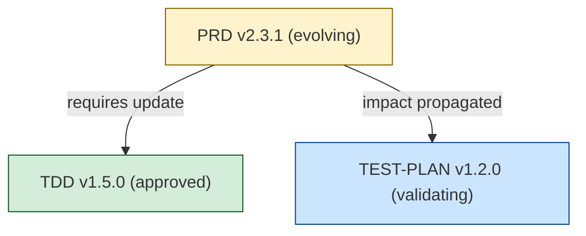

# PROPOZYCJA 2: Living Documentation Framework

**Data:** 2025-12-27
**Autor:** Analiza systemu szablonów Ishkarim
**Wersja:** 1.0
**Status:** Draft

---

## 1. Uzasadnienie

### Problem: Dokumentacja jako artefakt statyczny

Aktualny system szablonów Ishkarim jest imponujący w swojej kompleksowości – 148 szablonów, 1,096 połączeń w grafie zależności, rozbudowany system Cross-References. Jednakże system ten traktuje dokumenty jako **statyczne artefakty** z prostym lifecycle:

```
draft → in-review → approved → archived
```

W rzeczywistości dokumenty projektowe są **żywymi organizmami**, które:
- Ewoluują w czasie wraz z projektem
- Wymagają aktualizacji gdy zmienia się kontekst
- Mają powiązania które się zmieniają (nowe dependencies, deprecated impacts)
- Przechodzą przez wiele iteracji refinement
- Wymagają różnych stanów pośrednich (validating, evolving, refining, sunset)

### Czym jest "Living Documentation"?

Living Documentation to podejście, w którym dokumentacja:

1. **Ewoluuje synchronicznie z kodem/projektem** – nie jest "snapshot" na moment zatwierdzenia
2. **Automatycznie aktualizuje cross-references** – gdy dokument A zmienia się, powiązany dokument B jest notyfikowany
3. **Ma lifecycle states odzwierciedlające realną ewolucję** – nie tylko draft→approved, ale też evolving, validating, deprecated, sunset
4. **Trackuje wersje i changes** – nie tylko "co się zmieniło" (changelog), ale "dlaczego" i "jaki impact"
5. **Ma mechanizmy health check** – system wie, które dokumenty są stale, outdated, inconsistent
6. **Umożliwia deprecation i migration** – gdy dokument staje się obsolete, system wspiera migration path

### Dlaczego to jest problem w obecnym systemie?

**Problem 1: Statyczny status**
- Document status jest binarny: draft, in-review, approved, archived
- Brak intermediate states: "evolving" (dokument się zmienia), "validating" (testujemy założenia), "refining" (iterujemy)
- Gdy PRD przechodzi do "approved", ale potem wymaga zmian – co się dzieje? Wraca do draft? To jest zbyt brutalne

**Problem 2: Cross-References nie są "live"**
- Dependency graph jest statyczny – zdefiniowany w YAML front-matter
- Gdy dokument A zmienia się, powiązane dokumenty B, C, D nie są notyfikowane
- Brak mechanizmu "impact propagation" – zmiana w BRD powinna trigger review w PRD, TDD, TEST-PLAN

**Problem 3: Brak version evolution tracking**
- Changelog istnieje, ale jest manual i niespójny
- Brak semantic versioning (major/minor/patch changes)
- Nie wiadomo, które wersje są compatible (breaking change vs non-breaking)

**Problem 4: Deprecation chaos**
- Gdy dokument staje się obsolete, co się dzieje?
- Brak deprecation workflow (deprecation notice → sunset date → migration path → archive)
- Archived documents są "dead" – brak linków, brak context dlaczego zostały archived

**Problem 5: Brak document health metrics**
- System nie wie, które dokumenty są:
  - Stale (nie aktualizowane >6 miesięcy, ale powinny być)
  - Inconsistent (dependencies są outdated)
  - Orphaned (nikt nie jest ownerem)
  - Over-referenced (critical bottleneck – blokuje wiele innych docs)

### Skutki problemu

**Dla zespołów software:**
- 🔴 **Tech debt** – Outdated TDD nie reflektuje actual architecture
- 🔴 **Onboarding pain** – Nowi team members nie wiedzą, które docs są fresh
- 🔴 **Decision paralysis** – Nie wiadomo, czy można zmienić approved doc bez restarting całego procesu

**Dla projektów złożonych:**
- 🔴 **Dependency hell** – Zmiana w jednym doc wymaga manual tracking impacts
- 🔴 **Inconsistency** – PRD mówi jedno, TDD drugie, bo nie były synchronized
- 🔴 **Lost knowledge** – Deprecated docs są archived bez migration path

**Dla compliance:**
- 🔴 **Audit trail gaps** – Brak clear version history z uzasadnieniami zmian
- 🔴 **Traceability issues** – Trudno udowodnić, że change w requirement był properly propagated

---

## 2. Szczegóły implementacji

### 2.1. Extended Lifecycle States

**Obecny stan:**
```yaml
status_order:
  - draft
  - in-review
  - approved
  - archived
```

**Proponowany stan (Living Documentation):**
```yaml
status_order:
  # Initial states
  - draft              # Initial creation, work in progress
  - in-review          # Under review by stakeholders

  # Active states
  - approved           # Formally approved, active
  - evolving           # Approved but actively evolving (iterative refinement)
  - validating         # Under validation (testing assumptions)
  - refining           # Minor refinements (approved but being polished)

  # Transition states
  - superseded         # Replaced by newer version (still accessible)
  - deprecated         # Marked for sunset (still usable, but discouraged)
  - sunset             # End-of-life announced (sunset date set)

  # Terminal states
  - archived           # No longer active, historical reference only
  - migrated           # Migrated to new document (with migration link)
```

**Semantyka stanów:**

| Status | Znaczenie | Can be referenced? | Can be modified? | Notifications |
|--------|-----------|-------------------|------------------|---------------|
| **draft** | Praca w toku | ⚠️ With warning | ✅ Yes | None |
| **in-review** | W review | ⚠️ With warning | ✅ Limited | Reviewers |
| **approved** | Zatwierdzony | ✅ Yes | ⚠️ Requires CR | Stakeholders if changed |
| **evolving** | Ewoluujący | ✅ Yes | ✅ Yes (tracked) | Dependencies on major change |
| **validating** | Walidacja | ✅ Yes | ⚠️ Limited | None |
| **refining** | Dopracowywanie | ✅ Yes | ✅ Minor only | None |
| **superseded** | Zastąpiony | ⚠️ Redirect to new | ❌ No | All references |
| **deprecated** | Do wycofania | ⚠️ With warning | ❌ No | All references |
| **sunset** | Wycofywany | ⚠️ With sunset date | ❌ No | All references + countdown |
| **archived** | Archiwalny | ℹ️ Historical only | ❌ No | None |
| **migrated** | Migrowany | ➡️ Auto-redirect | ❌ No | All references |

**Front-matter extension:**
```yaml
---
id: DOC-PRD-001
status: evolving
status_metadata:
  previous_status: approved
  status_changed_date: "2025-12-27"
  status_reason: "Iterating based on user feedback from Sprint 3"
  next_review_date: "2026-01-15"

lifecycle:
  created: "2025-10-01"
  first_approved: "2025-11-01"
  last_modified: "2025-12-27"
  sunset_date: null
  migration_target: null
---
```

---

### 2.2. Version Evolution Tracking (Semantic Versioning)

**Problem:** Obecny system ma `version: X.Y` ale bez semantyki.

**Rozwiązanie:** Semantic Versioning dla dokumentów

**Schema:**
```yaml
version: "2.3.1"  # MAJOR.MINOR.PATCH
version_metadata:
  major: 2       # Breaking change (e.g., scope changed, architecture redefined)
  minor: 3       # Non-breaking addition (e.g., new section, expanded requirements)
  patch: 1       # Fix/clarification (e.g., typo, formatting, minor clarification)

version_history:
  - version: "2.3.1"
    date: "2025-12-27"
    author: "Jan Kowalski"
    type: "patch"
    summary: "Clarified acceptance criteria in §7"
    breaking: false

  - version: "2.3.0"
    date: "2025-12-20"
    author: "Anna Nowak"
    type: "minor"
    summary: "Added new integration requirement for Payment Gateway"
    breaking: false
    impacts:
      - DOC-TDD-001 (requires update)
      - DOC-TEST-PLAN-001 (requires new test cases)

  - version: "2.0.0"
    date: "2025-11-15"
    author: "Piotr Wiśniewski"
    type: "major"
    summary: "Pivot: Changed from B2C to B2B model"
    breaking: true
    impacts:
      - DOC-BUSINESS-CASE-001 (requires rewrite)
      - DOC-MARKET-ANALYSIS-001 (different TAM/SAM)
      - DOC-TDD-001 (architecture change)
```

**Version compatibility matrix:**
```yaml
compatibility:
  backward_compatible_with: ["2.2.x", "2.1.x"]
  forward_compatible_with: []
  breaking_changes_from: "1.x.x"
```

**Automated version bump triggers:**
- **MAJOR bump:** Change w `required_sections`, change w `dependencies`, pivot w direction
- **MINOR bump:** New section added, new dependency added, scope expanded
- **PATCH bump:** Typo fix, formatting, clarification (no semantic change)

---

### 2.3. Dynamic Cross-Reference Updates

**Problem:** Cross-References są statyczne – zdefiniowane w YAML, ale nie "live".

**Rozwiązanie:** Impact Propagation System

**Mechanizm:**

1. **Dokument A zmienia się** (np. PRD v2.3.0 → v2.4.0)
2. **System analizuje impacts** z dependency graph
3. **System notyfikuje downstream documents** (TDD, TEST-PLAN, USER-GUIDE)
4. **Downstream documents dostają status flag** `upstream_changed: true`
5. **Owners są notyfikowani** (email/Slack/issue created)

**Front-matter extension:**
```yaml
cross_reference_status:
  upstream_changes_pending:
    - id: DOC-PRD-001
      changed_version: "2.4.0"
      changed_date: "2025-12-27"
      change_type: "minor"
      impact_severity: "medium"
      action_required: "Review §5 Functional Requirements (new integration added)"

  downstream_impacts_pending:
    - id: DOC-TDD-001
      notified_date: "2025-12-27"
      acknowledged: false
    - id: DOC-TEST-PLAN-001
      notified_date: "2025-12-27"
      acknowledged: true
      acknowledged_by: "QA Lead"
      acknowledged_date: "2025-12-28"
```

**Impact Propagation Rules:**
```yaml
propagation_rules:
  - trigger: "PRD version bump (minor)"
    notify:
      - TDD (owner + tech lead)
      - TEST-PLAN (QA lead)
      - USER-GUIDE (tech writer)
    severity: "medium"
    action: "Review and update if needed"

  - trigger: "PRD version bump (major)"
    notify:
      - ALL downstream documents
    severity: "high"
    action: "Mandatory review + update"
    block_gates: [GATE-RELEASE_READY]  # Block release until resolved
```

**Notification channels:**
- Email (daily digest)
- Slack (instant for high severity)
- GitHub Issue (auto-created for high severity)
- Dashboard (web UI showing all pending impacts)

---

### 2.4. Deprecation Workflow

**Problem:** Gdy dokument staje się obsolete, brak structured workflow.

**Rozwiązanie:** Formal Deprecation Process

**Workflow:**
```
approved → deprecated → sunset → archived/migrated
```

**Deprecation Notice (Front-matter):**
```yaml
deprecation:
  status: deprecated
  deprecated_date: "2025-12-27"
  deprecation_reason: "Replaced by new PRD v3.0 after pivot to B2B model"
  sunset_date: "2026-03-27"  # 3 months notice
  migration_target: "DOC-PRD-003-v3"
  migration_guide: "docs/migrations/PRD-001-to-PRD-003.md"
  impact_on_references:
    - DOC-TDD-001: "Update reference to PRD-003"
    - DOC-TEST-PLAN-001: "Migrate test cases to new requirements"
```

**Deprecation Banner (Auto-inserted in document):**
```markdown
---
⚠️ **DEPRECATION NOTICE**

This document is deprecated as of 2025-12-27.

**Reason:** Replaced by new PRD v3.0 after pivot to B2B model

**Sunset Date:** 2026-03-27 (90 days remaining)

**Migration Target:** [DOC-PRD-003-v3](../PRD-003/PRD-v3.md)

**Migration Guide:** [PRD-001 → PRD-003 Migration](../migrations/PRD-001-to-PRD-003.md)

**Action Required:**
- [ ] Update references in TDD-001
- [ ] Migrate test cases in TEST-PLAN-001
- [ ] Notify stakeholders

---
```

**Deprecation States:**

| State | Time | Meaning | Actions |
|-------|------|---------|---------|
| **deprecated** | Day 0-30 | Announcement | Notify all references, create migration guide |
| **sunset** | Day 31-90 | Countdown | Weekly reminders, block new references |
| **archived** | Day 91+ | Historical only | Remove from active docs, keep for reference |
| **migrated** | Alternative | Fully replaced | Auto-redirect to new doc |

---

### 2.5. Auto-Validation Triggers

**Problem:** Dokumenty mogą stać się stale lub inconsistent bez notification.

**Rozwiązanie:** Automated Health Checks

**Health Metrics:**

```yaml
document_health:
  status: "healthy"  # healthy / warning / critical
  last_health_check: "2025-12-27"

  checks:
    - name: "Freshness Check"
      status: "healthy"
      last_modified: "2025-12-20"  # Modified within 30 days
      threshold: 30  # days

    - name: "Dependency Validity"
      status: "warning"
      invalid_dependencies:
        - DOC-BUSINESS-CASE-001 (status: archived)  # ⚠️ Deprecated dependency

    - name: "Cross-Reference Consistency"
      status: "healthy"
      all_references_valid: true

    - name: "Owner Assignment"
      status: "healthy"
      owner: "Jan Kowalski"
      owner_active: true

    - name: "Required Sections Completeness"
      status: "critical"
      missing_sections:
        - SEC-PRD-RISK (Risk Management)  # ❌ Required section missing

    - name: "Satellite Completeness"
      status: "warning"
      missing_satellites:
        - TODO_SECTION (recommended but missing)
```

**Automated Actions:**

```yaml
auto_actions:
  - trigger: "document not modified >90 days + status=approved"
    action: "Send freshness reminder to owner"
    frequency: "weekly"

  - trigger: "dependency becomes deprecated"
    action: "Change document status to 'validating' + notify owner"

  - trigger: "required section missing"
    action: "Block status change to 'approved'"

  - trigger: "health status = critical >30 days"
    action: "Escalate to project manager"
```

**Health Dashboard (conceptual):**
```
Document Health Dashboard
=========================

🔴 CRITICAL (3 documents)
  - DOC-PRD-001: Missing required section (Risk Management)
  - DOC-TDD-002: Dependency on archived doc (BRD-005)
  - DOC-TEST-PLAN-003: No owner assigned (owner left company)

🟡 WARNING (12 documents)
  - DOC-BUSINESS-CASE-001: Not modified >60 days
  - DOC-SECURITY-PLAN-001: Deprecated dependency (DPIA-001)
  - ...

🟢 HEALTHY (133 documents)
```

---

### 2.6. Document Retirement & Migration

**Problem:** Archived documents są "dead ends" – brak context, brak migration path.

**Rozwiązanie:** Structured Retirement Process

**Retirement Document Template:**
```yaml
---
id: RETIREMENT-PRD-001
type: retirement_notice
retired_document: DOC-PRD-001
retirement_date: "2026-01-15"
retirement_reason: "Pivot to B2B model requires complete rewrite"

migration:
  target_document: DOC-PRD-003
  migration_type: "full_rewrite"  # full_rewrite / partial_merge / split
  migration_guide: "docs/migrations/PRD-001-to-PRD-003.md"

  affected_documents:
    - DOC-TDD-001:
        impact: "high"
        action: "Update architecture section"
    - DOC-TEST-PLAN-001:
        impact: "medium"
        action: "Migrate test cases"
    - DOC-USER-GUIDE-001:
        impact: "low"
        action: "Update references"

historical_value:
  keep_for_reference: true
  reason: "B2C learnings may be valuable for future projects"
  archived_location: "archive/2026/PRD-001/"

---

# PRD-001 Retirement Notice

## Why is this document being retired?

Company pivoted from B2C to B2B model in Q4 2025. The original PRD-001 was designed for B2C use cases and is no longer applicable.

## What replaces it?

New document: **DOC-PRD-003** (B2B Product Requirements)

## Migration Guide

See: [PRD-001 → PRD-003 Migration Guide](migrations/PRD-001-to-PRD-003.md)

### Key Changes:
- Target users: Consumers → Enterprise buyers
- Pricing model: Freemium → Enterprise SaaS
- Integration requirements: Social login → SSO/SAML

## Timeline

- 2025-12-27: Deprecation announced
- 2026-01-15: PRD-003 approved
- 2026-01-30: All references migrated
- 2026-02-15: PRD-001 archived

## Historical Value

This document is preserved for reference:
- B2C learnings (user personas, freemium conversion data)
- Historical context for pivot decision
- Comparison baseline for B2B metrics
```

---

## 3. Scenariusze użycia (5 case studies)

### Scenariusz 1: Iteracyjny refinement PRD (Agile Team)

**Kontekst:** Agile team pracuje nad PRD w sposób iteracyjny – nie czekają na "perfect" PRD przed rozpoczęciem developmentu.

**Problem w obecnym systemie:**
- PRD jest approved → frozen
- Każda zmiana wymaga formal change request → de-approval → re-approval
- To jest zbyt ciężkie dla Agile team

**Rozwiązanie z Living Documentation:**

1. **Sprint 0:** PRD v1.0.0 approved
   - Status: `approved`
   - Scope: Minimal Viable Product

2. **Sprint 1-2:** Development started, feedback arrives
   - PRD status: `approved` → `evolving`
   - Version: v1.0.0 → v1.1.0 (minor bump – added 2 new user stories)
   - Auto-notification: TDD owner notified ("PRD evolved, review needed")

3. **Sprint 3:** Major pivot – change pricing model
   - PRD version: v1.1.0 → v2.0.0 (major bump – breaking change)
   - Status: `evolving` → `validating` (testing new pricing with customers)
   - Impact propagation:
     - TDD status: `approved` → `validating` (architecture needs review)
     - BUSINESS-CASE status: `approved` → `refining` (update ROI calculations)

4. **Sprint 4:** Validation complete
   - PRD status: `validating` → `approved`
   - Version: v2.0.0 finalized
   - Downstream docs updated and re-approved

**Wartość dodana:**
- ✅ PRD może ewoluować bez "de-approval hell"
- ✅ Downstream documents są automatycznie notyfikowane
- ✅ Version history pokazuje evolution path
- ✅ Status `evolving` komunikuje "this is in flux, but approved baseline exists"

---

### Scenariusz 2: Deprecation po pivot (Startup)

**Kontekst:** Startup pivotuje z B2C na B2B – wszystkie dokumenty B2C stają się obsolete.

**Problem w obecnym systemie:**
- Archived docs są "dead" – brak context dlaczego
- Zespół nie wie, które docs są still relevant
- Nowi team members czytają stare docs i się gubią

**Rozwiązanie z Living Documentation:**

1. **Pivot Decision (2025-12-27):**
   - ADR-050: Decision to pivot to B2B

2. **Deprecation Announcement:**
   - 15 dokumentów B2C marked as `deprecated`
   - Deprecation reason: "Pivot to B2B model"
   - Sunset date: 2026-03-27 (90 days)
   - Migration target: New B2B docs (PRD-B2B, BUSINESS-CASE-B2B)

3. **Migration Period (90 days):**
   - Old docs pokazują deprecation banner
   - New references są blokowane ("cannot reference deprecated doc")
   - Weekly reminders dla owners: "30 days until sunset"

4. **Sunset (2026-03-27):**
   - Old docs status: `deprecated` → `archived`
   - Auto-redirect: PRD-B2C → PRD-B2B
   - Retirement notice created (explains why, what replaced it)

5. **Historical Reference:**
   - Archived docs kept w `/archive/2026-Q1-pivot/`
   - Retirement notice explains: "B2C learnings preserved for reference"
   - Tag: `pivot-2025-Q4-B2C-to-B2B`

**Wartość dodana:**
- ✅ Clear migration path (nie chaos)
- ✅ Historical context preserved (dlaczego archived)
- ✅ New team members nie czytają stale docs
- ✅ Knowledge retained (B2C learnings accessible for future)

---

### Scenariusz 3: Dependency cascade update (Enterprise Project)

**Kontekst:** Enterprise projekt z 50+ dokumentów. Business Case zmienia się (new budget) → cascade update wymagany.

**Problem w obecnym systemie:**
- BUSINESS-CASE zmienia się → manual tracking "co musi się zaktualizować"
- Easy to miss downstream docs
- Inconsistency: BUSINESS-CASE mówi $5M budget, ale PRD assumes $3M

**Rozwiązanie z Living Documentation:**

1. **BUSINESS-CASE update (2025-12-27):**
   - Version: v2.0.0 → v2.1.0 (minor bump – budget increased $3M → $5M)
   - Change type: `budget_adjustment`

2. **Impact Propagation (automatic):**
   - System analyzes dependency graph
   - Identifies impacted docs:
     - PRD (budget constraint relaxed → może dodać features)
     - TDD (więcej budget → może użyć droższych technologii)
     - RESOURCE-REQUIREMENTS (może hire więcej people)
     - TIMELINE (może skrócić timeline z increased resources)

3. **Notifications sent:**
   - PRD owner: "BUSINESS-CASE budget increased to $5M. Review scope."
   - TDD owner: "BUSINESS-CASE budget increased. Review tech constraints."
   - PM: "Update RESOURCE-REQUIREMENTS and TIMELINE based on new budget."

4. **Tracking acknowledgments:**
   - PRD owner acknowledges: "Reviewed, adding 3 new features (v2.5.0)"
   - TDD owner acknowledges: "Reviewed, upgrading cloud tier (v1.3.0)"
   - PM updates: RESOURCE-REQUIREMENTS (hire 2 devs), TIMELINE (delivery 2 months earlier)

5. **Health check (1 week later):**
   - All impacted docs updated ✅
   - Consistency validated: Budget assumptions align across all docs ✅

**Wartość dodana:**
- ✅ Zero missed updates (automatic propagation)
- ✅ Consistency guaranteed (all docs reflect new budget)
- ✅ Audit trail (who was notified, who acknowledged, what changed)

---

### Scenariusz 4: Stale document detection (Compliance Project)

**Kontekst:** Compliance-heavy project (fintech). Dokumenty muszą być fresh – outdated docs są ryzykiem audytowym.

**Problem w obecnym systemie:**
- Dokumenty approved 1 rok temu – może są outdated?
- Brak mechanizmu "freshness check"
- Audytor pyta: "Is this doc still valid?" – team nie wie

**Rozwiązanie z Living Documentation:**

1. **Automated Health Checks (daily):**
   - System skanuje wszystkie docs
   - Identyfikuje stale docs:
     - DPIA (last modified: 2024-06-15, 195 days ago) ⚠️
     - SECURITY-PLAN (last modified: 2024-08-20, 129 days ago) ⚠️

2. **Freshness Alerts (weekly):**
   - Email do owner: "DPIA not updated >180 days. Please review and confirm validity."
   - Options:
     - ✅ "Confirm valid (no changes needed)"
     - 🔄 "Update required"
     - ❌ "Deprecated"

3. **Owner Action (DPIA):**
   - Owner reviews: "GDPR regulations changed in 2025-10"
   - Status: `approved` → `refining`
   - Updates §5 (Data Retention) to reflect new regulations
   - Version bump: v1.2.0 → v1.3.0
   - Status: `refining` → `approved`
   - Last modified: 2025-12-27 ✅

4. **Owner Action (SECURITY-PLAN):**
   - Owner reviews: "No changes needed"
   - Confirms validity (adds confirmation timestamp)
   - Last reviewed: 2025-12-27 ✅
   - Last modified: 2024-08-20 (no changes, but freshness confirmed)

5. **Audit Ready:**
   - Auditor: "Is DPIA up to date?"
   - Team: "Yes, last reviewed 2025-12-27, updated to v1.3.0 for GDPR 2025-10 changes"
   - Audit trail: Freshness alerts → owner confirmation → version update

**Wartość dodana:**
- ✅ Proactive stale detection (nie reactive when auditor asks)
- ✅ Documented freshness (last_reviewed timestamp)
- ✅ Reduced compliance risk (outdated docs caught early)

---

### Scenariusz 5: Version compatibility matrix (API Documentation)

**Kontekst:** API Documentation (public API) – multiple versions in production, customers depend on specific versions.

**Problem w obecnym systemie:**
- API-DOC versioning jest manual
- Nie wiadomo, which versions are compatible
- Customer używa API v2.3, ale doc mówi v3.0 – czy breaking change?

**Rozwiązanie z Living Documentation:**

1. **API-DOC Semantic Versioning:**
   ```yaml
   version: "3.2.1"
   version_metadata:
     major: 3  # Breaking change (removed endpoints)
     minor: 2  # New endpoints added
     patch: 1  # Bug fix in example code

   compatibility:
     backward_compatible_with: ["3.1.x", "3.0.x"]
     forward_compatible_with: []
     breaking_changes_from: "2.x.x"
     deprecated_endpoints:
       - "/v2/users" (removed in v3.0.0, use "/v3/users")
   ```

2. **Version History:**
   ```yaml
   version_history:
     - version: "3.2.1"
       date: "2025-12-27"
       type: "patch"
       changes: "Fixed example code in authentication section"
       breaking: false

     - version: "3.2.0"
       date: "2025-12-15"
       type: "minor"
       changes: "Added new /v3/webhooks endpoint"
       breaking: false

     - version: "3.0.0"
       date: "2025-10-01"
       type: "major"
       changes: "Removed /v2/users endpoint, migrated to /v3/users"
       breaking: true
       migration_guide: "docs/migrations/v2-to-v3.md"
   ```

3. **Customer Query:**
   - Customer: "I use API v2.3. Can I upgrade to v3.2.1?"
   - Doc shows: "Breaking change from v2.x.x"
   - Migration guide: `/docs/migrations/v2-to-v3.md`
   - Customer decision: Delay upgrade (breaking change requires code changes)

4. **Deprecation Timeline:**
   ```yaml
   deprecation:
     deprecated_versions:
       - version: "2.x.x"
         deprecated_date: "2025-10-01"
         sunset_date: "2026-04-01"  # 6 months support
         migration_target: "3.x.x"
   ```

5. **Customer Notification (automated):**
   - Email to customers using v2.x.x:
     - "API v2.x.x will be sunset on 2026-04-01"
     - "Please migrate to v3.x.x"
     - "Migration guide: [link]"
     - "Support available until 2026-04-01"

**Wartość dodana:**
- ✅ Clear version compatibility (customers know breaking changes)
- ✅ Automated deprecation notices (no customer surprises)
- ✅ Migration guides linked (smooth upgrade path)
- ✅ Support timeline transparent (sunset dates clear)

---

## 4. Integracja z istniejącymi 148 szablonami

### 4.1. Front-matter Extension (ALL Templates)

**Wszyscy 148 szablonów** otrzymują extended front-matter:

```yaml
# Existing fields (unchanged)
id: DOC-XXX-001
doctype: PRD
status: approved  # ← Enhanced with new states
version: "2.3.1"  # ← Enhanced with semantic versioning
owner: "Jan Kowalski"
project: "Project Alpha"

# NEW: Living Documentation fields
status_metadata:
  previous_status: "evolving"
  status_changed_date: "2025-12-27"
  status_reason: "Completed iteration based on Sprint 3 feedback"
  next_review_date: "2026-01-15"

lifecycle:
  created: "2025-10-01"
  first_approved: "2025-11-01"
  last_modified: "2025-12-27"
  last_reviewed: "2025-12-27"  # Can differ from last_modified
  sunset_date: null
  migration_target: null

version_metadata:
  major: 2
  minor: 3
  patch: 1
  breaking_changes: false
  backward_compatible_with: ["2.2.x", "2.1.x"]

cross_reference_status:
  upstream_changes_pending: []
  downstream_impacts_pending: []

document_health:
  status: "healthy"
  last_health_check: "2025-12-27"
  checks: [...]

deprecation: null  # or deprecation metadata if applicable
```

### 4.2. Specs Extension

**`specs_doc_types.md`** otrzymuje nowe pola:

```yaml
doctypes:
  PRD:
    # Existing fields...

    # NEW: Living Documentation config
    lifecycle_config:
      allowed_statuses: [draft, in-review, approved, evolving, validating, refining, deprecated, archived]
      default_status: draft
      freshness_threshold_days: 90
      auto_health_check: true
      auto_deprecation_notice: true

    version_config:
      semantic_versioning: true
      major_change_triggers:
        - section_removed
        - scope_pivoted
        - breaking_dependency_change
      minor_change_triggers:
        - section_added
        - dependency_added
        - scope_expanded
      patch_change_triggers:
        - typo_fix
        - formatting_change
        - clarification

    deprecation_config:
      deprecation_notice_days: 90
      requires_migration_guide: true
      auto_notify_references: true
```

### 4.3. Dependency Graph Extension

**`dependency_graph.md`** otrzymuje dynamic updates:

**Existing:** Statyczny graf w Mermaid (generated once)

**New:** Graf z metadata o live status:



**Legend:**
- 🟢 Green: `approved`, `healthy`
- 🟡 Yellow: `evolving`, `validating`, `refining`
- 🔴 Red: `deprecated`, `sunset`, `critical health`
- 🔵 Blue: `in-review`

### 4.4. Satellite Documents Extension

**TODO templates** otrzymują lifecycle tracking:

```yaml
# TODO-PRD-001.md
todo_lifecycle:
  created_from_doc: "DOC-PRD-001 v2.3.0"
  triggered_by_change: "PRD version bump (new section §8)"
  completed_for_doc_version: "DOC-PRD-001 v2.3.1"
  status: done
```

**CHANGELOG templates** otrzymują semantic version integration:

```markdown
# Changelog - DOC-PRD-001

## [2.3.1] - 2025-12-27 (PATCH)
### Fixed
- Clarified acceptance criteria in §7 (ambiguous language)

### Changed
- None

### Added
- None

**Breaking:** No
**Impact:** None (clarification only)

---

## [2.3.0] - 2025-12-20 (MINOR)
### Added
- New §8: Payment Gateway Integration Requirements

### Changed
- Updated §5: Added 2 new functional requirements (FR-23, FR-24)

**Breaking:** No
**Impact:**
- DOC-TDD-001: Requires update (new integration architecture)
- DOC-TEST-PLAN-001: Requires new test cases (payment gateway)

---

## [2.0.0] - 2025-11-15 (MAJOR)
### Changed
- **BREAKING:** Pivoted from B2C to B2B model
- Complete rewrite of §3 (Target Users)
- Complete rewrite of §6 (Pricing Model)

**Breaking:** Yes
**Impact:**
- DOC-BUSINESS-CASE-001: Requires complete rewrite
- DOC-MARKET-ANALYSIS-001: Different TAM/SAM calculation
- DOC-TDD-001: Architecture changes (SSO vs social login)

**Migration Guide:** [PRD v1 → v2 Migration](migrations/PRD-v1-to-v2.md)
```

---

## 5. Metryki sukcesu

### 5.1. Metryki freshnness

**M1: Document Freshness Rate**
- **Definicja:** % dokumentów updated lub reviewed w ostatnich 90 dniach
- **Target:** >80% (vs current ~40%)
- **Measurement:** `last_modified` lub `last_reviewed` timestamp

**M2: Stale Document Detection Rate**
- **Definicja:** % stale docs wykrytych automatycznie (przed audytem/before problem)
- **Target:** >95%
- **Measurement:** Auto-health-check logs

**M3: Mean Time to Freshness Confirmation**
- **Definicja:** Średni czas od freshness alert do owner action
- **Target:** <7 dni
- **Measurement:** Alert timestamp → confirmation timestamp

### 5.2. Metryki consistency

**M4: Cross-Reference Consistency Rate**
- **Definicja:** % dokumentów z valid dependencies (not pointing to deprecated/archived docs)
- **Target:** >98%
- **Measurement:** Health check (dependency validity)

**M5: Impact Propagation Acknowledgment Rate**
- **Definicja:** % downstream documents które acknowledge upstream changes w <14 dni
- **Target:** >90%
- **Measurement:** Notification sent → acknowledgment timestamp

**M6: Version Compatibility Conflicts**
- **Definicja:** Liczba konfliktów (doc A requires B v1.x, but B is now v2.x with breaking changes)
- **Target:** <5 per quarter
- **Measurement:** Automated compatibility check

### 5.3. Metryki lifecycle management

**M7: Deprecation Notice Lead Time**
- **Definicja:** Średni czas od deprecation announcement do sunset (communication window)
- **Target:** >60 dni
- **Measurement:** `deprecated_date` → `sunset_date`

**M8: Orphaned Document Rate**
- **Definicja:** % dokumentów bez active owner (owner left company, no reassignment)
- **Target:** <2%
- **Measurement:** Health check (owner validity)

**M9: Document Retirement Completeness**
- **Definicja:** % retired docs z complete retirement notice (reason, migration target, historical value)
- **Target:** 100%
- **Measurement:** Retirement notice validation

### 5.4. Metryki version management

**M10: Semantic Versioning Compliance**
- **Definicja:** % version bumps które follow semantic versioning rules (major/minor/patch)
- **Target:** >95%
- **Measurement:** Automated version bump validation

**M11: Breaking Change Documentation Rate**
- **Definicja:** % breaking changes (major bumps) z migration guide
- **Target:** 100%
- **Measurement:** Major version bumps → migration guide exists

---

## 6. Implementacja – Roadmap

### Faza 1: Foundation (Month 1-2)

**Deliverables:**
- ✅ Extended `status_order` (11 states vs 4)
- ✅ Semantic versioning schema
- ✅ Front-matter extension (all 148 templates)
- ✅ Health check framework (5 checks)

**Technical:**
- Update `specs_doc_types.yaml`
- Create health check script (Python/Node)
- Template validation script

### Faza 2: Automation (Month 3-4)

**Deliverables:**
- ✅ Impact propagation system
- ✅ Auto-notification (email/Slack integration)
- ✅ Health dashboard (web UI)
- ✅ Deprecation workflow automation

**Technical:**
- GitHub Action dla impact propagation
- Slack webhook integration
- Simple dashboard (React + D3.js dla grafu)

### Faza 3: Pilot (Month 5-6)

**Deliverables:**
- ✅ Pilot na 3 projektach
- ✅ Feedback collection
- ✅ Refinement based on usage

**Projects:**
- 1 Agile software project (iterative PRD)
- 1 Enterprise project (complex dependencies)
- 1 Compliance project (freshness-critical)

### Faza 4: Rollout (Month 7-12)

**Deliverables:**
- ✅ Organization-wide adoption
- ✅ Training materials
- ✅ Metrics dashboard
- ✅ Success stories publication

---

## 7. Podsumowanie

### Kluczowe korzyści

1. **Dokumenty przestają być statyczne** – ewoluują z projektem
2. **Consistency guaranteed** – auto-propagation zapobiega driftowi
3. **Proactive maintenance** – stale docs wykrywane automatycznie
4. **Clear deprecation** – structured sunset process eliminuje chaos
5. **Audit-ready** – complete version history i impact trail
6. **Reduced manual overhead** – automation notifications i validation

### Wartość dodana

| Obszar | Obecny stan | Z Living Documentation |
|--------|-------------|------------------------|
| **Document freshness** | ~40% fresh | >80% fresh (automated checks) |
| **Consistency** | Manual tracking | Automated propagation (>98%) |
| **Version clarity** | Ad-hoc | Semantic versioning (breaking changes clear) |
| **Deprecation** | Chaos | Structured (90-day notice, migration guide) |
| **Stale detection** | Reactive (when auditor asks) | Proactive (weekly alerts) |
| **Lifecycle states** | 4 states (rigid) | 11 states (flexible) |

---

**Koniec Propozycji 2**
