```mermaid
graph TB
    UNKNOWN["🔍 Unknown Identified<br/>(Backlog, Risk Register)"]
    HYPOTHESIS["📋 Hypothesis Document<br/>SEC-HYP: Formulate hypothesis"]
    SPIKE["⚡ Spike Solution<br/>(if quick answer needed)"]
    POC["🔬 Proof of Concept<br/>SEC-POC: Detailed validation"]
    EXPERIMENT["📊 Experiment Log<br/>SEC-EXP: Track execution"]
    FINDINGS["📈 Research Findings<br/>SEC-RF: Aggregate results"]
    TRADEOFF["⚖️ Trade-off Analysis<br/>SEC-TA: Quantitative scoring"]
    ADR["✅ Architecture Decision Record<br/>SEC-ADR: Final decision"]
    TDD["📐 Technical Design Document<br/>SEC-TDD: Implementation design"]
    IMPL["🚀 Implementation<br/>(Sprint Core)"]

    UNKNOWN -->|"Formalize"| HYPOTHESIS
    HYPOTHESIS -->|"Quick exploration<br/>(2-5 days)"| SPIKE
    HYPOTHESIS -->|"Detailed validation<br/>(2-4 weeks)"| POC
    SPIKE -->|"Results"| FINDINGS
    POC -->|"Track execution"| EXPERIMENT
    EXPERIMENT -->|"Results"| FINDINGS
    FINDINGS -->|"Multiple options?"| TRADEOFF
    TRADEOFF -->|"Recommendation"| ADR
    FINDINGS -->|"Single option"| ADR
    ADR -->|"Decision: Proceed"| TDD
    TDD -->|"Implementation plan"| IMPL

    style UNKNOWN fill:#fff3cd
    style HYPOTHESIS fill:#cfe2ff
    style SPIKE fill:#d1ecf1
    style POC fill:#d1ecf1
    style EXPERIMENT fill:#d1ecf1
    style FINDINGS fill:#d4edda
    style TRADEOFF fill:#f8d7da
    style ADR fill:#d4edda
    style TDD fill:#e2e3e5
    style IMPL fill:#e2e3e5
```

```mermaid
graph TB
    IDEA["💡 Idea<br/>(Innovation Log, Brainstorm)"]
    HYPOTHESIS["📋 Hypothesis Document<br/>Business hypothesis"]
    MARKET["📊 Market Analysis<br/>TAM/SAM/SOM research"]
    EXPERIMENT["🧪 Experiment Log<br/>Customer interviews, A/B tests"]
    FINDINGS["📈 Research Findings<br/>Aggregate validation data"]
    FEASIBILITY["🔍 Feasibility Study<br/>Technical/Economic/Legal"]
    GONOGO["🚦 Go/No-Go Decision<br/>Proceed vs Pivot vs Kill"]
    BIZCASE["💼 Business Case<br/>ROI justification"]
    PRD["📋 Product Requirements<br/>Detailed requirements"]
    MVP["🚀 MVP Implementation"]

    IDEA -->|"Formalize"| HYPOTHESIS
    HYPOTHESIS -->|"Market validation"| MARKET
    HYPOTHESIS -->|"Customer validation"| EXPERIMENT
    MARKET -->|"Data"| FINDINGS
    EXPERIMENT -->|"Results"| FINDINGS
    FINDINGS -->|"Validated?"| FEASIBILITY
    FEASIBILITY -->|"Go/No-Go decision"| GONOGO
    GONOGO -->|"GO"| BIZCASE
    GONOGO -->|"PIVOT"| HYPOTHESIS
    GONOGO -->|"NO-GO"| IDEA
    BIZCASE -->|"Approved"| PRD
    PRD -->|"Implementation"| MVP

    style IDEA fill:#fff3cd
    style HYPOTHESIS fill:#cfe2ff
    style MARKET fill:#d1ecf1
    style EXPERIMENT fill:#d1ecf1
    style FINDINGS fill:#d4edda
    style FEASIBILITY fill:#f8d7da
    style GONOGO fill:#f8d7da
    style BIZCASE fill:#d4edda
    style PRD fill:#e2e3e5
    style MVP fill:#e2e3e5
```

```mermaid
graph TB
    RISK["⚠️ Risk Identified<br/>(Risk Register, RAID Log)"]
    ALT["🔀 Alternative Exploration<br/>Identify mitigation options"]
    POC["🔬 PoC/Experiment<br/>(if validation needed)"]
    TRADEOFF["⚖️ Trade-off Analysis<br/>Quantitative scoring"]
    DECISION["✅ Decision<br/>(ADR or Decision Log)"]
    MITIGATION["🛡️ Mitigation Plan<br/>Implementation plan"]
    MONITORING["📊 Monitoring Plan<br/>Risk tracking"]

    RISK -->|"Explore options"| ALT
    ALT -->|"Validate options"| POC
    POC -->|"Results"| TRADEOFF
    ALT -->|"No validation needed"| TRADEOFF
    TRADEOFF -->|"Recommendation"| DECISION
    DECISION -->|"Mitigation approach"| MITIGATION
    MITIGATION -->|"Track effectiveness"| MONITORING

    style RISK fill:#f8d7da
    style ALT fill:#fff3cd
    style POC fill:#d1ecf1
    style TRADEOFF fill:#f8d7da
    style DECISION fill:#d4edda
    style MITIGATION fill:#e2e3e5
    style MONITORING fill:#e2e3e5
```

# PROPOZYCJA 4: Concept Exploration Workflows

**Data:** 2025-12-27
**Autor:** Analiza systemu szablonów Ishkarim
**Wersja:** 1.0
**Status:** Implemented
**Data implementacji:** 2025-12-29
**Commit:** f38dc8e

---

## 1. Uzasadnienie

### Problem: Brak end-to-end workflows dla eksploracji

Propozycje 1, 2 i 3 dostarczają **narzędzi** (templates):
- **Propozycja 1:** Research templates (Hypothesis, Experiment, PoC, Spike, Research Findings)
- **Propozycja 2:** Living Documentation (lifecycle states, version evolution, deprecation)
- **Propozycja 3:** Decision templates (Decision Log, Trade-off Analysis, Go/No-Go, Decision Reversal)

Ale **narzędzia bez workflows** to rozproszone puzzles. Zespoły potrzebują:

1. **End-to-end workflows** – Od hipotezy → eksperyment → decyzja → implementacja
2. **Scenariusze dla różnych kontekstów** – Tech exploration ≠ Business innovation ≠ Risk mitigation
3. **Integracji z grafem zależności** – Jak templates się łączą w real workflow
4. **Checkpoints i gates** – Gdzie są decision points, gdzie są validation gates

### Analiza present state

**Co obecnie istnieje:**
- ✅ **GATE system** (specs_gates.md) – 5 gates (GO_NO_GO, REQ_FREEZE, RELEASE_READY, OPS_HANDOVER, PROJECT_CLOSURE)
- ✅ **Sprint templates** (Core, Discovery, Hardening, Release, Infra) – Workflow dla sprint types
- ✅ **Architecture transformation** (AS-IS → TO-BE → REFACTORING) – Workflow dla architecture change

**Co brakuje:**
- ❌ **Concept Exploration workflow** – Od unknowns → validated decision
- ❌ **Innovation Pipeline** – Od pomysłu → production
- ❌ **Risk Mitigation workflow** – Od identified risk → mitigated state
- ❌ **Alternative Approach workflow** – Parallel exploration → merge/kill decision

### Dlaczego to jest problem?

**Dla zespołów:**
- 🔴 **Confusion** – "Mamy Hypothesis template, ale kiedy go użyć? Co potem?"
- 🔴 **Incomplete workflows** – Team starts experiment, ale nie wiadomo "what's next step"
- 🔴 **Inconsistency** – Każdy projekt wymyśla własny process

**Dla projektów:**
- 🔴 **Missed steps** – Eksperyment bez follow-up decision (wyniki giną)
- 🔴 **No checkpoints** – Brak clear gates "kiedy stop research, kiedy pivot, kiedy proceed"

**Dla organizacji:**
- 🔴 **No repeatable process** – Innovation is ad-hoc, nie systematyczny
- 🔴 **Knowledge silos** – Każdy team ma własny workflow, nie shared best practices

---

## 2. Szczegóły implementacji

### 4 End-to-End Workflows

#### Workflow 1: Tech Exploration (Software Development)

**Use case:** Zespół eksploruje nową technologię / architekturę / tool.

**Workflow:**
```
Unknown/Risk → Hypothesis → Experiment/PoC → Decision → Implementation
```

**Szczegółowy flow:**



**Checkpoints:**

| Checkpoint | Gate | Criteria | Decision |
|------------|------|----------|----------|
| **After Hypothesis** | Hypothesis Review | Hypothesis is testable, clear success criteria | Proceed to Spike/PoC vs Reject |
| **After Spike/PoC** | Validation Gate | Results validate hypothesis (>70% success criteria) | Proceed to ADR vs More Research vs Pivot |
| **After ADR** | Decision Approval | Stakeholders approve decision | Proceed to TDD vs Re-evaluate |
| **After TDD** | GATE-REQ_FREEZE | TDD approved, ready for implementation | Proceed to Implementation vs Refine |

**Document dependencies:**

```yaml
workflow_tech_exploration:
  phase_1_discovery:
    artifacts:
      - HYPOTHESIS-DOC (required)
      - SPIKE-SOLUTION (optional, if quick answer)
      - POC-DOC (optional, if detailed validation)
      - EXPERIMENT-LOG (required if PoC)
    decision_point: "Hypothesis validated?"

  phase_2_analysis:
    artifacts:
      - RESEARCH-FINDINGS (required)
      - TRADE-OFF-ANALYSIS (required if 2+ options)
      - OPTION-COMPARISON-MATRIX (optional, qualitative comparison)
    decision_point: "Which option to choose?"

  phase_3_decision:
    artifacts:
      - ADR (required)
      - DECISION-LOG (alternative for lightweight decisions)
    decision_point: "Proceed vs Pivot vs Stop"

  phase_4_implementation:
    artifacts:
      - TDD (required)
      - SPRINT-CORE (required)
    decision_point: "Ready for production?"

  gates:
    - HYPOTHESIS_REVIEW (after phase_1)
    - VALIDATION_GATE (after phase_2)
    - DECISION_APPROVAL (after phase_3)
    - GATE-REQ_FREEZE (before phase_4)
```

**Przykład realny:**

**Scenario:** Explore React Server Components dla performance optimization

1. **HYPOTHESIS-DOC-RSC:**
   - H1: RSC reduce initial page load by 30%+
   - Success criteria: <500ms initial load (current: 800ms)
   - Timebox: 3 weeks

2. **SPIKE-SOLUTION-RSC-QUICK:**
   - Quick spike (3 days): Check compatibility z current setup
   - Result: Compatible ✅, but Redux needs refactoring

3. **POC-DOC-RSC:**
   - 2-week PoC: Build prototype z realistic data
   - EXPERIMENT-LOG-RSC: Track performance benchmarks
   - Result: 420ms initial load ✅ (48% improvement)

4. **RESEARCH-FINDINGS-RSC:**
   - Key findings: Performance goal achieved, but Redux migration needed
   - Recommendation: Proceed with RSC + Zustand migration

5. **TRADE-OFF-ANALYSIS-RSC:**
   - Option A: RSC + Zustand (performance + refactor cost)
   - Option B: Stick with current (no performance gain)
   - Scoring: Option A wins (8.5 vs 6.2)

6. **ADR-RSC-ADOPTION:**
   - Decision: Migrate to RSC + Zustand
   - Context: Trade-off analysis, PoC results
   - Consequences: 2 sprints refactoring, 48% performance improvement

7. **TDD-RSC-ARCHITECTURE:**
   - Technical design dla RSC implementation
   - Migration plan: Redux → Zustand
   - Performance targets documented

8. **Implementation (Sprint 16-17)**

**Wartość dodana:**
- ✅ Clear workflow (zespół wie "what's next")
- ✅ Decision checkpoints (nie endless research)
- ✅ Auditable trail (dlaczego wybrano RSC)

---

#### Workflow 2: Business Innovation (Product/Startup)

**Use case:** Startup/Product team eksploruje nowy pomysł biznesowy.

**Workflow:**
```
Idea → Research → Validation → Business Case → PRD → Implementation
```

**Szczegółowy flow:**



**Checkpoints:**

| Checkpoint | Gate | Criteria | Decision |
|------------|------|----------|----------|
| **After Hypothesis** | Hypothesis Validation | Customer problem validated (>10 interviews confirm pain point) | Proceed to Market Research vs Pivot |
| **After Research** | Market Validation | TAM >$100M, SAM >$10M, realistic SOM | Proceed to Feasibility vs Pivot |
| **After Feasibility** | GATE-GO_NO_GO | Technically feasible, economically viable, legally compliant | GO vs PIVOT vs NO-GO |
| **After Business Case** | Business Approval | ROI >3x, Payback <2 years | Proceed to PRD vs Re-evaluate |
| **After PRD** | GATE-REQ_FREEZE | Requirements frozen, stakeholders aligned | Proceed to MVP vs Refine |

**Przykład realny:**

**Scenario:** Startup eksploruje "AI-powered invoice processing dla SMB"

1. **HYPOTHESIS-DOC-INVOICE-AI:**
   - H1: SMB spend >5 hours/week na manual invoice processing
   - H2: AI can reduce to <30 min/week (90% reduction)
   - Validation: Interview 20 SMB accountants

2. **EXPERIMENT-LOG-CUSTOMER-INTERVIEWS:**
   - Week 1-2: 20 interviews conducted
   - Result: 17/20 confirm >5h/week pain point ✅
   - Willingness to pay: $100-200/month

3. **MARKET-ANALYSIS-INVOICE-AI:**
   - TAM: $5B (invoice processing software market)
   - SAM: $500M (SMB segment)
   - SOM: $50M (realistic 3-year capture)

4. **RESEARCH-FINDINGS-INVOICE-AI:**
   - Customer validation: 85% confirm pain point ✅
   - Market validation: TAM/SAM/SOM attractive ✅
   - Competitor analysis: 3 incumbents, but poor SMB UX
   - Recommendation: PROCEED to Feasibility

5. **FEASIBILITY-STUDY-INVOICE-AI:**
   - Technical: OCR + NLP achievable (PoC shows 92% accuracy)
   - Economic: CAC $150, LTV $1,800 (12:1 ratio) ✅
   - Legal: GDPR compliant (invoice data = personal data)
   - Recommendation: GO

6. **GO-NO-GO-DECISION-INVOICE-AI:**
   - Criteria met: Customer validation ✅, Market size ✅, Feasibility ✅
   - Decision: **GO**

7. **BUSINESS-CASE-INVOICE-AI:**
   - Investment: $500K (development + marketing)
   - ROI: 5x in Year 3
   - Break-even: Month 18
   - Approval: Investors approved

8. **PRD-INVOICE-AI:**
   - Features: OCR upload, AI categorization, Export to accounting software
   - Success metrics: 90% accuracy, <30 min/week processing time
   - MVP scope: Support 5 invoice formats

9. **MVP Implementation (6 months)**

**Wartość dodana:**
- ✅ Systematyczna walidacja (nie "build and hope")
- ✅ Data-driven decisions (customer interviews, market data)
- ✅ Clear go/no-go (nie endless exploration)

---

#### Workflow 3: Risk Mitigation Exploration (Enterprise/Compliance)

**Use case:** Enterprise projekt identyfikuje risk → eksploruje mitigation alternatives.

**Workflow:**
```
Risk Identified → Alternative Exploration → Trade-off Analysis → Decision → Mitigation Plan
```

**Szczegółowy flow:**



**Checkpoints:**

| Checkpoint | Gate | Criteria | Decision |
|------------|------|----------|----------|
| **After Alternative Exploration** | Options Identified | Min 3 mitigation options identified | Proceed to Analysis vs More Research |
| **After PoC** | Validation Complete | Top 2 options validated (technical/cost feasibility) | Proceed to Trade-off vs Pivot |
| **After Trade-off Analysis** | Decision Review | Clear winner (score >7/10) OR justified tie | Proceed to Decision vs Re-evaluate weights |
| **After Decision** | Approval | Stakeholders approve mitigation approach | Proceed to Implementation vs Reconsider |

**Przykład realny:**

**Scenario:** Enterprise projekt – Risk: Single cloud provider (AWS) = vendor lock-in

1. **RISK-OVERVIEW-TECH:**
   - Risk ID: RISK-TECH-005
   - Description: 100% AWS dependency → vendor lock-in, pricing risk
   - Impact: High (potential 50% cost increase if AWS raises prices)
   - Probability: Medium

2. **ALTERNATIVE-EXPLORATION-MULTI-CLOUD:**
   - Option A: Multi-cloud (AWS + Azure)
   - Option B: Cloud-agnostic architecture (Kubernetes + Terraform)
   - Option C: Accept risk (AWS-only, negotiate long-term contract)
   - Option D: Hybrid cloud (on-prem + AWS)

3. **POC-DOC-KUBERNETES-ABSTRACTION:**
   - PoC: Test Kubernetes abstraction layer
   - Result: Achievable, but 20% performance overhead
   - Cost: +$50K development

4. **TRADE-OFF-ANALYSIS-MULTI-CLOUD:**
   - Criteria: Cost, Complexity, Vendor independence, Performance
   - Scoring:
     - Option A (Multi-cloud): 6.8/10 (high complexity)
     - Option B (K8s abstraction): 7.5/10 (best balance)
     - Option C (AWS-only): 5.2/10 (highest risk)
     - Option D (Hybrid): 6.1/10 (high ops overhead)
   - Recommendation: Option B

5. **ADR-KUBERNETES-ABSTRACTION:**
   - Decision: Adopt Kubernetes dla cloud abstraction
   - Context: Trade-off analysis, PoC validation
   - Consequences: +$50K dev cost, 20% performance overhead, vendor independence

6. **MITIGATION-PLAN-VENDOR-LOCK-IN:**
   - Implementation: Migrate to Kubernetes over 6 months
   - Milestones: Q1 dev, Q2 staging, Q3 production
   - Success criteria: 100% services Kubernetes-based, <25% performance overhead

7. **MONITORING-PLAN-CLOUD-COST:**
   - Track cloud costs monthly
   - Alert if cost increase >15% MoM
   - Review vendor options quarterly

**Wartość dodana:**
- ✅ Systematyczna eksploracja alternatives (not panic reaction)
- ✅ Quantitative trade-off (not "let's go multi-cloud because it's trendy")
- ✅ Clear mitigation plan (not vague "we'll handle it")

---

#### Workflow 4: Parallel Concept Branching (R&D/Innovation)

**Use case:** R&D team eksploruje 2-3 różne podejścia równolegle.

**Workflow:**
```
Parent Concept → Branch 1 & Branch 2 & Branch 3 → Compare → Merge/Kill Decision
```

**Szczegółowy flow:**


**Checkpoints:**

| Checkpoint | Gate | Criteria | Decision |
|------------|------|----------|----------|
| **After Fork** | Branch Creation | Clear divergence point, separate teams/resources | Proceed with parallel exploration |
| **Mid-point Review** | Progress Check (Week 2) | Each branch shows progress, no blockers | Continue vs Kill underperforming branch |
| **After Experiments** | Results Review | All branches have complete results | Proceed to Comparison |
| **After Comparison** | Merge/Kill Decision | Clear winner OR justified hybrid | Merge best / Kill rest / Hybrid |

**Przykład realny:**

**Scenario:** AI team eksploruje 3 architektury dla churn prediction model

1. **HYPOTHESIS-DOC-CHURN-PREDICTION (Parent):**
   - H1: AI model can predict churn z accuracy >80%
   - 3 approaches to explore: Transformer, GNN, Random Forest

2. **CONCEPT-BRANCH-001-TRANSFORMER:**
   - Team A (2 data scientists)
   - Approach: BERT-based transformer dla user behavior sequences
   - Timeline: 4 tygodnie

3. **CONCEPT-BRANCH-002-GNN:**
   - Team B (2 data scientists)
   - Approach: Graph Neural Network (user relationships graph)
   - Timeline: 4 tygodnie

4. **CONCEPT-BRANCH-003-RANDOM-FOREST:**
   - Team C (1 data scientist – baseline)
   - Approach: Classical ML (feature engineering + RF)
   - Timeline: 2 tygodnie

5. **Parallel Execution (Week 1-4):**
   - EXPERIMENT-LOG-TRANSFORMER: Track training, hyperparameter tuning
   - EXPERIMENT-LOG-GNN: Track graph construction, model training
   - EXPERIMENT-LOG-RF: Baseline model (fast iteration)

6. **Mid-point Review (Week 2):**
   - Transformer: 75% accuracy (promising) ✅
   - GNN: 70% accuracy (slow progress) ⚠️
   - RF: 72% accuracy (baseline achieved) ✅
   - Decision: Continue all branches (no clear loser yet)

7. **RESEARCH-FINDINGS-CHURN-COMPARISON (Week 4):**
   - Transformer: 83% accuracy ✅, 50ms inference ✅
   - GNN: 85% accuracy ✅, 300ms inference ❌
   - RF: 78% accuracy ❌, 10ms inference ✅

8. **TRADE-OFF-ANALYSIS-CHURN-MODEL:**
   - Criteria: Accuracy (40%), Inference speed (30%), Maintainability (20%), Explainability (10%)
   - Scoring:
     - Transformer: 8.2/10
     - GNN: 7.5/10
     - RF: 6.8/10
   - Recommendation: Transformer (best balance)

9. **DECISION-MERGE-TRANSFORMER:**
   - Decision: Merge Transformer branch to Parent
   - Kill GNN branch (slow inference)
   - Keep RF as fallback (explainability dla compliance)

10. **ADR-CHURN-MODEL-ARCHITECTURE:**
    - Decision: Transformer for production, RF for auditing
    - Context: Parallel exploration results
    - Consequences: 83% accuracy, 50ms inference

**Wartość dodana:**
- ✅ Parallel exploration (3 approaches in 4 weeks vs 12 weeks sequential)
- ✅ Fair comparison (same dataset, same timeframe)
- ✅ Hybrid outcome (Transformer + RF fallback)
- ✅ Documented learnings (GNN approach preserved dla future reference)

---

## 3. Integracja z istniejącym systemem

### 3.1. Specs Extension – Workflow Definitions

**Nowy plik:** `specs_workflows.md`

```yaml
version: 1

workflows:
  TECH_EXPLORATION:
    description: "End-to-end workflow dla technical exploration"
    phases:
      - phase: discovery
        artifacts: [HYPOTHESIS-DOC, SPIKE-SOLUTION, POC-DOC, EXPERIMENT-LOG]
        checkpoint: HYPOTHESIS_REVIEW
      - phase: analysis
        artifacts: [RESEARCH-FINDINGS, TRADE-OFF-ANALYSIS]
        checkpoint: VALIDATION_GATE
      - phase: decision
        artifacts: [ADR, DECISION-LOG]
        checkpoint: DECISION_APPROVAL
      - phase: implementation
        artifacts: [TDD, SPRINT-CORE]
        checkpoint: GATE-REQ_FREEZE

  BUSINESS_INNOVATION:
    description: "End-to-end workflow dla business innovation"
    phases:
      - phase: ideation
        artifacts: [HYPOTHESIS-DOC, MARKET-ANALYSIS, EXPERIMENT-LOG]
        checkpoint: HYPOTHESIS_VALIDATION
      - phase: validation
        artifacts: [RESEARCH-FINDINGS, FEASIBILITY-STUDY]
        checkpoint: MARKET_VALIDATION
      - phase: go_no_go
        artifacts: [GO-NO-GO-DECISION]
        checkpoint: GATE-GO_NO_GO
      - phase: planning
        artifacts: [BUSINESS-CASE, PRD]
        checkpoint: GATE-REQ_FREEZE
      - phase: execution
        artifacts: [SPRINT-CORE, TDD]
        checkpoint: GATE-RELEASE_READY

  RISK_MITIGATION:
    description: "End-to-end workflow dla risk mitigation exploration"
    phases:
      - phase: exploration
        artifacts: [ALTERNATIVE-EXPLORATION, POC-DOC]
        checkpoint: OPTIONS_IDENTIFIED
      - phase: analysis
        artifacts: [TRADE-OFF-ANALYSIS]
        checkpoint: DECISION_REVIEW
      - phase: decision
        artifacts: [ADR, DECISION-LOG]
        checkpoint: APPROVAL
      - phase: implementation
        artifacts: [MITIGATION-PLAN, MONITORING-PLAN]
        checkpoint: none

  PARALLEL_BRANCHING:
    description: "Parallel concept exploration workflow"
    phases:
      - phase: fork
        artifacts: [CONCEPT-BRANCH (multiple)]
        checkpoint: BRANCH_CREATION
      - phase: exploration
        artifacts: [EXPERIMENT-LOG (per branch)]
        checkpoint: MID_POINT_REVIEW
      - phase: comparison
        artifacts: [RESEARCH-FINDINGS]
        checkpoint: RESULTS_REVIEW
      - phase: merge_kill
        artifacts: [ADR, DECISION-LOG]
        checkpoint: MERGE_KILL_DECISION
```

### 3.2. Gate System Extension

**Nowe gates w `specs_gates.md`:**

```yaml
gates:
  # Existing gates...

  # NEW gates dla workflows
  GATE-HYPOTHESIS_REVIEW:
    description: "Hypothesis validation checkpoint"
    required_documents:
      - {doctype: HYPOTHESIS-DOC, min_status: approved}
    required_rules:
      - RULE-HYP-TESTABLE
      - RULE-HYP-SUCCESS-CRITERIA
    approvers: ["Research Lead", "Product Owner"]

  GATE-VALIDATION_GATE:
    description: "Research validation checkpoint"
    required_documents:
      - {doctype: RESEARCH-FINDINGS, min_status: approved}
    required_satellites:
      - {kind: EVIDENCE, for_doctypes: [RESEARCH-FINDINGS]}
    approvers: ["Tech Lead", "Product Owner"]

  GATE-OPTIONS_IDENTIFIED:
    description: "Alternative options identified"
    required_documents:
      - {doctype: ALTERNATIVE-EXPLORATION, min_status: approved}
    required_rules:
      - RULE-ALT-MIN-3-OPTIONS
    approvers: ["Decision Owner"]

  GATE-MERGE_KILL_DECISION:
    description: "Concept branch merge/kill decision"
    required_documents:
      - {doctype: RESEARCH-FINDINGS, min_status: approved}
      - {doctype: ADR, min_status: approved}
    approvers: ["Research Lead", "CTO"]
```

### 3.3. Dependency Graph Extension

**Nowe workflow paths w dependency graph:**

```yaml
workflow_paths:
  tech_exploration:
    - UNKNOWN → HYPOTHESIS-DOC → SPIKE-SOLUTION → RESEARCH-FINDINGS → ADR → TDD
    - UNKNOWN → HYPOTHESIS-DOC → POC-DOC → EXPERIMENT-LOG → RESEARCH-FINDINGS → TRADE-OFF-ANALYSIS → ADR → TDD

  business_innovation:
    - IDEA → HYPOTHESIS-DOC → MARKET-ANALYSIS → RESEARCH-FINDINGS → FEASIBILITY → GO-NO-GO → BUSINESS-CASE → PRD → SPRINT-CORE

  risk_mitigation:
    - RISK-REGISTER → ALTERNATIVE-EXPLORATION → POC-DOC → TRADE-OFF-ANALYSIS → ADR → MITIGATION-PLAN → MONITORING-PLAN

  parallel_branching:
    - HYPOTHESIS-DOC → CONCEPT-BRANCH-001 → EXPERIMENT-LOG-001 → RESEARCH-FINDINGS
    - HYPOTHESIS-DOC → CONCEPT-BRANCH-002 → EXPERIMENT-LOG-002 → RESEARCH-FINDINGS
    - HYPOTHESIS-DOC → CONCEPT-BRANCH-003 → EXPERIMENT-LOG-003 → RESEARCH-FINDINGS
    - RESEARCH-FINDINGS → ADR
```

---

## 4. Scenariusze użycia (3 case studies)

### Scenariusz 1: Startup MVP – Business Innovation Workflow

**Kontekst:** Startup building "AI invoice processing dla SMB" – using full Business Innovation workflow.

**Workflow execution:**

**Week 1-2: Ideation Phase**
- HYPOTHESIS-DOC-INVOICE-AI created
- MARKET-ANALYSIS-INVOICE-AI (TAM/SAM/SOM research)
- EXPERIMENT-LOG-CUSTOMER-INTERVIEWS (20 interviews)
- Checkpoint: HYPOTHESIS_VALIDATION ✅ (17/20 confirm pain point)

**Week 3-4: Validation Phase**
- RESEARCH-FINDINGS-INVOICE-AI (aggregate data)
- FEASIBILITY-STUDY-INVOICE-AI (technical/economic/legal)
- Checkpoint: MARKET_VALIDATION ✅ (TAM >$100M, feasible)

**Week 5: Go/No-Go**
- GO-NO-GO-DECISION-INVOICE-AI
- Criteria met: Customer ✅, Market ✅, Feasibility ✅
- Checkpoint: GATE-GO_NO_GO ✅ (decision: GO)

**Week 6-8: Planning Phase**
- BUSINESS-CASE-INVOICE-AI (ROI 5x, break-even Month 18)
- PRD-INVOICE-AI (MVP features defined)
- Checkpoint: GATE-REQ_FREEZE ✅ (PRD approved)

**Week 9-32: Execution Phase**
- SPRINT-CORE x 6 sprints
- TDD-INVOICE-AI
- Checkpoint: GATE-RELEASE_READY ✅

**Wartość dodana:**
- ✅ Systematyczny process (not ad-hoc)
- ✅ Clear checkpoints (go/no-go decisions data-driven)
- ✅ Complete audit trail (dla investors, dla post-launch review)

---

### Scenariusz 2: Enterprise Migration – Tech Exploration Workflow

**Kontekst:** Enterprise migruje z monolith do microservices – using Tech Exploration workflow.

**Workflow execution:**

**Month 1: Discovery Phase**
- UNKNOWN: "Which microservices architecture?"
- HYPOTHESIS-DOC-MICROSERVICES: "Event-driven architecture improves scalability >50%"
- POC-DOC-EVENT-DRIVEN: 2-week PoC (Kafka-based)
- EXPERIMENT-LOG-EVENT-DRIVEN: Track performance benchmarks
- Checkpoint: HYPOTHESIS_REVIEW ✅

**Month 2: Analysis Phase**
- RESEARCH-FINDINGS-MICROSERVICES: PoC results (65% scalability improvement ✅)
- ALTERNATIVE-EXPLORATION-MICROSERVICES: Compare Kafka vs RabbitMQ vs AWS SQS
- TRADE-OFF-ANALYSIS-MESSAGE-QUEUE: Quantitative scoring
- Checkpoint: VALIDATION_GATE ✅ (Kafka wins)

**Month 3: Decision Phase**
- ADR-EVENT-DRIVEN-ARCHITECTURE: Decision: Kafka-based event-driven
- ADR-MIGRATION-STRATEGY: Strangler Fig pattern
- Checkpoint: DECISION_APPROVAL ✅

**Month 4-12: Implementation Phase**
- TDD-MICROSERVICES-ARCHITECTURE
- MIGRATION-PLAN-MONOLITH-TO-MICROSERVICES
- SPRINT-CORE x 8 sprints (incremental migration)
- Checkpoint: GATE-REQ_FREEZE ✅

**Wartość dodana:**
- ✅ Reduced migration risk (PoC validated before full commitment)
- ✅ Data-driven architecture decision (not "let's use Kafka because it's trendy")
- ✅ Clear migration path (strangler fig pattern dokumentowany)

---

### Scenariusz 3: R&D Team – Parallel Branching Workflow

**Kontekst:** AI research team exploring 3 model architectures równolegle.

**Workflow execution:**

**Week 0: Fork Phase**
- HYPOTHESIS-DOC-CHURN-PREDICTION (Parent)
- CONCEPT-BRANCH-001-TRANSFORMER (Team A)
- CONCEPT-BRANCH-002-GNN (Team B)
- CONCEPT-BRANCH-003-RF (Team C – baseline)
- Checkpoint: BRANCH_CREATION ✅

**Week 1-2: Exploration Phase (Part 1)**
- EXPERIMENT-LOG-TRANSFORMER (Team A progress)
- EXPERIMENT-LOG-GNN (Team B progress)
- EXPERIMENT-LOG-RF (Team C baseline achieved)
- Checkpoint: MID_POINT_REVIEW ✅ (all branches show progress)

**Week 3-4: Exploration Phase (Part 2)**
- Continue experiments
- Results: Transformer 83%, GNN 85%, RF 78%

**Week 5: Comparison Phase**
- RESEARCH-FINDINGS-CHURN-COMPARISON (aggregate results)
- TRADE-OFF-ANALYSIS-CHURN-MODEL (quantitative scoring)
- Checkpoint: RESULTS_REVIEW ✅

**Week 6: Merge/Kill Phase**
- ADR-CHURN-MODEL-ARCHITECTURE
- Decision: Merge Transformer (production), Keep RF (compliance fallback), Kill GNN (slow inference)
- Checkpoint: MERGE_KILL_DECISION ✅

**Wartość dodana:**
- ✅ Parallel exploration saved time (4 weeks vs 12 weeks sequential)
- ✅ Fair comparison (same data, same timeline)
- ✅ Hybrid outcome (production + compliance fallback)

---

## 5. Metryki sukcesu

### M1: Workflow Adoption Rate
- **Definicja:** % projektów using defined workflows (vs ad-hoc)
- **Target:** >60% w 6 miesięcy
- **Measurement:** Projects tagged with workflow_type w metadata

### M2: Checkpoint Compliance
- **Definicja:** % projektów które przechodzą wszystkie checkpoints w workflow
- **Target:** >80%
- **Measurement:** Gate validation logs

### M3: Time-to-Decision (per workflow)
- **Definicja:** Średni czas od start workflow → final decision
- **Target:**
  - Tech Exploration: <8 tygodni
  - Business Innovation: <12 tygodni
  - Risk Mitigation: <6 tygodni
  - Parallel Branching: <6 tygodni
- **Measurement:** Timestamp tracking (workflow start → ADR approved)

### M4: Workflow Completion Rate
- **Definicja:** % workflows które are completed (vs abandoned mid-way)
- **Target:** >70%
- **Measurement:** Workflows started vs completed

### M5: Decision Quality (post-workflow)
- **Definicja:** % decisions które nie wymagają reversal w <6 miesięcy
- **Target:** >85%
- **Measurement:** DECISION-REVERSAL count vs total decisions

---

## 6. Podsumowanie

### Kluczowe korzyści

1. **End-to-end clarity:** Zespoły wiedzą "what's next" w każdym momencie workflow
2. **Repeatable processes:** Workflows są dokumentowane, nie ad-hoc
3. **Clear checkpoints:** Decision points są zdefiniowane, nie arbitrary
4. **Integration:** Workflows łączą templates z Propozycji 1, 2, 3
5. **Flexibility:** 4 workflows dla różnych kontekstów (tech, business, risk, parallel)

### Wartość dodana

| Obszar | Obecny stan | Z Concept Exploration Workflows |
|--------|-------------|--------------------------------|
| **Process clarity** | Ad-hoc, each team different | 4 defined workflows |
| **Checkpoints** | Arbitrary | Defined gates w każdym workflow |
| **Time-to-decision** | Variable (4-16 weeks) | Predictable (4-12 weeks per workflow) |
| **Workflow completion** | ~50% (many abandoned) | >70% (clear path) |
| **Knowledge retention** | Lost (no structure) | Documented (workflow artifacts) |

### Następne kroki

1. ✅ **Approve workflows** – Stakeholder review
2. ✅ **Create specs_workflows.md** – Formal workflow definitions (402 lines, 4 workflows)
3. ✅ **Extend gates** – Add workflow-specific gates (4 new gates added)
4. ✅ **Extend dependency_graph.md** – Add workflow graphs (Graf I, J, K, L)
5. ✅ **Create workflow user guide** – concept-exploration-workflows.md (1336 lines)
6. ⏭️ **Pilot projects** – Test each workflow (1 projekt per workflow)
7. ⏭️ **Training** – Workshops dla teams (workflow navigation)
8. ⏭️ **Rollout** – Organization-wide adoption

---

**Koniec Propozycji 4**

---

## PODSUMOWANIE WSZYSTKICH 4 PROPOZYCJI

### Propozycja 1: Research Branch Templates (7 szablonów)
- Hypothesis, Experiment Log, PoC, Spike Solution, Research Findings, Alternative Exploration, Concept Branch
- **Wartość:** Formalizacja research, knowledge retention, data-driven decisions

### Propozycja 2: Living Documentation Framework (6 mechanizmów)
- Extended lifecycle states, Version evolution, Dynamic cross-references, Deprecation workflow, Auto-validation, Document retirement
- **Wartość:** Dokumenty przestają być statyczne, consistency guaranteed, proactive maintenance

### Propozycja 3: Decision Templates Enhancement (5 szablonów)
- Decision Log, Trade-off Analysis, Option Comparison Matrix, Go/No-Go Decision, Decision Reversal
- **Wartość:** Decision coverage 70%, lightweight options, structured trade-offs, honest retrospectives

### Propozycja 4: Concept Exploration Workflows (4 workflows)
- Tech Exploration, Business Innovation, Risk Mitigation, Parallel Branching
- **Wartość:** End-to-end clarity, repeatable processes, clear checkpoints

### Synergy
Propozycje 1-3 dostarczają **narzędzi** (templates, mechanisms).
Propozycja 4 dostarcza **workflows** (how to use tools).

Together: **Complete system dla concept exploration** – od unknowns → validated decisions → implementation.
