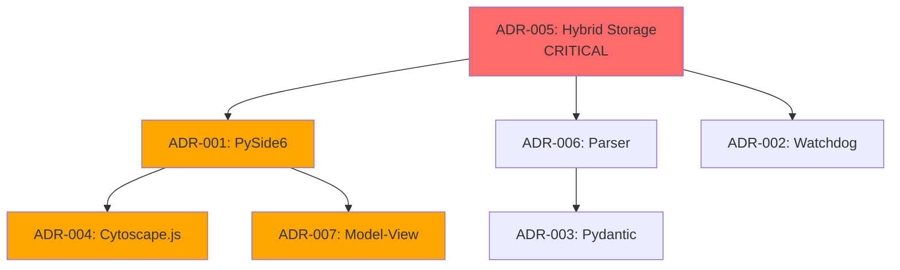

# Indeks Decyzji

## Cel
Scentralizowany indeks wszystkich Architecture Decision Records (ADR) dla szybkiego odniesienia.

## Wszystkie Decyzje (7 ADR)

| ADR ID | Tytuł | Status | Data | Decyzja | Impact |
|--------|-------|--------|------|---------|--------|
| ADR-001 | GUI Framework: PySide6 | accepted | 2025-12-18 | Użyj PySide6 (nie PyQt6, Tkinter) | High - cała warstwa GUI |
| ADR-002 | File Monitoring: Watchdog | accepted | 2025-12-19 | Użyj biblioteki Watchdog | Medium - real-time updates |
| ADR-003 | Validator: Python vs OPA | accepted | 2025-12-20 | Pure Python (Pydantic, nie OPA/Rego) | Medium - warstwa walidacji |
| ADR-004 | Graph Viz: Cytoscape.js | accepted | 2025-12-21 | Embed Cytoscape.js w QtWebEngine | High - main UI feature |
| ADR-005 | Storage: Hybrid Approach | accepted | 2025-12-22 | Files + SQLite (nie files-only lub DB-only) | Critical - foundational |
| ADR-006 | Parser Architecture | accepted | 2025-12-23 | python-frontmatter + markdown-it-py | Medium - warstwa parsingu |
| ADR-007 | GUI Pattern: Model-View | accepted | 2025-12-24 | Qt Signal/Slot (implicit controller) | High - wzorzec architektury |

## Według Statusu
- **Accepted**: 7
- **Rejected**: 0
- **Deprecated**: 0
- **Superseded**: 0

## Według Impaktu
- **Critical**: 1 (ADR-005 Storage)
- **High**: 3 (ADR-001 GUI, ADR-004 Viz, ADR-007 Pattern)
- **Medium**: 3 (ADR-002 Watcher, ADR-003 Validator, ADR-006 Parser)

## Graf Decyzji (Mermaid)

## Szybkie Linki
- [ADR-001: PySide6](../../engineering/decisions/ADR-001-pyside6.md)
- [ADR-002: Watchdog](../../engineering/decisions/ADR-002-watchdog.md)
- [ADR-003: Validator](../../engineering/decisions/ADR-003-validator.md)
- [ADR-004: Cytoscape.js](../../engineering/decisions/ADR-004-cytoscape.md)
- [ADR-005: Storage](../../engineering/decisions/ADR-005-storage.md)
- [ADR-006: Parser](../../engineering/decisions/ADR-006-parser-arch.md)
- [ADR-007: GUI Pattern](../../engineering/decisions/ADR-007-gui-pattern.md)

## Dodawanie Nowego ADR
1. Skopiuj `/docs/templates/adr-template.md`
2. Zmień nazwę na `ADR-{NUMBER}-{slug}.md`
3. Wypełnij wszystkie sekcje (Context, Decision, Consequences, Alternatives)
4. Zlinkuj evidence notes
5. Zaktualizuj ten indeks

## Statystyki
- **Total ADR**: 7
- **Accepted ratio**: 100% (7/7)
- **Evidence backing**: 7/7 (100% mają evidence notes)
- **Average impact**: High (5/7 są High lub Critical)

## Historia Zmian
| Data | Zmiana | Przez |
|------|--------|-------|
| 2025-12-26 | Utworzono indeks z 7 ADR | Claude |
