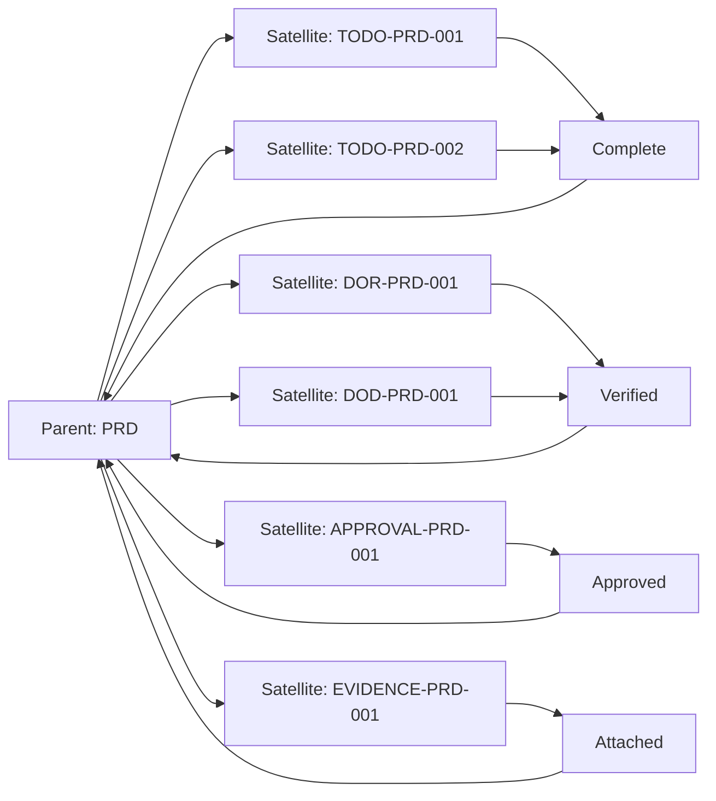

# Atomic — Atomowe Szablony Satelitarne

## 📋 Przeznaczenie

Folder zawiera **atomowe szablony satelitarne** — ultra-lightweight, reusable artifacts używane PRZEZ inne dokumenty jako "satellites" (TODO, DoR, DoD, Approval, Evidence, etc.).

## 🎯 Funkcja

Dokumenty w tym folderze służą do:
- **Lightweight tracking** (TODO per section, per epic, per release)
- **Quality gates** (Definition of Ready, Definition of Done)
- **Formal sign-offs** (Approval records)
- **Evidence management** (Evidence artifacts, attachments)
- **Risk tracking** (Individual risk items)
- **Release artifacts** (Atomic release checklists, postmortems)

## 👥 Kto używa?

**Wszyscy!** Atomic templates są używane przez:
- **Product Owners** — TODO, DoR, Approval
- **Scrum Masters** — TODO, DoD, Evidence
- **Developers** — TODO per section (implementation tracking)
- **QA Teams** — DoD, Evidence (test results)
- **Risk Managers** — Risk item templates
- **Release Managers** — Release checklist atoms, postmortem atoms

## ⏱️ Kiedy używać?

**Zawsze, gdy:**
- Potrzebujesz lightweight artifact do śledzenia
- Główny dokument jest za ciężki (PRD za długi → utwórz TODO-PRD-001)
- Chcesz formalnie zatwierdzić coś (→ Approval-*.md)
- Potrzebujesz dowodu (→ Evidence-*.md)
- Pojedynczy risk item wymaga tracking (→ risk-item-*.md)

**Pattern:** Parent document → creates satellite instances

## 📂 Atomic Templates (8 plików)

### TODO-template.md
**Lightweight TODO tracking**

- **Parent docs:** PRD, TDD, Roadmap, Sprint
- **Instances:** TODO-PRD-001, TODO-SPRINT-042, etc.
- **Zawiera:** Description, checklist, owner, due date, status
- **Pattern:** 1 TODO = 1 konkretna akcja

**Example use:**
```
PRD §4 Wymagania funkcjonalne (not yet written)
→ Create: TODO-PRD-004.md "Write functional requirements section"
```

### DoR-template.md
**Definition of Ready (atomic)**

- **Parent docs:** Sprint, Epic, User Story, Release
- **Instances:** DOR-SPRINT-042.md, DOR-EPIC-012.md
- **Zawiera:** Checklist kryteriów wejścia
- **Pattern:** Before work starts → verify DoR

**Example checklist:**
- [ ] Description clear & complete
- [ ] Acceptance criteria defined (GIVEN/WHEN/THEN)
- [ ] Estimated (story points)
- [ ] Dependencies identified
- [ ] Owner available

### DoD-template.md
**Definition of Done (atomic)**

- **Parent docs:** Sprint, Epic, User Story, Release
- **Instances:** DOD-SPRINT-042.md, DOD-EPIC-012.md
- **Zawiera:** Checklist kryteriów zakończenia
- **Pattern:** Before marking complete → verify DoD

**Example checklist:**
- [ ] Code merged to main
- [ ] Tests green (unit + integration)
- [ ] Documentation updated
- [ ] Security scans passed
- [ ] Stakeholder approval

### Approval-template.md
**Formal approval record**

- **Parent docs:** PRD, TDD, Business Case, Roadmap, Release
- **Instances:** APPROVAL-PRD-001.md, APPROVAL-RELEASE-042.md
- **Zawiera:** Approver name, date, notes, signature
- **Pattern:** Document ready → get approval → record

**Example:**
```yaml
approver: "Jane Doe (CPO)"
date: "2025-01-15"
status: "approved"
notes: "Approved with minor comments (see PRD §7)"
```

### Evidence-template.md
**Evidence artifact**

- **Parent docs:** Business Case, PRD, Test Plan, Compliance
- **Instances:** EVIDENCE-BUSCASE-001.md (market research.xlsx)
- **Zawiera:** File path, description, hash, what it proves
- **Pattern:** Claim in doc → attach evidence → reference

**Example:**
```
File: evidence/market-research-2025.xlsx
Description: TAM/SAM/SOM analysis for EMEA market
Proves: Business Case §3 Market Size claims
Hash: sha256:abc123...
```

### risk-item-template.md
**Individual risk item**

- **Parent docs:** Risk Register, Project Plan, Roadmap
- **Instances:** RISK-ROADMAP-001.md, RISK-PROJECT-042.md
- **Zawiera:** Risk description, likelihood, impact, mitigation, owner
- **Pattern:** 1 risk = 1 risk-item.md (granular tracking)

**Example:**
```yaml
id: RISK-ROADMAP-001
title: "Regulatory approval delay"
likelihood: "Medium"
impact: "High"
severity: "High"  # likelihood × impact
owner: "Legal Lead"
mitigation: "Early engagement with regulator; contingency plan"
status: "open"
```

### release-checklist-atom.md
**Atomic release checklist**

- **Parent docs:** Release Plan, Deployment Guide
- **Instances:** REL-ATOM-042.md (per-release instance)
- **Zawiera:** Lightweight checklist (smoke tests, monitoring, rollback)
- **Pattern:** Major checklist too heavy → atomic per-release

**Example:**
```markdown
- [ ] Smoke tests passed
- [ ] Monitoring configured
- [ ] Rollback verified
```

### postmortem-atom.md
**Atomic postmortem**

- **Parent docs:** Postmortem Template (full), Incident Report
- **Instances:** PM-ATOM-042.md (per-incident lightweight)
- **Zawiera:** Summary, timeline, root cause, actions (ultra-condensed)
- **Pattern:** Minor incident → atomic postmortem (not full template)

**Example:**
```markdown
Summary: API rate limit exceeded → 503 errors
Timeline: 14:30 incident, 14:45 resolved
Root cause: Burst traffic (marketing campaign)
Actions: Increase rate limit, add alerting
```

## 🔄 Satellite Pattern



**Lifecycle:**
1. Parent doc created (PRD)
2. Satellites auto-generated or manually created (TODO-PRD-*)
3. Satellites tracked separately (lightweight)
4. Satellites completion → parent doc progress

## 🔗 Powiązania

**Dependencies:**
- ⬅️ **All parent docs** → Atomic templates są używane PRZEZ inne docs

**Impacts:**
- ➡️ **Parent docs** → Satellite completion → parent progress
- ➡️ **Tracking systems** → Satellites feed into TODO trackers, kanban boards
- ➡️ **Automation** → Satellites can be auto-generated (when parent created)

## 📊 Statystyki

- **Liczba atomic templates:** 8
- **Reusability:** 100% (all templates reusable across domains)
- **Instances created:** Potentially 100s-1000s (per-project satellites)
- **Average size:** 20-50 lines (ultra-lightweight!)

## 🚀 Quick Start

**Scenario 1: PRD created, need TODO tracking**
1. Copy: `TODO-template.md` → `TODO-PRD-001.md`
2. Fill: Section = "§4 Functional Requirements", owner, due date
3. Track: In project management tool or satellites/todos/ folder

**Scenario 2: Sprint planning, need DoR checklist**
1. Copy: `DoR-template.md` → `DOR-SPRINT-042.md`
2. Customize: Add sprint-specific criteria
3. Verify: Before sprint starts, check all DoR items

**Scenario 3: Release ready, need approval**
1. Copy: `Approval-template.md` → `APPROVAL-RELEASE-042.md`
2. Get sign-off: From Release Manager / CPO
3. Attach: To release documentation

## ⚠️ Uwagi

**Lightweight philosophy:**
- Atomic templates są LEKKIE (nie rozdmuchuj!)
- 1 atom = 1 konkretny purpose (TODO, DoR, DoD, etc.)
- Keep it simple (20-50 lines max)

**Per-instance:**
- Każdy satellite = nowy plik (TODO-PRD-001, TODO-PRD-002, etc.)
- NIGDY nie edytuj template'u samego (kopiuj → wypełnij)

**Storage convention:**
```
docs/project/
  ├─ PRD.md (parent)
  ├─ satellites/
     ├─ todos/
        ├─ TODO-PRD-001.md
        ├─ TODO-PRD-002.md
     ├─ dor/
        ├─ DOR-PRD-001.md
     ├─ approvals/
        ├─ APPROVAL-PRD-001.md
     ├─ evidence/
        ├─ EVIDENCE-PRD-001.md
```

**Automation opportunity:**
- When PRD created → auto-generate TODO-PRD-* per section
- When Sprint planned → auto-generate DOR-SPRINT-*, DOD-SPRINT-*
- When Release planned → auto-generate REL-ATOM-*, APPROVAL-RELEASE-*

## 📖 Zobacz też

- [../sprints/](../sprints/) — Sprint docs use atomic satellites
- [../roadmaps/](../roadmaps/) — Roadmap docs use atomic satellites
- [../specs/satelitarne_artefakty_*.md](../specs/) — Satellite framework spec
- [../../dependency_graph.md](../../dependency_graph.md) — Graf H: Atomic Satellites Network

---

**Wygenerowano:** 2025-12-28
**Kategoria:** Atomic (Lightweight Satellite Artifacts)
**Pattern:** Parent docs → Satellite instances (1:N relationship)
**Philosophy:** Ultra-lightweight, single-purpose, reusable
