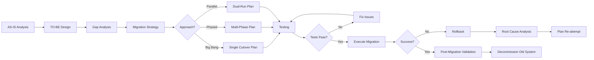

# Migration — Planowanie Migracji Systemów

## 📋 Przeznaczenie

Folder zawiera **szablon do planowania migracji systemów** — kompleksowy dokument wspierający proces przejścia z systemu A (AS-IS) do systemu B (TO-BE), w tym analizę, strategię, plan wdrożenia i rollback.

## 🎯 Funkcja

Dokument w tym folderze służy do:
- **Planowania migracji** (strategy, approach, timeline)
- **Analizy AS-IS → TO-BE** (current state vs target state)
- **Risk management** (migration risks, mitigation)
- **Execution planning** (phases, cutover, rollback)
- **Testing & validation** (migration testing, data validation)
- **Communication** (stakeholder updates, training)

## 👥 Kto używa?

- **System Architects** — AS-IS/TO-BE analysis, migration strategy
- **Migration Lead** — overall migration planning & execution
- **Data Engineers** — data migration strategy, ETL
- **DevOps/SRE** — infrastructure migration, cutover
- **QA Teams** — migration testing, validation
- **Project Managers** — timeline, resources, risk management
- **Stakeholders** — approval, communication, training

## ⏱️ Kiedy używać?

**Timing:** Przed każdą major migration

**Migration Scenarios:**
- **System migration** (legacy → modern platform)
- **Data migration** (database → new schema/platform)
- **Infrastructure migration** (on-prem → cloud)
- **Application migration** (monolith → microservices)
- **Provider migration** (vendor A → vendor B)

**Lifecycle:**
```
AS-IS Analysis → TO-BE Design → Migration Plan → 
Execute → Validate → Cutover → Rollback (if needed) → 
Post-Migration Review
```

## 📂 Dokument Migracji (1 plik)

### migration_plan_doc.md
**Comprehensive Migration Plan**

**Struktura:**

1. **Executive Summary**
   - Migration goal, scope, timeline
   - High-level approach (big bang vs phased)
   - Key risks & mitigation

2. **AS-IS Analysis**
   - Current system description
   - Architecture, data model, integrations
   - Pain points, technical debt
   - Dependencies, constraints

3. **TO-BE Vision**
   - Target system description
   - New architecture, data model
   - Benefits, improvements
   - Success criteria

4. **Gap Analysis**
   - Functional gaps (AS-IS vs TO-BE)
   - Data mapping (old schema → new schema)
   - Integration changes
   - Custom code migration needs

5. **Migration Strategy**
   - Approach: Big Bang vs Phased vs Parallel Run
   - Migration phases (if phased)
   - Data migration strategy (ETL, sync)
   - Cutover strategy (weekend, blue-green, canary)

6. **Execution Plan**
   - Timeline & milestones
   - Phase-by-phase tasks
   - Resource allocation (team, budget)
   - Dependencies & sequencing

7. **Testing & Validation**
   - Migration testing plan
   - Data validation strategy
   - UAT (User Acceptance Testing)
   - Performance testing

8. **Rollback Plan**
   - Rollback triggers (when to abort)
   - Rollback procedures (step-by-step)
   - Data restoration plan
   - Communication plan (if rollback)

9. **Risk Management**
   - Migration risks (data loss, downtime, etc.)
   - Likelihood, impact, mitigation
   - Contingency plans

10. **Communication & Training**
    - Stakeholder communication plan
    - User training (new system)
    - Support plan (post-migration)

11. **Post-Migration**
    - Validation checklist
    - Performance monitoring
    - Lessons learned
    - Decommissioning old system

**Dependencies:**
- ⬅️ **AS-IS Architecture** → understanding current state
- ⬅️ **TO-BE Architecture** → target state design
- ⬅️ **Business Case** → justification for migration
- ⬅️ **Risk Register** → migration risks

**Impacts:**
- ➡️ **Implementation Plan** → detailed execution
- ➡️ **Test Plan** → migration testing
- ➡️ **Deployment Guide** → cutover procedures
- ➡️ **Runbook** → post-migration operations

## 🔄 Migration Workflow



## 📊 Statystyki

- **Liczba szablonów:** 1 (comprehensive)
- **Średnia wielkość:** 500-800 linii (very detailed)
- **Typical duration:** 3-12 months (depends on complexity)
- **Success rate:** 70-80% (proper planning critical!)

## 🚀 Quick Start - Typical Migration Process

**Phase 1: Analysis (Week 1-4)**
1. Document AS-IS state (architecture, data, integrations)
2. Design TO-BE state (target architecture, data model)
3. Perform gap analysis (what needs to change)

**Phase 2: Planning (Week 5-8)**
4. Define migration strategy (big bang vs phased)
5. Create execution plan (timeline, phases, resources)
6. Develop rollback plan (contingency)

**Phase 3: Testing (Week 9-12)**
7. Migration testing (dry runs)
8. Data validation (integrity, completeness)
9. UAT (user acceptance)

**Phase 4: Execution (Week 13)**
10. Pre-cutover checklist
11. Execute migration (according to plan)
12. Post-cutover validation

**Phase 5: Post-Migration (Week 14+)**
13. Monitor performance
14. Decommission old system (after stabilization)
15. Lessons learned (postmortem)

## ⚠️ Uwagi

**High-stakes:**
- Migrations są high-risk (data loss, downtime, business impact)
- Proper planning = success (70%+ migrations fail without plan)
- Rollback plan CRITICAL (always have escape hatch)

**Testing is key:**
- Dry runs recommended (3-5 iterations)
- Data validation automated (check integrity post-migration)
- UAT with real users (catch issues early)

**Communication:**
- Stakeholders need constant updates (no surprises)
- Users need training (new system = change management)
- Support ready (post-migration issues expected)

**Common pitfalls:**
- Underestimating complexity (2x your estimate)
- Insufficient testing (test, test, test!)
- No rollback plan (always have escape route)
- Poor communication (stakeholders blindsided)

## 📈 Success Criteria

**Pre-Migration:**
- [ ] AS-IS fully documented
- [ ] TO-BE design approved
- [ ] Gap analysis complete
- [ ] Migration strategy agreed
- [ ] Rollback plan tested

**During Migration:**
- [ ] No data loss (100% integrity)
- [ ] Downtime within SLA (< X hours)
- [ ] All integrations working
- [ ] Performance acceptable

**Post-Migration:**
- [ ] All functionality working
- [ ] Users trained & productive
- [ ] No P0/P1 issues outstanding
- [ ] Old system decommissioned

## 🛠️ Tools & Techniques

**Data Migration:**
- ETL tools (Talend, Informatica, Apache NiFi)
- Database replication (MySQL replication, PostgreSQL streaming)
- Data validation (checksums, row counts, sample verification)

**Infrastructure Migration:**
- Blue-green deployment (swap environments)
- Canary releases (gradual rollout)
- Feature flags (toggle old/new system)

**Testing:**
- Dry runs (practice migrations in staging)
- Chaos engineering (test failure scenarios)
- Load testing (performance under migration load)

## 📖 Zobacz też

- [../przedprodukcyjna/](../przedprodukcyjna/) — AS-IS/TO-BE architecture templates
- [../produkcyjna/](../produkcyjna/) — Deployment guide, runbook, postmortem
- [../specs/](../specs/) — Doc types, error codes (validation)
- [../../dependency_graph.md](../../dependency_graph.md) — Migration dependencies

---

**Wygenerowano:** 2025-12-28
**Kategoria:** Migration (System Migration Planning)
**Scope:** Comprehensive migration lifecycle (analysis → execution → validation)
**Critical:** Rollback plan REQUIRED (never migrate without escape route!)
