# Research Templates - Diagramy Workflow (Mermaid)

**Wersja:** 1.0
**Data:** 2025-12-29
**Opis:** Wizualne reprezentacje przepływów pracy dla Research Templates

---

## Spis treści

1. [Decision Tree - Wybór szablonu](#decision-tree---wybór-szablonu)
2. [Workflow 1: Technology Selection](#workflow-1-technology-selection)
3. [Workflow 2: Sprint Spike (Agile)](#workflow-2-sprint-spike-agile)
4. [Workflow 3: Research Cycle (Quarterly)](#workflow-3-research-cycle-quarterly)
5. [Workflow 4: Parallel Exploration](#workflow-4-parallel-exploration)
6. [Template Dependencies Graph](#template-dependencies-graph)
7. [Research Lifecycle](#research-lifecycle)

---

## Decision Tree - Wybór szablonu

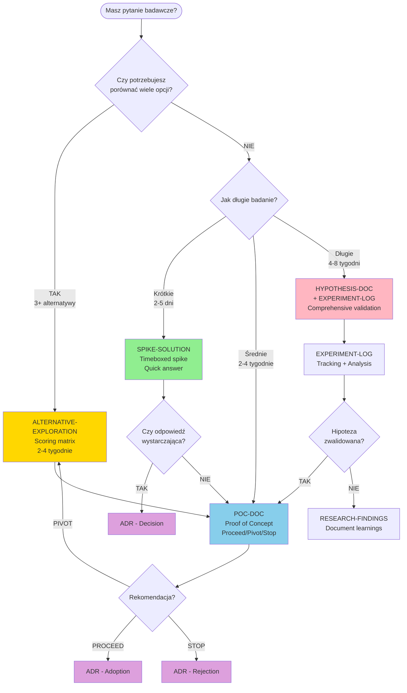

---

## Workflow 1: Technology Selection

**Scenariusz:** Wybór bazy danych dla modułu analytics

```mermaid
graph TB
    Problem([Problem: Wolne wyszukiwanie<br/>PostgreSQL nie skaluje]) --> Alt[ALTERNATIVE-EXPLORATION-001<br/>Week 1-2]

    Alt --> Options[Zidentyfikowane opcje:<br/>• MongoDB<br/>• Elasticsearch<br/>• PostgreSQL Optimized<br/>• Dgraph]

    Options --> Matrix[Scoring Matrix<br/>MongoDB: 8.35/10 ✅<br/>Elasticsearch: 6.40<br/>PostgreSQL: 7.50<br/>Dgraph: 5.80]

    Matrix --> Shortlist[Shortlist: MongoDB<br/>Top option dla validation]

    Shortlist --> Hyp[HYPOTHESIS-001<br/>Week 3<br/>MongoDB improves performance 60%+]

    Hyp --> Exp[EXPERIMENT-001<br/>Week 4-6<br/>Benchmark 10K docs]

    Exp --> Results1[Results:<br/>Search -76% ✅<br/>Graph -61% ✅<br/>Hypothesis VALIDATED]

    Results1 --> PoC[POC-001<br/>Week 7-10<br/>Pilot: 5K docs, 20 users]

    PoC --> Results2[Results:<br/>Real-world -68% search ✅<br/>NPS +85 ✅<br/>0 data loss ✅]

    Results2 --> Recommend[Recommendation:<br/>PROCEED with MongoDB]

    Recommend --> Findings[RESEARCH-FINDINGS-001<br/>Week 11<br/>Aggregate all results]

    Findings --> ADR[ADR-042<br/>Week 12<br/>Decision: Migrate to MongoDB<br/>Budget: $65K approved]

    ADR --> Impl[Production Migration<br/>Q2 2026 - 12 weeks]

    style Problem fill:#FFB6C1
    style Alt fill:#FFD700
    style Hyp fill:#FFB6C1
    style Exp fill:#87CEEB
    style PoC fill:#87CEEB
    style Findings fill:#90EE90
    style ADR fill:#DDA0DD
    style Impl fill:#98FB98
```

**Timeline:** 12 tygodni research → High-confidence decision $65K investment

---

## Workflow 2: Sprint Spike (Agile)

**Scenariusz:** User Story zablokowany przez technical unknown

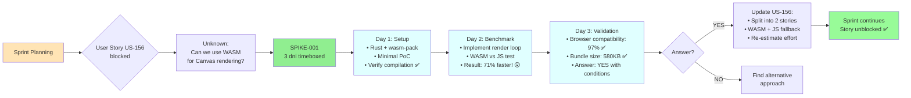

**Timeline:** 3 dni spike → Story unblocked → Sprint delivery on track

---

## Workflow 3: Research Cycle (Quarterly)

**Scenariusz:** Q1 2026 Performance Optimization Initiative

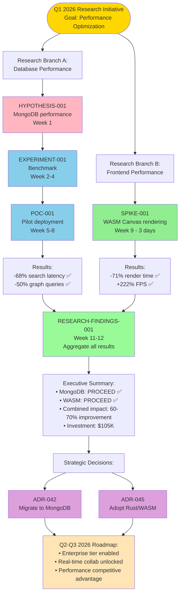

**Timeline:** 14 tygodni research → Strategic roadmap Q2-Q3 2026

---

## Workflow 4: Parallel Exploration

**Scenariusz:** Real-time Collaboration - Unknown best approach

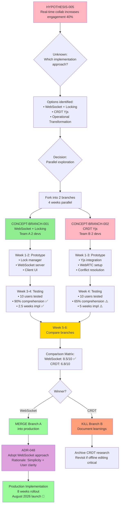

**Timeline:** 4 weeks parallel + 8 weeks implementation = 12 weeks total
**Value:** Higher confidence, mitigated risk vs sequential approach (10 weeks + risk)

---

## Template Dependencies Graph

**Jak research templates odnoszą się do siebie:**

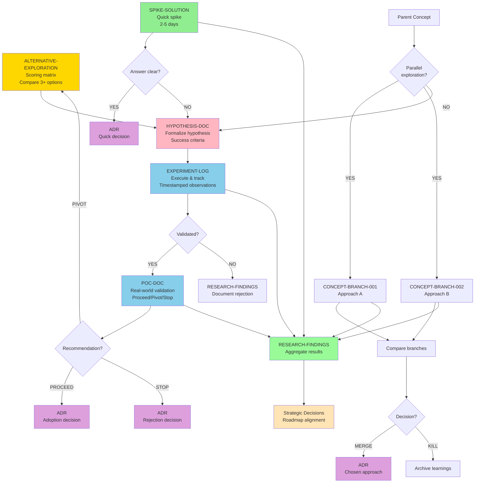

---

## Research Lifecycle

**Od problemu do produkcji:**

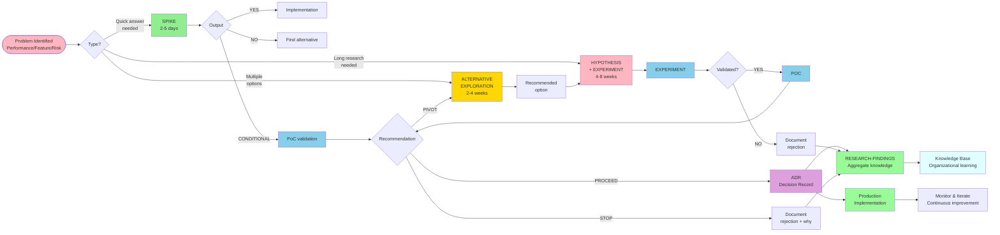

---

## Szczegółowy Timeline Example

**Technology Selection - Week by week:**

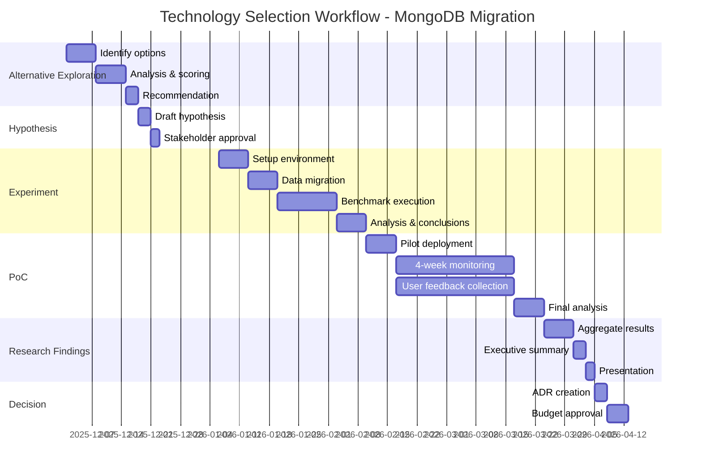

---

## Stakeholder Decision Points

**Kluczowe momenty decision-making w research workflow:**

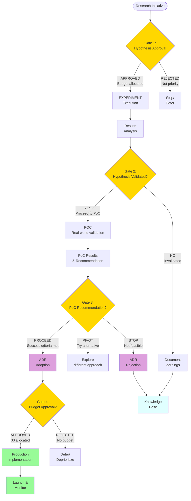

**Decision Gates (kluczowe checkpoints):**

1. **Gate 1: Hypothesis Approval** - Czy badanie warte investment?
2. **Gate 2: Validation** - Czy hipoteza potwierdzona danymi?
3. **Gate 3: PoC Recommendation** - Proceed/Pivot/Stop?
4. **Gate 4: Budget Approval** - Czy inwestujemy w produkcję?

---

## Research vs Implementation Ratio

**Optymalna alokacja czasu:**

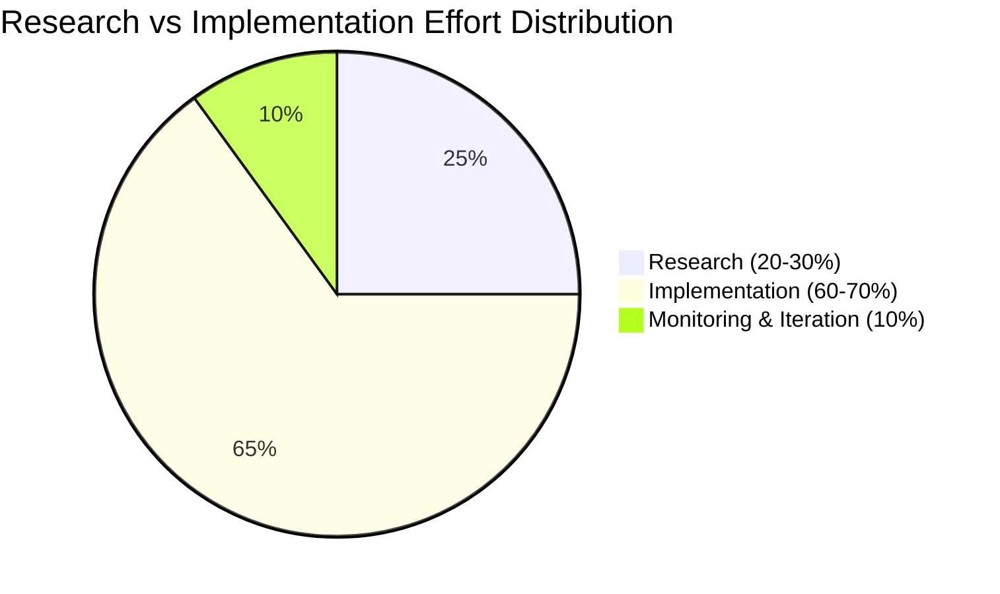

**Best practice:**
- **Zbyt mało research (<10%):** High risk bad decisions, wasted implementation
- **Zbyt dużo research (>40%):** Analysis paralysis, opportunity cost
- **Sweet spot (20-30%):** Data-driven decisions, confident implementation

---

## Complexity vs Research Depth

**Kiedy inwestować więcej w research:**

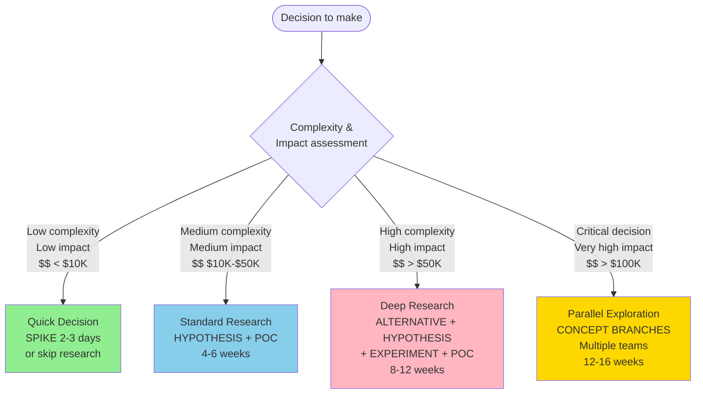

**Zasada:** Research investment proporcjonalny do:
- Complexity (technical/business)
- Impact (revenue, users, strategic)
- Cost of wrong decision ($$, time, opportunity cost)

---

## Template Selection Matrix

**Quick reference - który szablon wybrać:**

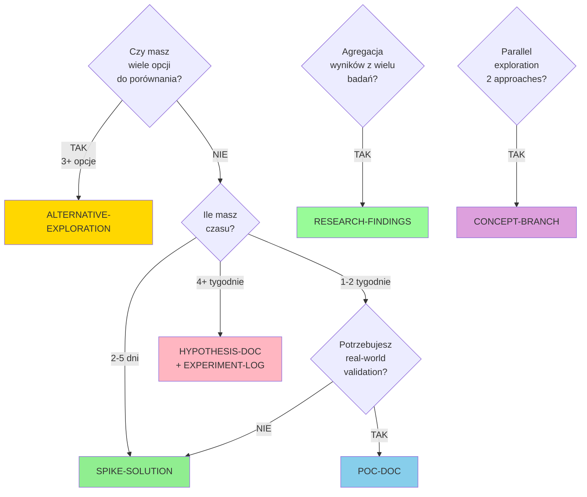

---

## Legenda kolorów

W diagramach używane są następujące kolory dla czytelności:

| Kolor | Znaczenie | Przykład |
|-------|-----------|----------|
| 🟢 **Zielony (#90EE90)** | Spike / Quick decisions | SPIKE-SOLUTION |
| 🔵 **Niebieski (#87CEEB)** | Experiments / PoC | EXPERIMENT-LOG, POC-DOC |
| 🌸 **Różowy (#FFB6C1)** | Hypotheses / Problems | HYPOTHESIS-DOC |
| 🟡 **Żółty (#FFD700)** | Analysis / Comparison | ALTERNATIVE-EXPLORATION |
| 🟣 **Fioletowy (#DDA0DD)** | Decisions / ADR | Architecture Decision Records |
| 🟢 **Jasny zielony (#98FB98)** | Success / Production | Research Findings, Production |
| 🔶 **Pomarańczowy (#FFE4B5)** | Strategic / Roadmap | Roadmap, Strategy |
| 💧 **Cyan (#E0FFFF)** | Knowledge / Archive | Knowledge Base |

---

## Jak używać tych diagramów

### Osadzanie w dokumentach

```markdown
# Twój dokument

## Workflow

```mermaid
[skopiuj diagram stąd]
\```
```

### Renderowanie

**Narzędzia wspierające Mermaid:**
- **GitHub/GitLab:** Automatyczne renderowanie w README.md
- **Obsidian:** Plugin Mermaid
- **VS Code:** Mermaid Preview extension
- **Online:** https://mermaid.live/

### Eksport do obrazów

**Mermaid Live Editor:**
1. Otwórz https://mermaid.live/
2. Wklej kod diagramu
3. Export → PNG/SVG/PDF

---

## Modyfikacja diagramów

### Zmiana kolorów

```mermaid
graph TD
    Node1[Twój node]

    style Node1 fill:#TWÓJ_KOLOR,stroke:#333,stroke-width:2px
```

### Dodanie ikon

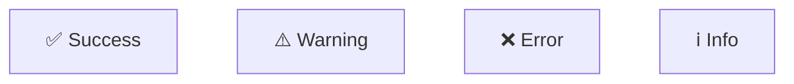

### Zmiana kierunku

```mermaid
graph LR  # Left to Right
graph TD  # Top to Down
graph BT  # Bottom to Top
graph RL  # Right to Left
```

---

## Więcej zasobów

**Mermaid dokumentacja:**
- https://mermaid.js.org/
- https://mermaid.js.org/syntax/flowchart.html
- https://mermaid.js.org/syntax/gantt.html

**Research Templates:**
- [README.md](./README.md) - Główna dokumentacja
- [/templates/research/](.) - Szablony
- [/examples/research/](../../examples/research/) - Przykłady

---

**Ostatnia aktualizacja:** 2025-12-29
**Wersja:** 1.0
**Maintainer:** Zespół Dokumentacji Ishkarim
