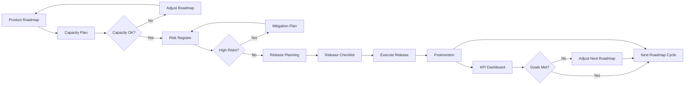

# Roadmaps — Planowanie Strategiczne i Roadmapy

## 📋 Przeznaczenie

Folder zawiera **szablony do planowania strategicznego i zarządzania roadmapami** — dokumenty wysokopoziomowe definiujące wizję produktu, milestones, capacity, ryzyka i KPIs na dłuższy horyzont czasowy (6-12 miesięcy).

## 🎯 Funkcja

Dokumenty w tym folderze służą do:
- **Strategic planning** (product roadmap, milestones, releases)
- **Resource planning** (capacity plan, budgeting)
- **Risk management** (risk register, mitigation)
- **Release management** (release checklist, deployment)
- **Post-release analysis** (postmortem, lessons learned)
- **Performance tracking** (KPI dashboard, metrics)

## 👥 Kto używa?

- **Product Managers** — product roadmap, milestones, priorities
- **C-Level / Leadership** — strategic vision, business alignment
- **Resource Managers** — capacity planning, budgeting
- **Risk Managers** — risk register, mitigation strategies
- **Release Managers** — release planning, checklists
- **Operations** — postmortems, incident analysis

## ⏱️ Kiedy używać?

**Timing:** Strategic planning cycles (quarterly, semi-annually)

**Roadmap Lifecycle:**
```
Vision → Roadmap → Capacity → Risk → Release → Postmortem
  ↓        ↓          ↓         ↓        ↓          ↓
Strategy Milestones Resources  Risks   Deploy   Lessons
```

## 📂 Dokumenty Roadmap (6 plików)

### roadmap-product.md
**Product Roadmap**

- **Cel:** High-level wizja produktu na 6-12 miesięcy
- **Wypełnia:** Head of Product / CPO
- **Timing:** Quarterly review & update
- **Zawiera:**
  - Context & Strategic goal (OKRs, KPIs)
  - Roadmap swimlanes (strategic/product/release/tactical)
  - Milestones & Releases (M1, M2, ...)
  - Epics / Feature sets
  - Dependencies & Blockers
  - Capacity & Budget summary
  - KPIs & success metrics
  - Checkpoints & Gates

**Horyzont:** 12 months
**Audience:** C-Level, stakeholders, product team

### capacity-plan.md
**Capacity Plan**

- **Cel:** Planowanie zasobów (FTE, budget) dla roadmap
- **Wypełnia:** Delivery Manager / Resource Manager
- **Timing:** Quarterly, synchronized z roadmap
- **Zawiera:**
  - Available resources (FTE, contractors)
  - Assumptions (vacations, bench, etc.)
  - Demand by milestone (effort estimates)
  - Gaps & mitigation (hiring, contractors)

**Horyzont:** Aligned z roadmap milestones
**Audience:** Finance, HR, delivery teams

### risk-register.md
**Risk Register**

- **Cel:** Roadmap-level risk tracking
- **Wypełnia:** Head of Product / Risk Manager
- **Timing:** Ongoing (monthly reviews)
- **Zawiera:**
  - Risk table (ID, description, likelihood, impact, severity)
  - Owner, mitigation strategy, status
  - RAID items (Risks, Assumptions, Issues, Dependencies)

**Scope:** Strategic risks (regulatory, vendor, market)
**Audience:** Leadership, risk committee

### release-checklist.md
**Release Checklist**

- **Cel:** Checklist dla major releases z roadmap
- **Wypełnia:** Release Manager
- **Timing:** Per-release (aligned z milestones)
- **Zawiera:**
  - Pre-freeze checklist (code complete, DoR)
  - Pre-release checklist (QA, security, DB migration)
  - Release window checklist (deployment, smoke tests)
  - Post-release checklist (postmortem, communication)

**Scope:** Major releases (M1, M2, etc.)
**Audience:** Engineering, QA, operations

### postmortem-template.md
**Postmortem Template**

- **Cel:** Post-release analysis (incidents, lessons learned)
- **Wypełnia:** Incident Lead / Release Manager
- **Timing:** Post-release or post-incident
- **Zawiera:**
  - Summary (what happened)
  - Impact (users affected, metrics, duration)
  - Timeline (event chronology)
  - Root cause analysis
  - Remediation & Actions (owner, due date)
  - Lessons learned
  - Follow-ups (TODO tracking)

**Trigger:** Major incidents, release issues
**Audience:** Engineering, operations, leadership

### kpi-dashboard-spec.md
**KPI & Dashboard Specification**

- **Cel:** Definicja metryk i dashboardów dla roadmap tracking
- **Wypełnia:** Product Ops / Data Team
- **Timing:** Setup once, updated quarterly
- **Zawiera:**
  - Metrics (% complete, delivered value, lead time)
  - Dashboards (exec dashboard, delivery dashboard)
  - Data sources (warehouse tables, ETL jobs)

**Purpose:** Data-driven roadmap tracking
**Audience:** Product Ops, leadership, stakeholders

## 🔄 Roadmap Workflow



## 🔗 Powiązania

**Dependencies:**
- ⬅️ **Business Case** → ROI, business goals justify roadmap
- ⬅️ **Vision Document** → Strategic vision drives roadmap
- ⬅️ **Market Analysis** → Market trends inform priorities

**Impacts:**
- ➡️ **PRD** → Roadmap epics → PRD features
- ➡️ **Sprints** → Milestones → sprint goals
- ➡️ **Release Plans** → Roadmap releases → deployment plans
- ➡️ **KPIs** → Roadmap metrics → business performance

## 📊 Statystyki

- **Liczba szablonów:** 6 (strategic planning layer)
- **Pokrycie:** 100% roadmap lifecycle
- **Połączenia w grafie:** ~200 dependencies/impacts
- **Top document:** ROADMAP-PROD (#1 w dependency graph, 28 deps)

## 🚀 Quick Start - Quarterly Roadmap Cycle

**Quarter Start (Month 1, Week 1):**
1. `roadmap-product.md` — Define vision, milestones (1 week)
2. `capacity-plan.md` — Resource planning (1 week)
3. `risk-register.md` — Identify strategic risks (ongoing)

**Quarter Execution (Month 1-3):**
4. `kpi-dashboard-spec.md` — Setup metrics tracking (Week 2)
5. Monthly: Update risk register
6. Per-milestone: `release-checklist.md` preparation

**Quarter End (Month 3, Week 4):**
7. `release-checklist.md` — Execute major releases
8. `postmortem-template.md` — Post-release analysis
9. Review KPIs → Input to next quarter roadmap

**Next Quarter:**
10. Adjust roadmap based on learnings → Repeat cycle

## ⚠️ Uwagi

**Strategic layer:**
- Roadmaps są "strategic layer" nad execution (sprints, PRD)
- Roadmap epics → PRD features → Sprint backlog items

**Flexibility:**
- Roadmaps są living documents (adjust based on market, learnings)
- Quarterly reviews recommended (adapt to change)

**Stakeholder alignment:**
- Roadmaps require exec buy-in (get C-level approval)
- Communication plan critical (monthly updates to stakeholders)

**Data-driven:**
- KPI dashboard drives decisions (objective vs subjective)
- Postmortems feed into next cycle (continuous improvement)

## 📈 Metryki Sukcesu

**Delivery:**
- % epics completed vs planned
- On-time delivery rate (milestones met)
- Velocity trend (improving vs declining)

**Business Value:**
- Delivered value vs forecast
- ROI vs business case projections
- Customer adoption metrics

**Quality:**
- Post-release defect rate
- Incident frequency (major/critical)
- Postmortem action item completion

**Risk Management:**
- Risk realization rate (materialized vs mitigated)
- Time-to-mitigation (risk identified → resolved)

## 📖 Zobacz też

- [../sprints/](../sprints/) — Sprint management (execution layer)
- [../przedprodukcyjna/](../przedprodukcyjna/) — PRD (feature layer)
- [../atomic/](../atomic/) — Atomic satellites (TODO, DoR, DoD for roadmap items)
- [../../dependency_graph.md](../../dependency_graph.md) — Graf G: Roadmap & Planning Workflow

---

**Wygenerowano:** 2025-12-28
**Kategoria:** Roadmaps (Strategic Planning & Product Roadmaps)
**Horyzont:** 6-12 months, quarterly updates
**Top Document:** ROADMAP-PROD (#1 most-referenced, 28 dependencies)
