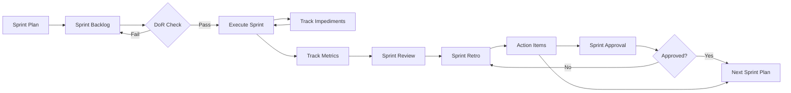

# Sprints — Zarządzanie Sprintami (Agile)

## 📋 Przeznaczenie

Folder zawiera **szablony do zarządzania sprintami w metodologii Agile/Scrum** — komplet dokumentów satelitarnych wspierających planowanie, wykonanie, review i retrospektywę sprintów.

## 🎯 Funkcja

Dokumenty w tym folderze służą do:
- **Planowania sprintu** (sprint plan, backlog, capacity)
- **Kontroli jakości** (Definition of Ready, Definition of Done)
- **Śledzenia postępu** (impediments, metrics, scope changes)
- **Retrospektywy** (sprint review, retro, action items)
- **Formalnego zamknięcia** (sprint approval)

## 👥 Kto używa?

- **Scrum Master** — sprint plan, impediments, retro facilitation
- **Product Owner** — backlog prioritization, DoR, approval
- **Development Team** — DoD, impediments, metrics
- **Stakeholders** — sprint review, approval

## ⏱️ Kiedy używać?

**Timing:** Każdy sprint (typowo 2-week cycle)

**Sprint Lifecycle:**
```
Planning → Execution → Review → Retrospective → Approval
   ↓          ↓           ↓          ↓             ↓
 Plan &    Daily      Review    Retro +       Formal
Backlog   tracking   progress   actions     sign-off
```

## 📂 Dokumenty Sprintowe (11 plików)

### Planning Phase

**sprint-plan.md**
- **Cel:** Definicja sprint goal, capacity, timeline
- **Wypełnia:** Scrum Master + Product Owner
- **Timing:** Sprint Planning meeting (Day 0)
- **Zawiera:** Goal, capacity, duration, team composition

**sprint-backlog.md**
- **Cel:** Lista user stories/tasks w sprincie
- **Wypełnia:** Product Owner + Team
- **Timing:** Sprint Planning (Day 0)
- **Zawiera:** Backlog items, priorities, estimates, owners

**sprint-dor.md** (Definition of Ready)
- **Cel:** Kryteria wejścia dla backlog items
- **Wypełnia:** Product Owner
- **Timing:** Pre-sprint (refinement)
- **Zawiera:** Checklist: story described, acceptance criteria, estimated, etc.

**sprint-dod.md** (Definition of Done)
- **Cel:** Kryteria zakończenia dla backlog items
- **Wypełnia:** Team Lead / QA
- **Timing:** Sprint Planning (Day 0)
- **Zawiera:** Checklist: code merged, tests pass, docs updated, etc.

### Execution Phase

**sprint-impediments.md**
- **Cel:** Rejestr blokerów i impediments
- **Wypełnia:** Scrum Master + Team
- **Timing:** Daily (ongoing)
- **Zawiera:** Impediment description, owner, resolution, status

**sprint-scope-change.md**
- **Cel:** Formalny proces zmiany scope'u sprintu
- **Wypełnia:** Product Owner
- **Timing:** Mid-sprint (when needed)
- **Zawiera:** Change request, justification, impact, approval

**sprint-metrics.md**
- **Cel:** Metryki sprintu (velocity, burndown, quality)
- **Wypełnia:** Scrum Master
- **Timing:** Daily updates, end-of-sprint summary
- **Zawiera:** Velocity, burndown chart, story points, quality metrics

### Review Phase

**sprint-review.md**
- **Cel:** Prezentacja wyników sprintu stakeholderom
- **Wypełnia:** Product Owner + Team
- **Timing:** Sprint Review meeting (Last day)
- **Zawiera:** Completed items, demo notes, feedback, next steps

**sprint-retro.md**
- **Cel:** Retrospektywa zespołu (co poszło dobrze/źle)
- **Wypełnia:** Scrum Master (facilitated)
- **Timing:** Sprint Retrospective meeting (Last day)
- **Zawiera:** What went well, what to improve, action items

**sprint-action-items.md**
- **Cel:** Action items z retrospektywy
- **Wypełnia:** Scrum Master
- **Timing:** Post-retrospective
- **Zawiera:** Actions, owners, due dates, tracking

### Closure Phase

**sprint-approval.md**
- **Cel:** Formalne zatwierdzenie sprintu
- **Wypełnia:** Product Owner
- **Timing:** Post-review (after stakeholder approval)
- **Zawiera:** Approval status, sign-off, notes

## 🔄 Sprint Workflow



## 🔗 Powiązania

**Dependencies:**
- ⬅️ **Roadmap** → Sprint goals align z roadmap milestones
- ⬅️ **PRD** → Backlog items pochodzą z PRD
- ⬅️ **Capacity Plan** → Sprint capacity bazuje na capacity plan

**Impacts:**
- ➡️ **Next Sprint** → Action items trafiają do next sprint planning
- ➡️ **Roadmap** → Sprint progress updates roadmap status
- ➡️ **Metrics Dashboard** → Sprint metrics feed into KPI dashboard

## 📊 Statystyki

- **Liczba szablonów:** 11 (komplet sprint lifecycle)
- **Pokrycie:** 100% sprint workflow (planning → approval)
- **Połączenia w grafie:** ~180 dependencies/impacts
- **Sprint duration:** Typowo 2 weeks (10 business days)

## 🚀 Quick Start - Typical 2-Week Sprint

**Week 1 - Day 0 (Planning):**
1. `sprint-plan.md` — Define goal, capacity (2h meeting)
2. `sprint-backlog.md` — Select & estimate stories (2h meeting)
3. `sprint-dor.md` — Verify all stories meet DoR
4. `sprint-dod.md` — Confirm team understands DoD

**Week 1-2 - Days 1-9 (Execution):**
5. `sprint-impediments.md` — Track blockers (daily standup)
6. `sprint-metrics.md` — Update burndown (daily)
7. `sprint-scope-change.md` — Handle scope changes (as needed)

**Week 2 - Day 10 (Review & Retro):**
8. `sprint-review.md` — Demo to stakeholders (1h)
9. `sprint-retro.md` — Team retrospective (1h)
10. `sprint-action-items.md` — Capture action items (30m)
11. `sprint-approval.md` — Get PO sign-off (async)

**Week 3 - Day 0:**
12. Next sprint → Repeat cycle

## ⚠️ Uwagi

- **Satellite pattern:** Sprint docs są satellites (lightweight, per-sprint instances)
- **Per-sprint instances:** Każdy sprint = nowy set (SPRINT-001, SPRINT-002, etc.)
- **Cross-sprint tracking:** Action items z sprintu N trafiają do sprintu N+1
- **Continuous improvement:** Retrospectives drive process evolution

## 📈 Metryki Sukcesu

**Velocity:**
- Track story points completed per sprint
- Use for capacity planning

**Burndown:**
- Daily tracking of remaining work
- Indicator of sprint health

**Quality:**
- Defect rate (bugs found post-sprint)
- DoD compliance rate

**Team Health:**
- Action items completion rate
- Impediment resolution time

## 📖 Zobacz też

- [../roadmaps/](../roadmaps/) — Product roadmap, release planning
- [../atomic/](../atomic/) — Atomic satellite templates (TODO, DoR, DoD)
- [../przedprodukcyjna/](../przedprodukcyjna/) — PRD, user stories (źródło backlog)
- [../../dependency_graph.md](../../dependency_graph.md) — Graf F: Sprint Workflow

---

**Wygenerowano:** 2025-12-28
**Kategoria:** Sprints (Agile/Scrum Sprint Management)
**Cycle:** 2-week sprints, continuous iteration
